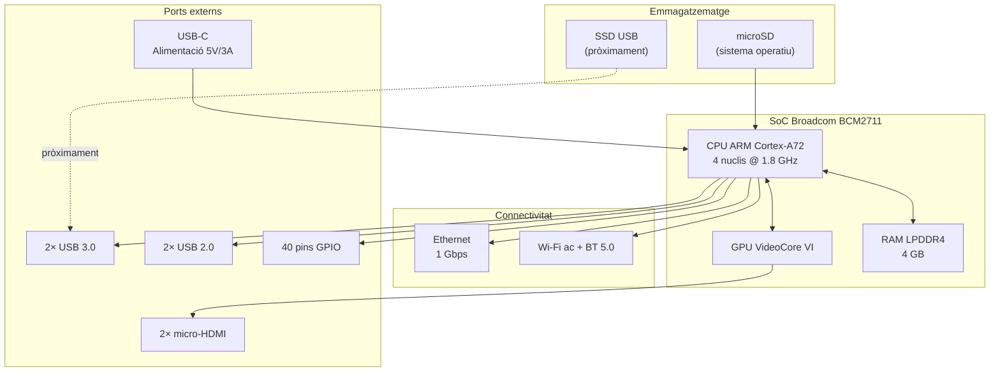

# Capítol 2 — La Raspberry Pi 4 per dins

> *"El primer pas per administrar bé una màquina és entendre-la. La Raspberry Pi 4 no és un PC: és un ordinador amb coses per aprendre."*

## 2.1 Què és exactament una Raspberry Pi 4

La Raspberry Pi 4 Model B és un **ordinador de placa única** (SBC, single-board computer) fabricat per la Raspberry Pi Foundation, una organització britànica sense ànim de lucre que va néixer el 2012 amb l'objectiu de portar la informàtica a les escoles. La idea era construir un ordinador prou barat, prou petit i prou obert perquè qualsevol nen o nena del món pogués aprendre programació. Aquella idea va acabar convertint-se en una plataforma de referència per a projectes de tota mena: des de media centers fins a homelabs, passant per robots, càmeres de seguretat, sistemes industrials i, naturalment, servidors personals com el BernatLab.

La Raspberry Pi 4 va aparèixer el 2019 com la quarta generació important de la família. La **B** del nom indica que és la versió completa, amb tots els ports i capacitats — la versió que ens interessa per a un servidor. A diferència de la Raspberry Pi 5 (més nova, més cara, més potent), la 4 té un equilibri excel·lent entre preu, consum i potència, i la comunitat la coneix a fons.

El model que tenim al BernatLab és la **Raspberry Pi 4 Model B amb 4 GB de RAM**. Hi ha versions amb 1 GB, 2 GB i 8 GB; 4 GB és el punt dolç per a un servidor amb contenidors: prou memòria per a Portainer, Uptime Kuma, Homepage, i encara queda espai per afegir Grafana, InfluxDB o una base de dades petita.

## 2.2 CPU: el cor ARM

La CPU és el **Broadcom BCM2711**, un processador **ARM Cortex-A72** de quatre nuclis (quad-core) a 1,8 GHz. Això és molt important per entendre la Raspberry Pi, perquè ARM no és x86.

La majoria d'ordinadors que has fet servir — PCs de sobretaula, portàtils, servidors professionals — duen processadors **x86** (Intel o AMD), una arquitectura de 64 bits amb instruccions complexes (CISC). Les Raspberry Pi duen processadors **ARM**, una arquitectura de 32 o 64 bits amb instruccions reduïdes (RISC), pensada originalment per a mòbils i sistemes encastats. La diferència pràctica, avui, és menor del que sembla: les dues arquitectures corren Linux, les dues corren Docker, les dues corren navegadors moderns. Però hi ha tres coses que cal saber:

1. **Les imatges Docker arm64**: quan descarreguem una imatge de Docker Hub, hem de mirar si n'hi ha versió `linux/arm64` (la nostra) o només `linux/amd64` (x86). La majoria de projectes moderns ja publiquen ambdues. Si una imatge només té `amd64`, Docker pot intentar executar-la amb **emulació** (binfmt_misc) i funcionar, però amb una pèrdua de rendiment notable.
2. **El sistema operatiu és arm64**: per això tenim **Debian 13 Trixie Lite per a arm64**. Si algú ens passa una ISO per a x86, no funcionarà. Si volem instal·lar programes, hem d'assegurar-nos que el paquet `apt` és per a arm64 (cosa que el propi `apt` ja gestiona quan detecta l'arquitectura).
3. **Rendiment**: a 1,8 GHz amb quatre nuclis, la CPU és modesta comparada amb un PC modern, però més que suficient per a un servidor de serveis petits. La limitació real no és la CPU; és la RAM i, sobretot, l'emmagatzematge.

Els quatre nuclis volen dir que el sistema pot fer quatre coses alhora de veritat, no de manera simulada. Això és útil per a Docker: un contenidor pot estar fent una consulta a base de dades mentre un altre serveix pàgines web i un tercer monitoritza. En un sistema amb un sol nucli, tot aniria molt més a poc a poc.

## 2.3 Memòria RAM

Tenim 4 GB de RAM LPDDR4. La LPDDR4 és una memòria de baix consum dissenyada originalment per a mòbils, que comparteix el mateix xip que la CPU (package-on-package, PoP). Això té avantatges (menys latència, menys espai) i inconvenients (no es pot ampliar, no es pot canviar).

Quan el sistema arrenca, Debian Lite consumeix al voltant de 80-120 MB de RAM. La resta queda lliure per a aplicacions i contenidors Docker. Una distribució amb entorn gràfic consumiria 400-600 MB només per al sistema base, la qual cosa deixaria molt poc espai per als serveis.

Amb 4 GB podem allotjar còmodament 5-8 contenidors petits simultàniament. Si volem allotjar InfluxDB amb una càrrega important de dades, Grafana, una base de dades PostgreSQL, i mitja dotzena més de serveis, començarem a notar la pressió. Per això, en el Capítol 10, parlarem de la possibilitat d'afegir swap a un disc SSD extern — una mena de "RAM virtual" que ens pot treure d'un embús puntual, tot i que és molt més lenta que la RAM real.

Per veure la memòria disponible, podem executar:

```bash
free -h
```

La sortida mostrarà quatre línies importants: `Mem` (memòria física total), `Swap` (disc d'intercanvi), amb columnes `total`, `used`, `free` i `available`. La que realment importa és `available`, que és la que el nucli considera utilitzable tenint en compte caches i reserves.

## 2.4 Emmagatzematge: la targeta microSD

Aquí hi ha la gran particularitat de la Raspberry Pi — i el seu principal punt feble com a servidor. L'emmagatzematge principal és una **targeta microSD**, no un disc dur ni un SSD.

La Raspberry Pi 4 no porta emmagatzematge intern. Per arrencar, necessita una targeta microSD amb un sistema operatiu gravat. A la pràctica, una microSD és una memòria flash NAND — la mateixa tecnologia que duen els pendrives USB i els discs SSD barats — però amb un controlador molt més senzill i, per tant, amb una durabilitat molt menor.

Això vol dir que les targetes microSD:

- **Es degraden amb les escriptures**. Cada vegada que el sistema escriu un fitxer, la memòria NAND pateix un petit desgast. Les targetes modernes duren milers de cicles d'escriptura, però un servidor escriu molt: logs, bases de dades, configuracions, actualitzacions. Una targeta barata pot morir en mesos.
- **Són lentes**. Comparades amb un SSD, les microSD tenen latències altes i velocitats seqüencials baixes. Per a un servidor amb molta lectura (servir pàgines web, executar consultes), això es nota.
- **Són petites**. 16, 32, 64 GB, rarament més. Per a un sistema operatiu amb contenidors, això s'omple ràpid.

La solució estàndard al món Raspberry és **arrencar des d'un disc SSD USB**. La Raspberry Pi 4 ho permet des del firmware de 2020: amb una actualització de la EEPROM i un disc SSD connectat a un port USB 3.0, podem fer que la màquina arrenqui des del SSD com si fos una microSD. Aquesta és una de les millores que tenim a la full de ruta (Capítol 10) — encara no implementada, però prevista.

Mentre no fem el pas a SSD, podem allargar la vida de la microSD amb dues mesures bàsiques:

1. **Usar una targeta de qualitat**. Samsung EVO, SanDisk Extreme, Kingston Canvas. Targeta "no name" de 5 € és llençar diners.
2. **Reduir les escriptures**. Moure els logs a RAM amb `log2ram`, moure els volums Docker a un SSD extern, desactivar la swap agressiva, evitar `apt` innecessaris.

## 2.5 Ports i connectivitat

La Raspberry Pi 4 Model B té una quantitat interessant de ports, alguns dels quals val la pena conèixer bé:

### USB

Dos ports **USB 3.0** (blaus) i dos ports **USB 2.0** (negres). Els USB 3.0 són útils per connectar un SSD extern (fins a 5 Gbps teòrics, ~400 MB/s reals) o dispositius d'emmagatzematge ràpids. Els USB 2.0 (480 Mbps) són per a perifèrics lents: teclats, ratolins, dongles Wi-Fi externs, o un segon disc si la velocitat no és crítica.

### Ethernet

Un port **Gigabit Ethernet** (1 Gbps, 125 MB/s) connectat directament al xip, no pas a un hub USB intern (a diferència de les Raspberry anteriors). Això vol dir que la xarxa per cable pot aprofitar-se bé: podem saturar-la amb un SSD de xarxa o amb tràfic intens. Per a un servidor personal, 1 Gbps és més que suficient: la majoria d'Internet domèstic no passa de 100-300 Mbps de baixada.

### Wi-Fi i Bluetooth

La Raspberry Pi 4 porta un xip **Cypress CYW43455** que ofereix Wi-Fi 802.11ac (dual-band 2,4 i 5 GHz) i Bluetooth 5.0. Per a un servidor, la Wi-Fi és útil com a backup si el cable falla, però **un servidor sempre ha d'anar per cable**. La Wi-Fi és menys estable, té més latència, i en un homelab volem predibilitat.

### GPIO

40 pins **GPIO** (general-purpose input/output) són el cor del "maker" de la Raspberry. A través d'aquests pins podem connectar sensors, LEDs, motors, relés, i comunicar-nos amb ells des de programes. Són la porta d'entrada al món de l'electrònica.

En el context del BernatLab, els GPIO els usarem eventualment per connectar sensors ambientals o per comunicar-nos amb un mòdul LoRa SX1262. Però aquesta és feina del Capítol 10, no d'ara. De moment, només cal saber que hi són.

### HDMI

Dos ports **micro-HMI** (HDMI 0 i HDMI 1) que permeten connectar dos monitors 4K a 30 Hz o un a 60 Hz. Com que tenim la versió Lite de Debian sense entorn gràfic, aquests ports no els farem servir. Sí que els podem fer servir puntualment per connectar un monitor en cas d'emergència — per exemple, si la màquina no arrenca i volem veure què passa.

### USB-C (alimentació)

L'**alimentació** entra per un connector USB-C. La Raspberry Pi 4 accepta 5 V a 3 A, és a dir, 15 W de potència màxima. En un servidor, és recomanable usar un carregador oficial o un de qualitat, capaç de subministrar els 3 A de forma estable. Subministrar menys pot provocar reinicions sota càrrega, cosa que en un servidor és inadmissible.

## 2.6 Temperatura i refrigeració

La CPU genera calor. Sense refrigeració, sota càrrega, pot arribar a 80-85 °C i començar a fer **thermal throttling**: reduir la velocitat dels nuclis per no cremar-se. Això passa amb freqüència en servidors 24/7.

Les opcions de refrigeració són:

- **Disipador passiu**: un petit bloc d'alumini enganxat al xip. Gratuït o gairebé, funciona bé si la càrrega és moderada.
- **Ventilador actiu**: un petit ventilador de 30 mm alimentat pels pins GPIO 5V. Gairebé sempre inaudible, refreda molt bé, però afegeix un component mecànic que es pot trencar.
- **Carcassa amb dissipació**: una carcassa d'alumini que actua com a dissipador. Elegant, però més cara.

Al BernatLab, tenim [pendent d'anotar quina solució hem posat]. Independentment del que hi hagi, podem monitoritzar la temperatura amb:

```bash
vcgencmd measure_temp
```

o, si `vcgencmd` no està disponible:

```bash
cat /sys/thermal/thermal_zone0/temp
```

que retorna la temperatura en mil·lis de grau Celsius (dividir entre 1000).

Si la temperatura supera els 70 °C de forma regular, és hora de millorar la refrigeració. En un servidor, la temperatura òptima és 40-60 °C en repòs, 55-70 °C sota càrrega. Més de 80 °C és senyal d'alarma.

## 2.7 Procés d'arrencada

Quan connectem l'alimentació a la Raspberry Pi 4, passa el següent:

1. **El xip de vídeo (VideoCore VII) agafa el control**. Llegeix la primera etapa del bootloader des d'una petita ROM interna del xip. Aquesta primera etapa és immutable i s'encarrega d'inicialitzar el mínim necessari.
2. **El bootloader carrega la segona etapa** des de la targeta microSD (o SSD USB). Aquesta segona etapa és a la partició `boot` (FAT32) i s'anomena `bootcode.bin` o, en versions modernes, és el fitxer `pieeprom.bin`.
3. **La EEPROM entra en acció**. En les Raspberry Pi 4 modernes, el bootloader es troba en una EEPROM reprogramable. Això ens permet actualitzar el firmware (per exemple, per habilitar l'arrencada USB) sense canviar la targeta.
4. **El kernel Linux arrenca**. Un cop el bootloader ha acabat la seva feina, carrega el fitxer `kernel8.img` (per a arm64) i li passa el control. El kernel munta el sistema de fitxers arrel (`/`), carrega els mòduls, configura el maquinari.
5. **systemd arrenca els serveis**. Un cop el kernel ha muntat tot el que cal, executa `/sbin/init`, que en el nostre cas és un enllaç a `systemd`. systemd és el **gestor de serveis i d'arrencada** que s'encarrega d'activar tots els serveis del sistema: xarxa, SSH, Docker, Portainer, etc.
6. **El sistema està llest**. Tots els serveis configurats per arrencar automàticament estan funcionant. La Raspberry està esperant connexions SSH, contenidors en marxa, etc.

El procés complet dura entre 15 i 60 segons, depenent de la targeta i de quants serveis tinguis. Ho podem comprobar amb:

```bash
systemd-analyze
```

que ens dirà quant ha trigat el kernel i quant ha trigat l'espai d'usuari. Si triga massa, podem veure on es perd el temps amb:

```bash
systemd-analyze blame
```

que ens dóna una llista dels serveis ordenats pel temps que han trigat a arrencar. Si Docker triga 20 segons i Portainer 8, potser podem optimitzar l'ordre d'arrencada.

## 2.8 El kernel Linux

El **kernel** és el nucli del sistema operatiu. És el programa que s'executa amb més privilegis (mode kernel) i que té accés directe al maquinari: CPU, memòria, discos, xarxa, GPIO. Tot el que fem servir — la línia d'ordres, els contenidors, els serveis — passa per sobre del kernel, que actua com a intermediari entre el programari i el metall.

Al BernatLab tenim un **kernel Linux** compilat per a ARM, versió [caldrà comprovar amb `uname -r`]. Aquest kernel inclou tots els controladors necessaris per al maquinari de la Raspberry Pi 4: el controlador de la CPU, de la xarxa, de l'USB, del GPIO, de la GPU, etc.

El kernel es pot actualitzar amb `apt`:

```bash
sudo apt update
sudo apt full-upgrade
```

Però compte: actualitzar el kernel pot trencar coses. Algunes funcionalitats — com el controlador de GPIO, l'accés a la càmera, o la sortida HDMI — poden canviar de comportament entre versions. Per això, en un servidor, sempre és bona idea llegir les notes de versió abans d'actualitzar el kernel, i tenir una manera de tornar enrere si alguna cosa falla.

Per veure quin kernel tenim:

```bash
uname -a
```

que ens retornarà una línia amb el nom del kernel, la versió, l'arquitectura, la data de compilació i el hostname.

## 2.9 systemd: el mestre de cerimònies

**systemd** és el **gestor de sistemes i serveis** que Debian i la majoria de distribucions modernes fan servir. La seva feina és:

- Arrencar els serveis en l'ordre correcte durant l'inici del sistema.
- Aturar-los ordenadament durant l'apagada.
- Supervisar els serveis i reiniciar-los automàticament si fallen.
- Gestionar punts de muntatge, dispositius, temporitzadors, sockets.

systemd organitza els serveis en **unitats** (units). Cada unitat és un fitxer de text amb una extensió que indica el tipus: `.service` (un servei normal), `.timer` (un temporitzador), `.mount` (un punt de muntatge), `.socket` (un socket de xarxa), `.target` (un objectiu que agrupa altres unitats), etc.

Per exemple, el servei de Docker és `docker.service`, definit a `/lib/systemd/system/docker.service`. Per veure'n l'estat:

```bash
systemctl status docker
```

Per activar-lo a l'arrencada:

```bash
sudo systemctl enable docker
```

Per iniciar-lo ara:

```bash
sudo systemctl start docker
```

Per aturar-lo:

```bash
sudo systemctl stop docker
```

Per reiniciar-lo:

```bash
sudo systemctl restart docker
```

Per veure tots els serveis actius:

```bash
systemctl list-units --type=service --state=running
```

Aquestes ordres les farem servir cada setmana. Són la base de l'administració d'un servidor Linux modern.

## 2.10 Per què Debian Lite

Triar un sistema operatiu per a un homelab és una decisió important. Tenim opcions com Raspberry Pi OS (l'oficial), Ubuntu Server, DietPi, Arch Linux ARM, Alpine. Per què Debian Lite?

Tres raons pràctiques:

1. **Estabilitat**. Debian és coneguda per ser extremadament estable. La versió actual (Trixie, 13) porta programes provats i madurs, no les últimes versions. Per a un servidor, això és bo: volem que el sistema no canviï sota els nostres peus.
2. **Repositoris**. Debian té un dels repositoris de paquets més grans del món. Qualsevol cosa que necessitem — eines de xarxa, editors, llenguatges de programació, biblioteques — hi és. La majoria de documentació que trobem a Internet assumeix Debian/Ubuntu.
3. **Lleugeresa**. La versió **Lite** (o **netinst**) no porta entorn gràfic ni programari innecessari. Només el sistema base. Això ens dóna control absolut sobre què hi ha instal·lat i redueix la superfície d'atac.

Raspberry Pi OS, la distribució oficial, és bona i està optimitzada per al maquinari, però porta moltes coses innecessàries per a un servidor (escriptori, Chromium, LibreOffice, Mathematica). DietPi és excel·lent per a sistemes molt limitats, però el seu valor afegit (instal·lador de programes automatitzat) no el necessitem en un entorn on ja tenim Docker. Ubuntu Server seria una bona opció, però la seva política d'actualitzacions és més agressiva i les seves versions LTS canvien coses cada pocs anys.

Debian Lite és, simplement, la millor relació entre simplicitat, estabilitat i control.

## 2.11 Esquema de la Raspberry Pi 4



## 2.12 Errors habituals

**Error 1: comprar una microSD barata**. Símptoma: la targeta falla al cap de 2-3 mesos, el sistema es corromp. Solució: targeta de marca (Samsung EVO Select, SanDisk Extreme), classe A2 o superior.

**Error 2: subministrar poca potència**. Símptoma: la Raspberry es reinicia aleatòriament, sobretot quan hi ha un USB connectat. Solució: carregador oficial o de qualitat, 5V/3A mínim.

**Error 3: ignorar la temperatura**. Símptoma: rendiment baix, "throttling" als logs (`dmesg | grep -i thermal`). Solució: afegir dissipador, ventilador, o carcassa dissipativa.

**Error 4: actualitzar el kernel sense previ avís**. Símptoma: el GPIO, la càmera, o algun altre maquinari deixa de funcionar. Solució: llegir notes de versió, fer còpia de seguretat, tenir un pla per tornar enrere.

**Error 5: confondre ARM amb x86**. Símptoma: descarregar una ISO o una imatge Docker que no funciona. Solució: verificar sempre l'arquitectura amb `uname -m` (que retorna `aarch64` per a arm64) i usar imatges adequades.

## 2.13 Resum

Hem recorregut la Raspberry Pi 4 peça a peça: la CPU ARM Cortex-A72, els 4 GB de RAM, la microSD i les seves limitacions, els ports USB, Ethernet, GPIO i HDMI, l'alimentació USB-C, la temperatura, el procés d'arrencada, el kernel Linux i systemd. Hem entès per què hem triat Debian Lite i quin paper juga cada peça en el BernatLab. En el proper capítol baixarem al sistema operatiu: aprendrem a administrar Linux de veritat.

## 2.14 Exercicis pràctics

1. Executa `uname -a` i anota la versió exacta del kernel.
2. Executa `free -h` i calcula quanta RAM queda lliure amb tots els serveis aturats.
3. Executa `vcgencmd measure_temp` o `cat /sys/thermal/thermal_zone0/temp` per veure la temperatura actual.
4. Executa `systemd-analyze` per veure quant ha trigat a arrencar el sistema.
5. Executa `systemd-analyze blame` i identifica els tres serveis que més triguen a arrencar.
6. Mira els logs del kernel amb `dmesg | less` i busca missatges sobre el maquinari (Ethernet, USB, etc.).

Comandes útils del capítol:
```bash
uname -a
free -h
vcgencmd measure_temp
cat /sys/thermal/thermal_zone0/temp
systemd-analyze
systemd-analyze blame
systemctl status docker
systemctl list-units --type=service --state=running
```

Paraules clau: **ARM Cortex-A72, BCM2711, microSD, EEPROM, systemd, kernel, thermal throttling, Debian Lite, arm64**.
