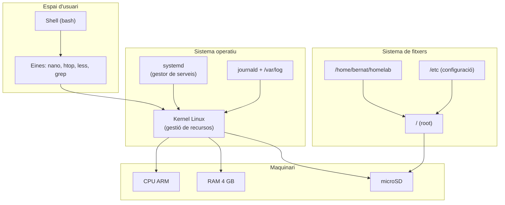

# Capítol 3 — Linux per administrar un servidor

> *"La consola no és una eina del passat. És la manera més precisa, més lleugera i més fiable de parlar amb un servidor."*

## 3.1 Per què la consola

Quan algú entra per primera vegada a un servidor Linux, sovint se sent perdut. La pantalla és negra, no hi ha icones, no hi ha menú. Però aquesta pantalla negra és, paradoxalment, una de les eines més potents que tenim. La consola de Linux ens permet:

- Fer coses que una interfície gràfica no pot fer.
- Automatitzar tasques amb un sol script.
- Treballar remotament, per una connexió de xarxa molt petita, sense dependre d'entorns gràfics.
- Entendre què està passant realment, sense la intermediació d'una interfície que amaga la complexitat.

Aquest capítol no és un manual exhaustiu de Linux. És un **recorregut pràctic pels conceptes i les ordres que farem servir cada dia al BernatLab**. Algunes són molt bàsiques, d'altres una mica més avançades. Totes, però, són útils.

## 3.2 El sistema de fitxers

Tot a Linux és un fitxer. Aquesta és potser la idea més important del sistema. Els directoris són fitxers. Els dispositius de maquinari són fitxers. Els processos són fitxers. Les connexions de xarxa són fitxers. Quan entens això, comences a entendre Linux.

L'estructura del sistema de fitxers de Linux segueix l'estàndard **FHS (Filesystem Hierarchy Standard)**. A Debian, l'estructura arrel és:

```
/
├── bin/        → binaris essencials (ls, cat, cp...)
├── sbin/       → binaris d'administració (mount, fdisk...)
├── etc/        → fitxers de configuració
├── home/       → directoris personals dels usuaris
│   └── bernat/ → el nostre directori
│       └── homelab/  → la carpeta de treball del BernatLab
├── var/        → dades variables (logs, bases de dades, cues)
│   └── log/    → logs del sistema
├── tmp/        → fitxers temporals
├── usr/        → programes d'usuari (la majoria del sistema)
├── opt/        → programes opcionals / comercials
├── lib/        → biblioteques compartides
├── dev/        → dispositius
├── proc/       → informació del kernel i processos
├── sys/        → interfície amb el kernel
└── mnt/ i media/ → punts de muntatge temporals
```

Les normes no escrites que val la pena recordar:

- **Tot el que és configurable és a `/etc`**. Si vols canviar el comportament d'un servei, és gairebé segur que el fitxer és aquí.
- **Els logs són a `/var/log`**. Si alguna cosa falla, és aquí on has de mirar.
- **Les dades temporals són a `/tmp`**. Es poden esborrar en qualsevol moment — no hi posis res important.
- **La teva àrea personal és a `/home/bernat`**. Aquí és on treballaràs, on guardaràs els teus projectes, on crearàs la carpeta `homelab`.

### Navegació bàsica

```bash
pwd                # mostra on sóc
ls                 # llista el contingut
ls -l              # llista amb detalls
ls -la             # llista amb detalls i amagats
cd /home/bernat    # canvia de directori
cd ..              # puja un nivell
cd ~               # va a /home/bernat
cd -               # torna a l'últim directori
```

### Operacions amb fitxers

```bash
cp origen desti       # copia
mv origen desti        # mou o reanomena
rm fitxer             # esborra
rm -r directori       # esborra recursivament
mkdir directori       # crea directori
rmdir directori       # esborra directori buit
touch fitxer          # crea fitxer buit o actualitza data
cat fitxer            # mostra contingut
less fitxer           # mostra contingut paginat
head -n 20 fitxer     # primeres 20 línies
tail -n 20 fitxer     # últimes 20 línies
tail -f fitxer        # últimes línies, en directe
```

### Comandes molt útils al BernatLab

```bash
du -sh /home/bernat/homelab    # espai ocupat
df -h                          # espai en discos
find / -name "docker-compose.yml"  # buscar un fitxer
grep -ri "error" /var/log/     # buscar text en fitxers
```

## 3.3 Usuaris i permisos

Linux és un sistema **multi-usuari**. Cada persona (o cada servei) té un compte propi, amb un nom, un directori personal i uns permisos. Al BernatLab tenim, com a mínim, dos usuaris importants:

- **root**: el superusuari, que pot fer tot. Compte — el seu directori personal és `/root`, no pas `/home/root`.
- **bernat**: l'usuari amb què treballem normalment. Té el seu directori a `/home/bernat`.

Per canviar temporalment a root:

```bash
su -
```

o per executar una sola ordre amb privilegis de root:

```bash
sudo ordre
```

`sudo` és el mecanisme estàndard. Està configurat al fitxer `/etc/sudoers` (millor no editar-lo a mà; usa `visudo` per seguretat). L'usuari `bernat` està al grup `sudo`, cosa que li permet executar ordres com a root sense contrasenya o amb la seva pròpia contrasenya.

### Permisos

Cada fitxer té tres tipus de permisos per a tres categories d'usuaris:

```
-rwxr-xr-- 1 bernat bernat  1234 oct  3 12:00 script.sh
```

Desglossant:

- `-` → és un fitxer regular (un directori seria `d`)
- `rwx` → el propietari pot llegir, escriure, executar
- `r-x` → el grup pot llegir i executar (no escriure)
- `r--` → la resta només pot llegir

Per canviar permisos:

```bash
chmod 755 script.sh      # rwxr-xr-x
chmod u+x script.sh      # afegeix execució al propietari
chmod go-w directori     # treu escriptura a grup i altres
```

Per canviar propietari:

```bash
chown bernat:bernat fitxer
chown -R bernat:bernat directori
```

Els números de `chmod` es calculen així: r=4, w=2, x=1. Suma'ls per a cada categoria. `755` = propietari 7 (rwx), grup 5 (r-x), altres 5 (r-x).

## 3.4 El sistema de paquets apt

**apt** és el gestor de paquets de Debian. La seva feina és descarregar, instal·lar, actualitzar i eliminar programes des dels **repositoris** oficials de Debian — enormes magatzems de programari mantinguts per la comunitat.

### Configuració bàsica

Els repositoris estan definits a `/etc/apt/sources.list` i als fitxers de `/etc/apt/sources.list.d/`. Si obrim el primer amb `cat`, veurem una cosa semblant a:

```
deb http://deb.debian.org/debian trixie main contrib non-free non-free-firmware
deb http://deb.debian.org/debian trixie-updates main contrib non-free non-free-firmware
deb http://security.debian.org/debian-security trixie-security main contrib non-free non-free-firmware
```

Això vol dir: "Baixa paquets per a la versió Trixie, des del servidor principal de Debian, de les seccions main, contrib, non-free i non-free-firmware".

### Ús diari

```bash
sudo apt update                  # actualitza la llista de paquets disponibles
sudo apt upgrade                 # actualitza tots els paquets
sudo apt full-upgrade            # igual però permet canvis majors
sudo apt install paquet          # instal·la un paquet
sudo apt remove paquet           # elimina un paquet
sudo apt purge paquet            # elimina un paquet i la seva configuració
sudo apt autoremove              # elimina dependències innecessàries
sudo apt search paraula          # busca paquets
apt show paquet                  # mostra informació d'un paquet
```

La diferència clau entre `apt update` i `apt upgrade` és que el primer només actualitza la informació sobre quins paquets hi ha disponibles, i el segon descarrega i instal·la les noves versions. Sempre s'ha de fer `update` abans de `upgrade`, i és bo fer-los junts.

Quan s'instal·la un paquet, `apt` resol automàticament les **dependències**: si volem instal·lar un programa que necessita una biblioteca, `apt` la descarrega i la instal·la sense que l'hi demanem. Aquesta és una de les grans virtuts de Debian.

## 3.5 L'editor nano

Per editar fitxers de configuració, necessitem un editor de text en consola. N'hi ha molts: **nano**, **vim**, **emacs**, **micro**, **joe**. Al BernatLab farem servir **nano**, que és el més amable per a principiants i que ve preinstal·lat a Debian Lite.

Per obrir-lo:

```bash
nano /etc/sudoers
```

A la part inferior de la pantalla veuràs les dreceres de teclat. Les més útils:

- `Ctrl+O` → desar (write Out)
- `Ctrl+X` → sortir
- `Ctrl+K` → tallar una línia
- `Ctrl+U` → enganxar
- `Ctrl+W` → buscar
- `Ctrl+G` → ajuda

Important: nano per sí sol no demana confirmació abans de desar. Polsar `Ctrl+X` i respondre `Y` desarà i sortirà. `Ctrl+C` cancel·la.

Si volem un editor una mica més potent, podem instal·lar **micro** (`sudo apt install micro`) o aprendre **vim** (un viatge al·lucinant, però que val la pena si volem ser administradors de veritat).

## 3.6 Serveis i systemd

Ja hem parlat de systemd al Capítol 2. Aquí aprofundim en la gestió quotidiana dels serveis.

```bash
systemctl status servei          # estat detallat
systemctl start servei           # iniciar
systemctl stop servei            # aturar
systemctl restart servei         # reiniciar
systemctl reload servei          # recarregar config sense parar
systemctl enable servei          # arrencar a l'inici
systemctl disable servei         # no arrencar a l'inici
systemctl is-active servei       # actiu? (yes/no)
systemctl is-enabled servei      # habilitat? (yes/no)
systemctl list-units --type=service --state=running
systemctl list-unit-files --type=service
```

A Debian, la majoria de serveis tenen el seu fitxer de configuració a `/etc/nomservei/`. Per exemple, la configuració de Docker és a `/etc/docker/`, i la de SSH a `/etc/ssh/sshd_config`.

Per veure els logs d'un servei:

```bash
journalctl -u servei                  # tots els logs
journalctl -u servei -f               # en directe (follow)
journalctl -u servei --since "1 hour ago"
journalctl -u servei --since today
```

`journalctl` és l'eina estàndard de systemd per accedir als logs. Combina tots els missatges de tots els serveis en una base de dades indexada, i permet filtres potents per data, prioritat, unitat, etc.

## 3.7 Processos

Cada programa que s'executa al sistema és un **procés**, amb un identificador únic (**PID**). Per veure'ls:

```bash
ps aux                 # tots els processos
ps aux | grep docker    # processos que contenen "docker"
top                    # vista dinàmica, ordenada per ús
htop                   # millor que top, cal instal·lar-lo
```

Si volem instal·lar `htop` (recomanable):

```bash
sudo apt install htop
```

Per matar un procés:

```bash
kill PID               # envia SIGTERM (amable)
kill -9 PID            # envia SIGKILL (forçat)
killall nom            # mata tots els processos amb aquest nom
pkill -f patro         # mata processos que coincideixen amb un patró
```

Quan un contenidor Docker no respon, sovint el "matarem" amb `docker kill` (que veurem al Capítol 5), però entendre `kill` i `ps` és fonamental.

## 3.8 Logs

Els logs són la memòria del sistema. Quan alguna cosa falla, els logs són la primera — i sovint l'única — pista que tenim per entendre per què.

Els principals fitxers de log a Debian són:

- `/var/log/syslog` → log general del sistema
- `/var/log/auth.log` → autenticacions (SSH, sudo)
- `/var/log/kern.log` → missatges del kernel
- `/var/log/mail.log` → correu
- `/var/log/docker/` → logs de Docker
- `/var/log/apt/` → historial d'instal·lacions apt

Comandes útils:

```bash
tail -f /var/log/syslog
less /var/log/syslog
grep "error" /var/log/syslog
journalctl -xe           # últims missatges amb explicacions
journalctl --since "1 hour ago"
```

Al BernatLab, els logs poden créixer molt. Una bona pràctica és configurar **logrotate** (que ja ve amb Debian) perquè els vagi rotant i comprimint, i **log2ram** per moure'ls a RAM, reduint les escriptures a la targeta microSD.

## 3.9 La carpeta /home/bernat/homelab

Aquí és on viu la nostra feina. L'estructura recomanada per al BernatLab és:

```
/home/bernat/homelab/
├── README.md                    # descripció general
├── CHANGELOG.md                 # registre de canvis
├── docker-compose.yml           # definició principal de serveis
├── .env                         # variables d'entorn (no versionat)
├── .gitignore                   # què no versionar
├── stacks/                      # sub-piles de compose
│   ├── monitoring/              # Uptime Kuma, Grafana, etc.
│   ├── data/                    # InfluxDB, PostgreSQL, etc.
│   ├── iot/                     # Mosquitto, Node-RED, etc.
│   └── media/                   # File Browser, foto, música
├── data/                        # volums persistents
│   ├── uptime-kuma/
│   ├── homepage/
│   ├── portainer/
│   └── ...
├── backup/                      # còpies de seguretat
├── scripts/                     # scripts de manteniment
└── docs/                        # documentació addicional
```

Aquesta estructura ens permet:

- **Tenir un sol fitxer `docker-compose.yml`** a l'arrel, o bé dividir-lo en piles temàtiques.
- **Guardar les dades persistents** dins de `data/`, cosa que facilita les còpies de seguretat.
- **Versionar tot** amb Git, excepte `.env` i `data/` (gràcies a `.gitignore`).
- **Documentar** dins del projecte, no en un altre lloc.

## 3.10 Comandes útils del dia a dia

Aquesta és la llista que consultarem cada setmana:

```bash
# Sistema
uname -a               # kernel i arquitectura
uptime                 # temps encès, càrrega
date                   # data i hora
who                    # qui està connectat
w                      # qui i què fa

# Disc
df -h                  # espai en sistemes de fitxers
du -sh /camí/          # espai ocupat per un directori
lsblk                  # llista de dispositius de bloc

# Xarxa
ip a                   # adreces IP
ip r                   # rutes
ss -tulpn              # ports oberts
ping host              # comprovar connectivitat

# Processos
ps aux
htop
pkill -f patro

# Logs
journalctl -xe
tail -f /var/log/syslog

# Serveis
systemctl status servei
systemctl restart servei
```

## 3.11 Bones pràctiques

1. **Mai no treballis com a root per defecte**. Usa un usuari normal i puja amb `sudo` quan calgui.
2. **Documenta cada canvi important**. Un cop fet, un parell de línies al `CHANGELOG.md`.
3. **Fes còpies de seguretat abans de canvis grans**. `apt full-upgrade`, canvis de configuració, actualitzacions de contenidors. Si alguna cosa es trenca, has de poder tornar enrere.
4. **Mira els logs quan alguna cosa falla**. No reinicis a cegues. Llegeix, entén, actua.
5. **No instal·lis programes que no necessitis**. Cada programa és un risc potencial i un consumidor de recursos.
6. **Aprèn una ordre abans de memoritzar el seu àlies**. Els àlies estan bé, però entén el que fas servir.

## 3.12 Errors habituals

**Error 1: executar ordres com a root "perquè sí"**. Símptoma: fitxers propietat de root que després no podem editar, o canvis irreversibles. Solució: usar `sudo` només quan és estrictament necessari.

**Error 2: `rm -rf` sense comprovar**. Símptoma: hem esborrat alguna cosa que no tocava. Solució: llegir dues vegades abans de prémer Enter. Mai no executar `rm -rf /` o `rm -rf *` en un directori arrel.

**Error 3: instal·lar paquets innecessaris**. Símptoma: sistema ple de coses, ports oberts, serveis innecessaris. Solució: abans d'instal·lar, preguntar-se si realment cal.

**Error 4: no mirar els logs**. Símptoma: quan alguna cosa falla, no sabem per què. Solució: `journalctl -xe` i `tail -f` són els nostres millors amics.

**Error 5: editar `/etc/sudoers` a mà amb nano**. Símptoma: sudo es trenca i no podem arreglar res. Solució: usar sempre `visudo`, que valida la sintaxi abans de desar.

## 3.13 Esquema del sistema



## 3.14 Resum

Hem après les ordres bàsiques de Linux aplicades al BernatLab: sistema de fitxers, usuaris, permisos, sudo, paquets apt, nano, serveis amb systemd, processos, logs. També hem vist com ha d'estar organitzada la carpeta `/home/bernat/homelab` i quines bones pràctiques seguir. En el proper capítol pujarem de nivell: xarxa, SSH i Tailscale.

## 3.15 Exercicis pràctics

1. Entra a `/home/bernat/homelab` i comprova què hi ha. Si no existeix, crea-la: `mkdir -p /home/bernat/homelab/{stacks,data,backup,scripts,docs}`.
2. Executa `ls -la /home/bernat/homelab` i explica què hi veus.
3. Mira l'ús de disc amb `df -h` i l'ús de memòria amb `free -h`. Anota els valors.
4. Executa `systemctl list-units --type=service --state=running` i compta quants serveis hi ha actius.
5. Mira les últimes 20 línies de `/var/log/syslog` amb `tail -n 20 /var/log/syslog`. Hi ha algun error o advertència?
6. Instal·la `htop` amb `sudo apt install htop`, executa'l i surt amb `q`.

Comandes útils del capítol:
```bash
pwd, ls, cd, cp, mv, rm, mkdir
chmod, chown, sudo
apt update && apt upgrade
apt install, apt remove
nano, systemctl, journalctl
ps aux, htop, kill
df -h, du -sh, free -h
ip a, ss -tulpn
```

Paraules clau: **filesystem, FHS, permisos, sudo, apt, nano, systemd, journalctl, htop, /var/log, homelab, bones pràctiques**.
