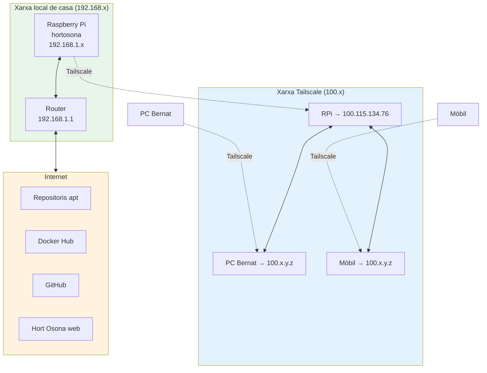

# Capítol 4 — Xarxa, SSH i Tailscale

> *"Un servidor sense xarxa és una caixa forta en una illa deserta. Un servidor amb bona xarxa és una extensió de tu mateix."*

## 4.1 Què vol dir "xarxa" en un servidor

Quan diem "xarxa" en el context d'un servidor, ens referim a la capacitat de la màquina de comunicar-se amb altres dispositius. Aquesta comunicació es fa a través de **protocols** (com TCP/IP), a través de **ports** (com el 22 per a SSH, el 80 per a HTTP, el 443 per a HTTPS), i a través d'**adreces** que identifiquen cada dispositiu de forma única.

Al BernatLab, la xarxa és fonamental perquè:

- Accedim al servidor remotament per SSH.
- Els serveis (Portainer, Uptime Kuma, Homepage) escolten peticions en ports específics.
- La Raspberry es comunica amb sensors, amb serveis al núvol, amb la base de dades.
- Volem accedir-hi des de qualsevol lloc del món — des de la feina, des del mòbil, des d'un portàtil de viatge.

Aquest capítol explica els conceptes bàsics i, sobretot, com fer que tot això funcioni **de manera segura** amb Tailscale.

## 4.2 IP, ports i DNS

### Adreces IP

Una adreça **IP** (Internet Protocol) és un número que identifica un dispositiu en una xarxa. En la versió 4 (IPv4), és un número de 32 bits que s'escriu com quatre grups de fins a tres xifres separats per punts, p. ex. `192.168.1.42` o `100.115.134.76`.

A la nostra Raspberry podem veure les adreces assignades amb:

```bash
ip a
```

Aquesta ordre ens mostrarà diverses interfícies de xarxa:

- **lo** (loopback): la interfície "cap a un mateix", amb adreça `127.0.0.1`. Sempre present.
- **eth0**: la interfície Ethernet, per cable. Aquesta serà la principal al BernatLab.
- **wlan0** (si l'habilitem): la interfície Wi-Fi.

En una xarxa domèstica, la Raspberry tindrà una adreça del tipus `192.168.x.y`, assignada pel router (que fa de servidor DHCP). Aquesta és la **IP privada local**: només és visible des de dins de casa.

Quan la Raspberry parla amb Internet, el router tradueix la seva IP privada per la **IP pública** que ens ha assignat l'operador. Això es fa gràcies al **NAT** (Network Address Translation). El problema: aquesta IP pública canvia de tant en tant (llevat que paguem una IP fixa), i des de fora de casa no sabem quina és en cada moment.

### Ports

Un **port** és un número de 16 bits (de 0 a 65535) que identifica una aplicació concreta dins d'una màquina. Quan un programa vol rebre connexions, escolta en un port. Per convenció:

- **22**: SSH
- **80**: HTTP
- **443**: HTTPS
- **3000-3999**: aplicacions web (Homepage, Grafana)
- **3001**: Uptime Kuma
- **9443**: Portainer
- **5432**: PostgreSQL
- **1883**: MQTT

Quan accedim a `100.115.134.76:9443`, estem dient: "vull connectar a la IP `100.115.134.76`, port `9443`". El port és part essencial de l'adreça.

Per veure quins ports té oberts la nostra màquina:

```bash
ss -tulpn
```

Aquesta ordre ens mostrarà totes les connexions TCP/UDP obertes, amb el protocol, l'adreça local, el port i el procés que les manté. És una eina molt útil per entendre què està passant.

### DNS

El **DNS** (Domain Name System) és el sistema que tradueix noms fàcils de recordar (`bernatmora.github.io`) en adreces IP (`140.82.121.4` o similar). Quan posem una adreça al navegador, el sistema consulta un servidor DNS per obtenir la IP.

A Debian, la configuració de DNS és a `/etc/resolv.conf`. Normalment hi veurem:

```
nameserver 192.168.1.1
```

que apunta al router, que al seu sap on són els servidors DNS de l'operador (o pot ser ell mateix, fent de DNS forwarder).

## 4.3 Tallafoc i seguretat bàsica

Un **tallafoc** (firewall) és un programa que decideix quin tràfic pot entrar i sortir d'una màquina. A Debian, el tallafoc estàndard és **nftables** (l'evolució de l'antic iptables), tot i que molts encara prefereixen la interfície **ufw** (Uncomplicated Firewall) per la seva senzillesa.

A l'instal·lació de Debian Lite, el tallafoc pot estar totalment obert (acceptant tot el tràfic) o parcialment tancat, depenent de la configuració. Per veure l'estat:

```bash
sudo ufw status
```

Si `ufw` no està instal·lat:

```bash
sudo apt install ufw
```

Regles bàsiques que podem aplicar al BernatLab:

```bash
sudo ufw default deny incoming
sudo ufw default allow outgoing
sudo ufw allow ssh
sudo ufw allow 9443/tcp    # Portainer
sudo ufw allow 3001/tcp    # Uptime Kuma
sudo ufw allow 3000/tcp    # Homepage
sudo ufw enable
```

Això obre els ports estrictament necessaris i tanca la resta. A la pràctica, com que Tailscale ja ens dona una xarxa privada i el router ja ens protegeix, el tallafoc del servidor és una **bona capa addicional** però no l'única.

## 4.4 SSH: la porta d'entrada

**SSH** (Secure Shell) és el protocol estàndard per accedir a una consola remota de forma segura. Quan obrim una sessió SSH, tot el que escrivim i tot el que rebem viatja **xifrat** per la xarxa, de manera que ningú no el pot interceptar.

Al BernatLab, SSH és la nostra eina principal. Treballem habitualment des del nostre PC o portàtil, connectant-nos a la Raspberry per SSH. Sense SSH, hauríem de tenir un monitor, un teclat i un ratolí connectats a la Raspberry — inviable per a un servidor 24/7.

### Com funciona SSH

Quan un client SSH es connecta a un servidor, passa el següent:

1. **Handshake inicial**: el client i el servidor intercanvien informació sobre les versions del protocol i quins algorismes de xifratge suporten.
2. **Intercanvi de claus**: s'estableix una connexió xifrada mitjançant un sistema asimètric (claus públiques i privades).
3. **Autenticació**: el client demostra la seva identitat al servidor. Pot fer-ho amb:
   - **Contrasenya**: el mètode més senzill però menys segur.
   - **Clau pública**: el mètode recomanable, basat en criptografia asimètrica.
4. **Sessió establerta**: a partir d'aquí, tota la comunicació viatja xifrada.

### Connexió bàsica

```bash
ssh bernat@100.115.134.76
```

Això connecta a la IP `100.115.134.76` (la Tailscale), com a usuari `bernat`. Ens demanarà la contrasenya (o la clau, si està configurada) i, un cop autenticats, estarem dins de la consola del servidor.

### Claus SSH: autenticació sense contrasenya

El mètode recomanat per a SSH és l'**autenticació amb clau pública**. En lloc d'escriure una contrasenya cada vegada, generem un parell de claus:

- **Clau privada**: queda al nostre PC (al fitxer `~/.ssh/id_ed25519`). **No l'hem de compartir mai.**
- **Clau pública**: la pengem al servidor, al fitxer `~/.ssh/authorized_keys`. Qualsevol pot veure-la — és pública.

Quan ens connectem, el client demostra al servidor que posseeix la clau privada sense enviar-la mai per la xarxa. Això és molt més segur que una contrasenya, perquè:

- Una clau de 256 bits és pràcticament impossible d'endevinar.
- La clau privada no viatja mai per la xarxa.
- Podem protegir la clau amb una passphrase (contrasenya local).

Per generar el parell de claus al nostre PC client:

```bash
ssh-keygen -t ed25519 -C "bernat@bernatlab"
```

Ens demanarà una passphrase (recomanable) i guardarà les claus a `~/.ssh/id_ed25519` (privada) i `~/.ssh/id_ed25519.pub` (pública).

Per pujar la clau pública al servidor:

```bash
ssh-copy-id bernat@100.115.134.76
```

A partir d'ara, podem entrar sense contrasenya (o amb la passphrase de la clau). El servidor confia en nosaltres perquè tenim la clau privada que correspon a la clau pública que ha acceptat.

### Configuració del servidor SSH

L'arxiu principal és `/etc/ssh/sshd_config`. Algunes directives recomanables:

```
Port 22
PermitRootLogin no
PasswordAuthentication no
PubkeyAuthentication yes
AllowUsers bernat
```

- **PermitRootLogin no**: impedeix que l'usuari root entri directament. Cal entrar com a `bernat` i fer `sudo`.
- **PasswordAuthentication no**: desactiva l'autenticació per contrasenya. Només es pot entrar amb clau.
- **AllowUsers bernat**: només l'usuari `bernat` pot entrar per SSH.

Després de modificar el fitxer, cal reiniciar el servei:

```bash
sudo systemctl restart ssh
```

I, IMPORTANT, abans de tancar la sessió, comprovar que podem reconnectar. Si hem deshabilitat l'accés per contrasenya sense pujar cap clau, ens quedarem fora del servidor.

### SSH segur: bones pràctiques

1. **Usa claus, no contrasenyes**.
2. **Desactiva l'accés de root**.
3. **Limita els usuaris** que poden entrar.
4. **Considera canviar el port 22 per un altre** (per dissuadir els bots que escanegen la xarxa). No és seguretat real, però redueix el soroll als logs.
5. **Mantén el servidor actualitzat**: `sudo apt update && sudo apt upgrade`.
6. **Monitoritza els intents de connexió** amb `journalctl -u ssh` o eines com `fail2ban`.

## 4.5 Tailscale: la xarxa privada

Aquí és on el BernatLab esdevé interessant. **Tailscale** és una eina que ens permet crear una **xarxa privada virtual (VPN)** entre tots els nostres dispositius, sense tocar el router, sense obrir ports, sense configurar NAT.

### Què és exactament

Tailscale es basa en **WireGuard**, un protocol de VPN modern, ràpid i segur. La diferència amb una VPN tradicional és que Tailscale s'encarrega de tota la complexitat: trobar els dispositius a través de NAT, travessar tallafocs, gestionar les claus. Nosaltres només hem d'instal·lar el client, autenticar-nos amb un compte, i tots els nostres dispositius apareixen en una xarxa comuna.

### La nostra xarxa

Al BernatLab tenim:

- La Raspberry Pi (hostname `hortosona`) → IP Tailscale `100.115.134.76`
- El PC amb Windows on treballem (BernatMora) → una altra IP `100.x.y.z`
- El mòbil Android, si hi instal·lem Tailscale → una altra IP `100.x.y.z`
- Potser un servidor a casa dels pares, una màquina virtual, etc.

Tots aquests dispositius es poden veure entre ells, com si estiguessin connectats a un switch virtual invisible. I tot, xifrat de punta a punta.

### Com s'ha instal·lat

La instal·lació a Debian és directa:

```bash
curl -fsSL https://tailscale.com/install.sh | sh
sudo tailscale up
```

Aquesta segona ordre ens dóna un enllaç per autenticar-nos al navegador. Un cop autentiquem el compte, la màquina apareix a la nostra xarxa Tailscale i li assigna una IP del rang `100.x.y.z`.

Per veure l'estat:

```bash
tailscale status
```

Per veure la nostra IP:

```bash
tailscale ip -4
```

### MagicDNS: noms en lloc d'IPs

Una de les funcions més útils de Tailscale és **MagicDNS**. Un cop activat, podem accedir a qualsevol dispositiu de la nostra xarxa pel seu nom, sense recordar la IP. Per exemple:

```bash
ssh bernat@hortosona
```

en lloc de:

```bash
ssh bernat@100.115.134.76
```

Això funciona perquè Tailscale munta un servidor DNS local (`100.100.100.100`) que resol els noms dels nostres dispositius. Si al nostre PC client tenim Tailscale instal·lat i actiu, podem accedir a `http://hortosona:3000` en lloc de `http://100.115.134.76:3000`. Més net, més fàcil de recordar.

### Per què és tan important

Tres raons:

1. **Seguretat**: cap port de la Raspberry està exposat a Internet. Només els dispositius de la nostra xarxa Tailscale hi poden accedir. Això és una capa de seguretat brutalment efectiva.
2. **Simplicitat**: no hem de configurar NAT, no hem d'obrir ports al router, no hem de gestionar IP dinàmica. Tailscale ho fa tot.
3. **Mobilitat**: podem accedir al BernatLab des d'una Wi-Fi pública, des del 4G del mòbil, des d'un cafè amb WiFi. La xarxa Tailscale funciona igual a tot arreu.

### Taildrop: compartició de fitxers

Tailscale inclou **Taildrop**, una eina per enviar fitxers entre dispositius de la xarxa. És útil, per exemple, per pujar una captura de pantalla del mòbil a la Raspberry, o per descarregar una còpia de seguretat al PC.

### Compartició de serveis amb altres

Si volem que algú altre (un amic, un company de feina) accedeixi a un dels nostres serveis sense tenir Tailscale, podem fer-ho amb **Tailnet Share** o, més senzill, exposant un port específic amb `tailscale serve`. Però de moment, al BernatLab, tots els serveis són d'ús personal.

## 4.6 Sortir a Internet: com es connecta la Raspberry a la xarxa

Fins aquí hem parlat de com la Raspberry escolta peticions entrants. Però, evidentment, la Raspberry també ha de poder parlar amb l'exterior: per actualitzar paquets amb `apt`, per descarregar imatges Docker, per fer pings als serveis que monitoritzem.

Això ho fa gràcies a la configuració de xarxa per defecte: la interfície `eth0` (o `wlan0`) rep una IP del router via DHCP, el router li dona accés a Internet a través del NAT, i el sistema configura el gateway per defecte. Per veure la ruta per defecte:

```bash
ip r
```

que ens mostrarà una línia tipus:

```
default via 192.168.1.1 dev eth0
```

que vol dir: "tot el tràfic que no és per a la xarxa local, passa pel router `192.168.1.1` per la interfície `eth0`".

Els servidors DNS estan configurats a `/etc/resolv.conf`, que sol apuntar al router o a servidors com `8.8.8.8` (Google) o `1.1.1.1` (Cloudflare).

## 4.7 Esquema de xarxa del BernatLab



## 4.8 Comandes útils

```bash
# Adreça IP
ip a
ip r
hostname -I

# DNS
cat /etc/resolv.conf
nslookup bernatmora.github.io
dig hortosona

# Ports
ss -tulpn
netstat -tulpn     # alternativa antiga

# SSH
ssh bernat@hortosona
ssh -i ~/.ssh/id_ed25519 bernat@100.115.134.76
scp fitxer.txt bernat@hortosona:~/

# Tailscale
tailscale status
tailscale ip -4
tailscale ping hortosona
```

## 4.9 Errors habituals

**Error 1: entrar per SSH amb contrasenya en lloc de clau**. Símptoma: cada vegada que entrem, hem d'escriure la contrasenya. Solució: generar clau i penjar-la al servidor.

**Error 2: deshabilitar l'autenticació per contrasenya sense pujar cap clau**. Símptoma: no podem entrar al servidor. Solució: connectar-hi un monitor i teclat, editar `/etc/ssh/sshd_config`, reiniciar.

**Error 3: pensar que Tailscale ens protegeix de tot**. Símptoma: ens relaxem massa. Solució: Tailscale és una capa, no l'única. Calen contrasenyes fortes, clau de SSH, tallafoc, actualitzacions.

**Error 4: obrir ports al router de casa**. Símptoma: el router queda exposat a Internet. Solució: mai no cal amb Tailscale. Si algú t'ho suggereix, desconfia.

**Error 5: no documentar les claus SSH**. Símptoma: perdem una clau, no podem entrar. Solució: desar una còpia segura de la clau privada (en un gestor de contrasenyes o en un dispositiu segur).

## 4.10 Resum

Hem après què és una IP, un port, un DNS, un tallafoc. Hem après a configurar SSH amb claus públiques, a deshabilitar l'accés per contrasenya, a limitar els usuaris. Hem après què és Tailscale, com funciona, com ens dóna una xarxa privada sense tocar el router, i com MagicDNS ens permet accedir als serveis pel nom. Ara ja podem connectar-nos al BernatLab de manera segura des de qualsevol lloc del món. En el proper capítol començarem a desplegar-hi serveis amb Docker.

## 4.11 Exercicis pràctics

1. Comprova la teva IP Tailscale amb `tailscale ip -4`.
2. Comprova l'estat dels dispositius de la teva xarxa amb `tailscale status`.
3. Connecta't a la Raspberry per SSH usant el nom en lloc de la IP: `ssh bernat@hortosona`.
4. Mira els últims accessos SSH amb `journalctl -u ssh --since "1 day ago"`.
5. Comprova quins ports tens oberts amb `ss -tulpn`. Quants serveis escolten? Quins?
6. Comprova si tens el tallafoc actiu: `sudo ufw status`. Si no el tens, instal·la'l i configura'l com s'ha explicat.
7. Genera una clau SSH al teu PC (si no en tens) i puja-la al servidor. Comprova que pots entrar sense contrasenya.

Comandes útils:
```bash
ip a, ip r, ss -tulpn
ssh bernat@hortosona
ssh-keygen -t ed25519
ssh-copy-id bernat@hortosona
sudo ufw status
sudo ufw allow ssh
tailscale status
tailscale ip -4
```

Paraules clau: **IP, port, DNS, tallafoc, SSH, clau pública, WireGuard, Tailscale, MagicDNS, NAT, VPN, seguretat**.
