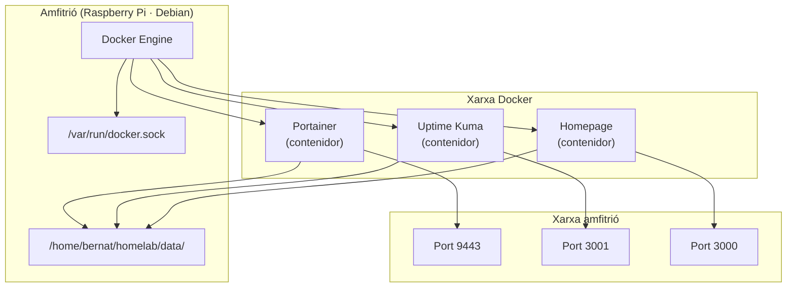

# Capítol 5 — Docker des de zero

> *"Docker no és una eina. Docker és una manera de pensar els serveis: cadascun en la seva caixa, tots parlant entre ells, cap contaminant l'altre."*

## 5.1 Què és Docker i per què serveix

Docker és una eina que ens permet executar aplicacions dins de **contenidors**: entorns aïllats, lleugers, portables, que contenen tot el que una aplicació necessita per funcionar. Un contenidor és, en essència, un **procés del sistema operatiu** que ve amb el seu propi sistema de fitxers, la seva pròpia interfície de xarxa i el seu propi cicle de vida — però sense portar un sistema operatiu sencer com ho faria una màquina virtual.

La diferència amb una màquina virtual és clau. Una VM emula un maquinari complet i executa un sistema operatiu sencer dins: pèrdues de rendiment evidents, consum de RAM important, arrencada lenta. Un contenidor comparteix el kernel de la màquina amfitriona (la nostra Raspberry) i només porta les biblioteques, configuracions i binaris que l'aplicació necessita. Com a resultat:

- Arrenca en segons, no en minuts.
- Consumeix pocs megabytes de RAM, no gigabytes.
- És totalment portable: un contenidor que funciona a la Raspberry, funcionarà a un servidor professional, al PC, a un núvol.

Docker ens permet tractar cada servei del BernatLab com una **unitat independent i autosuficient**. Portainer és un contenidor. Uptime Kuma és un altre. Homepage és un altre. Si un falla, els altres continuen funcionant. Si en volem actualitzar un, els altres ni se n'assabenten. Si volem moure'ns a un altre servidor, podem emportar-nos els contenidors com si fossin caixes de cartró ben etiquetades.

## 5.2 Conceptes fonamentals

Per entendre Docker, cal dominar quatre conceptes:

### Imatge

Una **imatge** Docker és un fitxer (o un conjunt de fitxers) que conté tot el necessari per executar un servei: el codi, les biblioteques, les configuracions per defecte, les dependències del sistema. Pensa en una imatge com una **plantilla de només lectura**: un motlle a partir del qual crearem contenidors.

Les imatges es distribueixen des de registres, el més conegut dels quals és **Docker Hub** ([hub.docker.com](https://hub.docker.com)). Quan fem `docker pull portainer/portainer-ce:latest`, estem dient: "descarrega la imatge oficial de Portainer, en la seva última versió".

Les imatges es construeixen amb un fitxer anomenat **Dockerfile**, que és una recepta: "comença amb una imatge base, instal·la aquestes dependències, copia aquest codi, exposa aquest port, executa aquesta ordre". Però al BernatLab no construirem imatges pròpies; usarem les que la comunitat ja ha publicat.

### Contenidor

Un **contenidor** és una instància viva d'una imatge. Si la imatge és la plantilla, el contenidor és la instància en execució. Podem tenir diversos contenidors de la mateixa imatge (per exemple, tres instàncies de Redis fent papers diferents) cadascun amb el seu propi estat.

Quan executem un contenidor, Docker hi assigna un identificador únic (un hash de 64 caràcters, encara que normalment en veiem només els 12 primers) i un nom aleatori (com `portainer-app-1` o `agitated_mclean`). Podem donar-li un nom nosaltres amb `--name`.

### Volum

Un **volum** és un emmagatzematge persistent, gestionat per Docker, que viu fora del sistema de fitxers del contenidor. Per què és important? Perquè els contenidors, per naturalesa, són **efímers**: quan els esborrem, tot el seu sistema de fitxers desapareix. Si el contenidor de Portainer té la seva configuració dins, i l'esborrem per accident, perdem la configuració. Per això, tot allò que volem conservar — bases de dades, configuracions, fitxers pujats — es munta en un volum.

Hi ha dos tipus de volums:

- **Volums anomenats** (named volumes): gestionats per Docker, amb noms com `portainer_data`. Es guarden a `/var/lib/docker/volumes/`.
- **Muntatges de bind** (bind mounts): apuntem a una carpeta concreta del sistema amfitrió, com `/home/bernat/homelab/data/portainer`. Al BernatLab farem servir aquesta segona opció, perquè ens permet tenir les dades dins de la nostra carpeta de treball, fàcil de copiar i versionar.

### Xarxa

Una **xarxa** Docker és un espai aïlat on els contenidors es poden comunicar entre ells pel nom. Per defecte, Docker crea una xarxa `bridge` que comunica tots els contenidors entre ells. Podem crear xarxes personalitzades per organitzar-los.

Això ens permet fer coses com: el contenidor de Uptime Kuma pot parlar amb el de Portainer pel nom `portainer`, sense necessitat d'IP ni de ports exposats a l'exterior.

## 5.3 Instal·lació i verificació

A Debian 13, Docker es pot instal·lar des dels repositoris oficials de Docker (no pas de Debian, perquè la versió empaquetada per Debian acostuma a ser antiga). La seqüència estàndard és:

```bash
# Eliminar versions antigues
sudo apt remove docker docker-engine docker.io containerd runc

# Afegir el repositori oficial
sudo apt install ca-certificates curl gnupg
sudo install -m 0755 -d /etc/apt/keyrings
curl -fsSL https://download.docker.com/linux/debian/gpg | sudo gpg --dearmor -o /etc/apt/keyrings/docker.gpg
echo "deb [arch=$(dpkg --print-architecture) signed-by=/etc/apt/keyrings/docker.gpg] https://download.docker.com/linux/debian $(. /etc/os-release && echo "$VERSION_CODENAME") stable" | sudo tee /etc/apt/sources.list.d/docker.list > /dev/null

# Instal·lar
sudo apt update
sudo apt install docker-ce docker-ce-cli containerd.io docker-buildx-plugin docker-compose-plugin

# Afegir l'usuari bernat al grup docker
sudo usermod -aG docker bernat
```

L'última ordre és fonamental: sense ella, només `root` pot executar ordres Docker. En afegir `bernat` al grup `docker`, podem fer `docker ps` sense `sudo`. Perquè el canvi tingui efecte, cal tancar i tornar a obrir la sessió SSH.

Per comprovar que tot funciona:

```bash
docker run hello-world
```

Aquesta ordre descarrega una imatge mínima, executa un contenidor que imprimeix un missatge de benvinguda, i surt. Si veiem el missatge, Docker està correctament instal·lat.

## 5.4 Ordres essencials

Aquestes són les ordres que farem servir cada dia. Convé memoritzar-les o, si més no, tenir-les a mà.

### Imatges

```bash
docker images                       # llista imatges locals
docker pull imatge:tag              # descarrega una imatge
docker rmi imatge                   # esborra una imatge
docker image prune                  # esborra imatges no usades
docker image prune -a               # esborra TOTES les imatges no usades
```

### Contenidors

```bash
docker ps                           # contenidors actius
docker ps -a                        # tots els contenidors (inclosos aturats)
docker run -d --name web nginx      # crea i arrenca un contenidor
docker start nom                    # arrenca un contenidor existent
docker stop nom                     # atura un contenidor
docker restart nom                  # reinicia
docker rm nom                       # esborra un contenidor aturat
docker rm -f nom                    # forçar esborrat
docker logs nom                     # mostra logs
docker logs -f nom                  # logs en directe
docker exec -it nom bash            # obre una consola dins del contenidor
docker stats                        # ús de recursos en temps real
```

### Volums

```bash
docker volume ls                    # llista volums
docker volume create nom            # crea un volum
docker volume rm nom                # esborra un volum
docker volume prune                 # esborra volums no usats
docker volume inspect nom           # info d'un volum
```

### Xarxes

```bash
docker network ls                   # llista xarxes
docker network create nom           # crea una xarxa
docker network rm nom               # esborra una xarxa
docker network inspect nom          # info d'una xarxa
```

### Sistema

```bash
docker system df                    # espai ocupat
docker system prune                 # neteja general
docker system prune -a --volumes    # neteja total (compte!)
docker info                         # informació del sistema Docker
```

## 5.5 Exemple pràctic: Nginx en un contenidor

Per veure-ho en acció, despleguem Nginx (un servidor web lleuger) en un contenidor. Això ens permetrà entendre tot el mecanisme sense complicacions:

```bash
docker run -d --name web -p 8080:80 nginx
```

Desglossant:

- `-d`: detached, en segon terme. Si no, la consola es queda penjada.
- `--name web`: li donem un nom.
- `-p 8080:80`: mapegem el port 80 del contenidor al port 8080 de la Raspberry.
- `nginx`: la imatge.

Ara podem obrir un navegador i anar a `http://100.x.y.z:8080`. Veurem la pàgina de benvinguda de Nginx.

Quan volguem netejar:

```bash
docker stop web
docker rm web
```

Ara, el mateix amb **persistencia** (volum) i **configuració**:

```bash
mkdir -p /home/bernat/homelab/data/nginx
docker run -d \
  --name web \
  -p 8080:80 \
  -v /home/bernat/homelab/data/nginx:/usr/share/nginx/html:ro \
  nginx
```

Amb `-v` hem muntat una carpeta local dins del contenidor, en mode només lectura (`ro`). Si creem un fitxer `index.html` a `/home/bernat/homelab/data/nginx/`, el Nginx el servirà. Si esborrem el contenidor, les dades continuen a la carpeta.

## 5.6 Per què Docker Compose i no docker run

Fins aquí hem vist `docker run`, que és perfectament vàlid per a un contenidor aïllat. Però al BernatLab tenim diversos serveis que volem gestionar junts, amb configuracions complexes, volums, xarxes, variables. Si els llancem un a un amb `docker run`, acabarem amb ordres llarguíssimes, impossibles de recordar, impossibles de reproduir.

**Docker Compose** ens permet descriure tot això en un sol fitxer `YAML`. Un cop definit, podem aixecar, parar, actualitzar tota la pila amb una sola ordre. I el fitxer YAML és **documentació en si mateix**: qualsevol que el llegeixi, sabrà exactament què s'està executant.

Exemple de fitxer `docker-compose.yml` per a Portainer:

```yaml
services:
  portainer:
    image: portainer/portainer-ce:latest
    container_name: portainer
    restart: unless-stopped
    ports:
      - "9443:9443"
    volumes:
      - /var/run/docker.sock:/var/run/docker.sock
      - /home/bernat/homelab/data/portainer:/data
```

Això és molt més llegible que la línia de `docker run` equivalent. I a mesura que afegim serveis, el fitxer creix ordenadament.

## 5.7 Docker Compose: estructura del fitxer

Un fitxer `docker-compose.yml` té tres seccions principals:

```yaml
version: "3.8"   # versió de l'esquema (opcional en versions modernes)

services:        # definició dels serveis (contenidors)
  servei1:
    image: ...
    ports: ...
    volumes: ...
    environment: ...
    restart: ...
    depends_on:
      - altre_servei

volumes:         # definició de volums (opcional)
  volum1:

networks:        # definició de xarxes personalitzades (opcional)
  xarxa1:
```

### Claus essencials per a cada servei

- **image**: quina imatge usar, amb tag opcional.
- **container_name**: nom del contenidor (opcional; per defecte, generat).
- **restart**: política de reinici. `unless-stopped` és la més comuna.
- **ports**: mapeig de ports `HOST:CONTENIDOR`.
- **volumes**: llista de volums o bind mounts.
- **environment**: variables d'entorn.
- **depends_on**: serveis dels quals depèn (ordre d'arrencada).
- **networks**: xarxes a les quals es connecta.

## 5.8 Ordres de Docker Compose

```bash
docker compose up -d              # aixeca tots els serveis
docker compose down               # atura i esborra contenidors
docker compose ps                 # llista serveis
docker compose logs servei        # logs d'un servei
docker compose logs -f            # logs en directe
docker compose restart servei     # reinicia un servei
docker compose pull               # descarrega noves imatges
docker compose up -d              # re- crea contenidors amb noves imatges
docker compose exec servei bash    # consola dins del contenidor
docker compose config             # valida el fitxer
```

Important: en versions modernes de Docker, l'ordre és `docker compose` (amb espai), no pas `docker-compose` (amb guió). La sintaxi antiga encara funciona si tenim l'eina instal·lada com a binari, però la nova és la recomanada.

## 5.9 Exemple complet: Portainer + Uptime Kuma + Homepage

Aquest és el fitxer `docker-compose.yml` que tenim al BernatLab. Serveix d'exemple del que podem arribar a fer:

```yaml
services:
  portainer:
    image: portainer/portainer-ce:latest
    container_name: portainer
    restart: unless-stopped
    ports:
      - "9443:9443"
    volumes:
      - /var/run/docker.sock:/var/run/docker.sock
      - /home/bernat/homelab/data/portainer:/data

  uptime-kuma:
    image: louislam/uptime-kuma:latest
    container_name: uptime-kuma
    restart: unless-stopped
    ports:
      - "3001:3001"
    volumes:
      - /home/bernat/homelab/data/uptime-kuma:/app/data

  homepage:
    image: ghcr.io/gethomepage/homepage:latest
    container_name: homepage
    restart: unless-stopped
    ports:
      - "3000:3000"
    environment:
      - HOMEPAGE_ALLOWED_HOSTS=gethomepage.local:3000
    volumes:
      - /var/run/docker.sock:/var/run/docker.sock:ro
      - /home/bernat/homelab/data/homepage:/app/config
      - /home/bernat/homelab/stacks/homepage:/app/config/widgets
```

Per aixecar tot això:

```bash
cd /home/bernat/homelab
docker compose up -d
```

I en qüestió de segons, els tres serveis estaran funcionant. Podem comprovar-ho amb `docker compose ps`.

## 5.10 Actualitzar contenidors

Una de les tasques habituals és mantenir els serveis actualitzats. El procediment estàndard és:

```bash
cd /home/bernat/homelab
docker compose pull              # descarrega noves versions
docker compose up -d             # re- crea els contenidors
docker image prune               # neteja imatges antigues
```

El `up -d` és intel·ligent: si la imatge ha canviat, Docker atura el contenidor antic, l'esborra i en crea un de nou amb la nova imatge. Si no ha canviat, no fa res.

Això es pot automatitzar amb **Watchtower** (un contenidor que vigila les actualitzacions) o amb **Diun** (que només avisa), o simplement amb un script al cron. Però abans d'automatitzar, fem-ho manualment unes quantes vegades per entendre què passa.

## 5.11 Volums i xarxes: com Docker els gestiona

Quan creem un contenidor amb un volum de bind mount, com `-v /home/bernat/homelab/data/portainer:/data`, el que fem és muntar una carpeta de l'amfitrió dins del contenidor. Els canvis que fem al contenidor es reflecteixen a l'amfitrió i viceversa. Si el contenidor s'esborra, la carpeta de l'amfitrió continua intacta.

Quan creem un contenidor amb un volum anomenat, com `-v portainer_data:/data`, Docker crea un directori a `/var/lib/docker/volumes/portainer_data/` i el munta dins del contenidor. La diferència pràctica: els volums anomenats són gestionats enterament per Docker, els bind mounts els gestionem nosaltres.

Al BernatLab, **preferim els bind mounts** perquè:

- Les dades són dins de la nostra carpeta de treball (`/home/bernat/homelab/data/`).
- Podem fer-ne còpies de seguretat amb eines normals (`tar`, `rsync`).
- Podem editar fitxers de configuració directament sense entrar al contenidor.
- Podem versionar les configuracions amb Git (els fitxers de configuració, no les dades binàries com bases de dades).

## 5.12 Xarxes Docker

Per defecte, tots els contenidors d'un `docker-compose.yml` es connecten a una xarxa interna que Docker crea automàticament. Aquesta xarxa permet que els contenidors es comuniquin entre ells pel **nom del servei** (no pas per IP).

Per exemple, al fitxer `docker-compose.yml` d'abans, el contenidor `uptime-kuma` podria parlar amb el `portainer` fent referència a `http://portainer:9443` des del seu interior, sense que el port 9443 estigui exposat a l'amfitrió. Això és útil per a serveis que volem que només siguin accessibles dins la xarxa Docker, no pas des de fora.

Podem definir xarxes personalitzades:

```yaml
networks:
  frontend:
  backend:

services:
  homepage:
    networks:
      - frontend
  portainer:
    networks:
      - backend
      - frontend
```

Això ens permet segmentar l'accés: Homepage pot parlar amb Portainer (a través de la xarxa frontend), però els altres serveis no.

## 5.13 El fitxer .env

Les variables d'entorn sovint contenen informació sensible: contrasenyes, tokens, claus. Per això, Docker Compose pot llegir variables d'un fitxer `.env` al mateix directori:

```env
TZ=Europe/Madrid
POSTGRES_PASSWORD=secret
INFLUXDB_TOKEN=elmeutoken
```

I al `docker-compose.yml` les referenciem amb `${POSTGRES_PASSWORD}`. Aquest fitxer **no s'ha de versionar amb Git** — l'afegim al `.gitignore` (Capítol 9).

## 5.14 Esquema conceptual



## 5.15 Errors habituals

**Error 1: executar contenidors com a root i no configurar-los bé**. Símptoma: el contenidor pot fer coses perilloses perquè té privilegis de root. Solució: usar sempre `restart: unless-stopped` i, quan calgui, opcions de seguretat com `read_only`, `cap_drop`, o executar com a usuari no root.

**Error 2: no persistir les dades**. Símptoma: en actualitzar o esborrar un contenidor, es perden les dades. Solució: SEMPRE usar volums o bind mounts per a dades importants.

**Error 3: mapejar massa ports a l'amfitrió**. Símptoma: la llista de serveis exposats creix, és difícil saber què és accessible i des de on. Solució: exposar només el que cal, mantenir la comunicació interna dins la xarxa Docker.

**Error 4: no mirar els logs quan alguna cosa falla**. Símptoma: contenidor que no arrenca, no sabem per què. Solució: `docker compose logs servei` o `docker logs nom`. El 90% dels errors es veuen als logs.

**Error 5: deixar contenidors antics consumint recursos**. Símptoma: el sistema va lent, el disc s'omple. Solució: `docker container prune`, `docker image prune`, `docker volume prune`. Compte amb els volums que continguin dades.

## 5.16 Bones pràctiques

1. **Usa sempre `docker compose`**, no pas `docker run` per a serveis que vagin més enllà d'una prova ràpida.
2. **Defineix un sol `docker-compose.yml`** per a tot el sistema, o divideix en piles (`stacks/`) per temàtica.
3. **Fes servir bind mounts** per a dades i configuracions a `/home/bernat/homelab/data/`.
4. **Usa fitxers `.env`** per a secrets, i no els versionis.
5. **Política `restart: unless-stopped`** per a tots els serveis que han d'estar sempre disponibles.
6. **Neteja periòdicament** amb `docker system prune`.
7. **Monitoritza** amb Uptime Kuma — que els contenidors no estiguin `running` no vol dir que estiguin funcionant correctament.

## 5.17 Resum

Hem après què és Docker, per què serveix, què són imatges, contenidors, volums i xarxes. Hem après les ordres essencials, hem vist per què `docker compose` és millor que `docker run` per a un homelab, i hem analitzat un `docker-compose.yml` complet del BernatLab. En el proper capítol veurem Portainer, la interfície web que ens permet gestionar tot això gràficament.

## 5.18 Exercicis pràctics

1. Comprova la versió de Docker: `docker --version`, `docker compose version`.
2. Llista les imatges locals: `docker images`.
3. Llista els contenidors actius: `docker ps` i `docker ps -a`.
4. Entra dins d'un contenidor: `docker exec -it uptime-kuma bash`. Mira què hi ha dins. Surt amb `exit`.
5. Mira els logs d'un servei: `docker compose logs homepage`.
6. Comprova l'ús de recursos: `docker stats` (executa durant 5 segons i prem `Ctrl+C`).
7. Crea una carpeta nova dins de `homelab/stacks/experiment/`, escriu-hi un `docker-compose.yml` amb un servidor Nginx i aixeca'l.
8. Fes `docker compose down` i comprova que el contenidor ha desaparegut.
9. Comprova l'espai ocupat per Docker: `docker system df`.

Comandes útils:
```bash
docker ps, docker ps -a
docker images, docker pull, docker rmi
docker logs, docker logs -f
docker exec -it nom bash
docker stats
docker volume ls, docker network ls
docker compose up -d, docker compose down
docker compose logs, docker compose pull
```

Paraules clau: **imatge, contenidor, volum, xarxa, port, bind mount, env, restart, docker compose, prune, persistència, portainer, uptime-kuma, homepage**.
