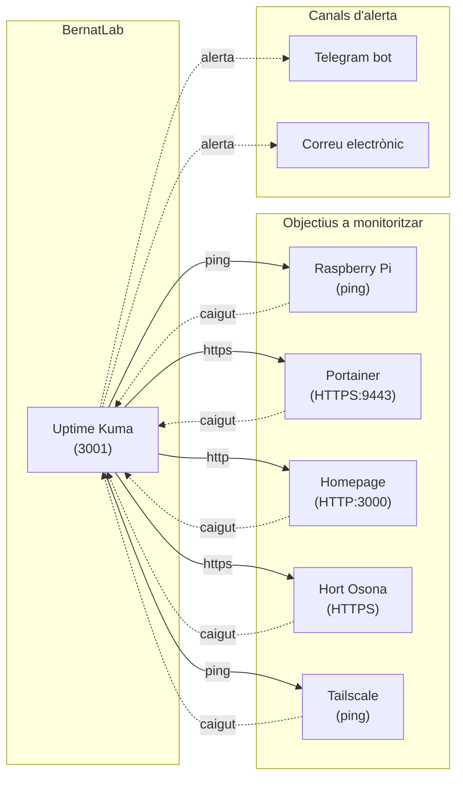

# Capítol 7 — Uptime Kuma

> *"Un servei que no saps si està caigut és un servei que ja està caigut. Però no t'has adonat."*

## 7.1 Què és Uptime Kuma

**Uptime Kuma** és una eina de **monitorització autoallotjada** de codi obert. La seva feina és, essencialment, fer comprovacions periòdiques sobre serveis que nosaltres definim i avisar-nos quan alguna cosa falla. Està escrita en Node.js, és lleugera, té una interfície neta, i és una de les millors opcions gratuïtes per a homelabs.

La paraula **uptime** en anglès vol dir "temps de funcionament". Un servei amb un uptime del 99,9% ha estat disponible el 99,9% del temps en un període determinat. Uptime Kuma ens ajuda a mesurar aquest número — i a millorar-lo, perquè ens avisa quan baixa.

Uptime Kuma va ser creada per Louis Cheung, un desenvolupador de Hong Kong, i publicada el 2021. Des de llavors, ha esdevingut l'estàndard de facto per a la monitorització autoallotjada, amb una comunitat activa i una quantitat enorme de funcionalitats.

## 7.2 Per què ens interessa

Al BernatLab tenim diversos serveis que volem que estiguin sempre disponibles: Portainer per gestionar, Uptime Kuma mateix (meta-monitorització), Homepage com a porta d'entrada, i — més endavant — la base de dades, Node-RED, l'API de sensors, etc. Sense monitorització, no sabríem si algun d'aquests serveis ha caigut fins que intentéssim accedir-hi i no poguéssim. I sovint, quan un usuari s'adona, ja fa estona que el servei no funciona.

Uptime Kuma ens permet:

- Saber en **temps real** l'estat de cada servei.
- Rebre **alertes** quan un servei cau o es recupera.
- Mesurar el **temps de resposta** dels serveis.
- Guardar un **historial** d'incidències.
- Generar una **pàgina pública d'estat** per a qui vulgui consultar-la.
- Rebre notificacions per **Telegram, correu, Discord, Slack, webhook**, etc.

## 7.3 Instal·lació al BernatLab

Uptime Kuma ja està instal·lat a `http://100.115.134.76:3001`. Vegem com està configurat.

### Definició al docker-compose.yml

```yaml
services:
  uptime-kuma:
    image: louislam/uptime-kuma:latest
    container_name: uptime-kuma
    restart: unless-stopped
    ports:
      - "3001:3001"
    volumes:
      - /home/bernat/homelab/data/uptime-kuma:/app/data
```

Aspectes a notar:

- La imatge `louislam/uptime-kuma:latest` és l'oficial.
- Muntem un bind mount a `/home/bernat/homelab/data/uptime-kuma` per persistir la configuració i l'historial.
- No exposem cap port intern — el 3001 és el port de Uptime Kuma i l'exposem a l'amfitrió.

### Primer accés

Quan entrem per primera vegada a `http://100.115.134.76:3001`, Uptime Kuma ens demana crear un compte d'administrador. Triarem una contrasenya forta. A partir d'aquí, totes les dades (usuaris, monitors, configuracions) es guarden a la base de dades interna del contenidor, que està al bind mount que hem definit.

## 7.4 Tipus de monitors

Uptime Kuma suporta una quantitat impressionant de tipus de monitor. Els que farem servir al BernatLab són:

### HTTP(s)

El tipus més comú. Uptime Kuma fa una petició HTTP/HTTPS a una URL i ens diu:

- Si la petició ha retingut resposta.
- El codi d'estat (200, 404, 500, etc.).
- El temps de resposta.
- El cos de la resposta (opcional).

Serveix per monitoritzar pàgines web, APIs, serveis que escolten HTTP. Per defecte, busca un codi 2xx com a èxit. Podem canviar-ho per acceptar només 200, o per acceptar qualsevol cosa menys 5xx.

### Ping

Uptime Kuma envia un ping ICMP a una adreça IP o nom de domini. Si rep resposta, el servei està viu. No ens diu res sobre el servei concret, només sobre la connectivitat. Serveix per monitoritzar màquines, dispositius de xarxa, o simplement comprovar que la Raspberry està en marxa.

### Port TCP

Uptime Kuma intenta obrir una connexió TCP a un port concret. Si la connexió s'obre amb èxit, el servei està escoltant. Serveix per monitoritzar serveis que no parlen HTTP (per exemple, una base de dades al port 5432, MQTT al 1883).

### DNS

Comprova que un nom de domini es resol correctament a una IP. Serveix per monitoritzar el DNS mateix o per alertar si un domini canvia d'IP.

### Certificat SSL/TLS

Comprova la validesa i expiració d'un certificat HTTPS. Ens pot avisar X dies abans que caduqui, la qual cosa és molt útil per a serveis amb certificats propis (no pas per a serveis darrere de Tailscale, que no exposen HTTPS directament).

### Paraula clau (Keyword)

Una variació del monitor HTTP: Uptime Kuma cerca una paraula concreta a la resposta. Si la troba, el servei està funcionant correctament; si no, alguna cosa va malament. Serveix per fer comprovacions més fines que el simple codi d'estat.

### Altres

Hi ha més tipus: **Docker container** (comprova si un contenidor concret està en marxa), **Steam Game Server**, **MQTT**, **SQL Server**, **Push** (per a monitors que es disparen des d'una font externa), **gRPC**, etc. Al BernatLab, els bàsics (HTTP i Ping) ens cobriran la majoria dels casos.

## 7.5 Configurar monitors al BernatLab

Vegem quins monitors hauríem de tenir configurats al BernatLab i quins valors posar.

### 1. La pròpia Raspberry (Ping)

- **Tipus**: Ping
- **Nom**: "Raspberry Pi (hortosona)"
- **Host**: `hortosona` (MagicDNS de Tailscale) o `100.115.134.76`
- **Interval**: 60 segons
- **Timeout**: 5 segons
- **Retries**: 3 (abans d'alertar)

Aquest monitor ens avisa si la Raspberry deixa de respondre a pings. Compte: si la Raspberry penja totalment, el monitor quedarà caigut però no podrem rebre l'alerta perquè el correu/Telegram depenen d'ella. En aquest cas, podem complementar amb un **monitor extern** (Uptime Kuma al núvol, o un servei com UptimeRobot) que ens avisi si la Tailscale IP deixa de respondre des de fora.

### 2. Portainer (HTTP)

- **Tipus**: HTTP(s)
- **Nom**: "Portainer"
- **URL**: `https://100.115.134.76:9443`
- **Interval**: 60 segons
- **Acceptar codis 2xx** (per defecte)

Això fa una petició HTTPS a Portainer. Compte: Uptime Kuma potser no validarà el certificat autosignat. Podem desactivar la validació SSL al monitor.

### 3. Uptime Kuma (HTTP)

- **Tipus**: HTTP(s)
- **Nom**: "Uptime Kuma (self)"
- **URL**: `http://100.115.134.76:3001`
- **Interval**: 60 segons

Meta-monitorització. Útil per confirmar que el sistema de monitorització funciona.

### 4. Homepage (HTTP)

- **Tipus**: HTTP(s)
- **Nom**: "Homepage"
- **URL**: `http://100.115.134.76:3000`
- **Interval**: 60 segons

### 5. Hort Osona (HTTP, web pública)

- **Tipus**: HTTP(s)
- **Nom**: "Hort Osona"
- **URL**: `https://bernatmora.github.io/hort-osona/`
- **Interval**: 300 segons (5 minuts, per no carregar GitHub Pages)
- **Acceptar codis 2xx**

Aquest monitor ens avisa si la web pública deixa de funcionar.

### 6. Tailscale (Ping extern)

- **Tipus**: Ping
- **Nom**: "Tailscale connectivity"
- **Host**: `100.115.134.76` o un nom de Tailscale
- **Interval**: 300 segons

Comprova que la xarxa Tailscale continua activa.

## 7.6 Configurar alertes

Aquí és on Uptime Kuma demostra la seva potència. Podem configurar notificacions per múltiples canals. Vegem com configurar **Telegram**, que és el canal que farem servir al BernatLab.

### Configurar un bot de Telegram

1. Parlem amb **@BotFather** a Telegram.
2. Li diem `/newbot` i seguim les instruccions: posem un nom i un nom d'usuari (que ha d'acabar en `bot`).
3. Rebem un **token** llarg, del tipus `123456789:ABCDefghIJKlmnoPQRsTUVwxyz`. **Guardem aquest token en lloc segur**.
4. Iniciem una conversa amb el nostre bot (li enviem qualsevol missatge).
5. Per obtenir el nostre **chat ID**, podem:
   - Usar @userinfobot, que ens el donarà.
   - O fer una petició a `https://api.telegram.org/bot<TOKEN>/getUpdates` i buscar l'ID al JSON retornat.

### Configurar la notificació a Uptime Kuma

A Uptime Kuma:

1. Anem a **Settings → Notifications**.
2. Cliquem **Setup Notification**.
3. Triem **Telegram**.
4. Omplim:
   - **Bot Token**: el token que hem rebut.
   - **Chat ID**: el nostre chat ID.
5. Cliquem **Test** per comprovar que funciona. Hauríem de rebre un missatge del bot.
6. Desem.

A partir d'ara, podem seleccionar aquesta notificació per a qualsevol monitor. Quan el monitor passi de "up" a "down", Uptime Kuma enviarà un missatge a Telegram. Quan torni a "up", rebré un altre missatge informant de la recuperació.

### Bones pràctiques amb alertes

- **No configurar alertes per a tot**. Si rebem 50 missatges al dia, deixarem de mirar-los. Configurem alertes només per als serveis crítics.
- **Definir el llindar de retries correcte**. Si un monitor fa 3 comprovacions i falla, podem configurar que ho faci 1 vegada abans d'alertar (per evitar falss positius).
- **Configurar finestres de manteniment**. Si sabem que anem a fer una aturada, podem silenciar les alertes temporalment.
- **Combinar canals**. Telegram per a alertes immediates, correu per a informes setmanals.

## 7.7 Pàgina d'estat pública

Uptime Kuma ens permet generar una **pàgina d'estat pública** on qualsevol pot veure l'estat dels nostres serveis, sense necessitat d'autenticació. És útil si volem:

- Compartir l'estat del BernatLab amb altres persones.
- Tenir una pàgina pública del tipus `status.bernatlab.cat` (en el futur, quan tinguem un domini).

Per activar-la, anem a **Settings → Status Page**, creem una pàgina nova, afegim els monitors que volem que siguin visibles, i obtenim una URL pública.

A la pràctica, al BernatLab, podem crear una pàgina d'estat interna per al nostre ús, sense fer-la pública a Internet.

## 7.8 Manteniment i actualitzacions

Uptime Kuma evoluciona activament. Per mantenir-lo actualitzat:

```bash
cd /home/bernat/homelab
docker compose pull uptime-kuma
docker compose up -d uptime-kuma
```

Les actualitzacions solen ser suaus i no trenquen la configuració. De tota manera, és bona pràctica fer una còpia de seguretat abans:

```bash
tar czf ~/homelab/backup/uptime-kuma-$(date +%F).tar.gz \
  ~/homelab/data/uptime-kuma
```

## 7.9 Comprendre les estadístiques

Uptime Kuma ens dóna molta informació útil:

- **Uptime %**: percentatge de temps que el servei ha estat disponible. Es calcula sobre una finestra mòbil (per defecte, els últims 90 dies).
- **Avg. response time**: temps de resposta mitjà.
- **Cert exp**: data d'expiració del certificat SSL.
- **Historial**: línia de temps amb pujades, baixades, incidents.

Aquesta informació és valuosa per:

- Detectar serveis que es degraden lentament.
- Planificar capacitats (si els temps de resposta pugen, potser el sistema va saturat).
- Demostrar estabilitat (per exemple, davant d'un proveïdor de núvol).

## 7.10 Exemple d'incident: què fer

Imagineu que Uptime Kuma ens avisa per Telegram: "Portainer is down". Què fem?

1. **Comprovar**: el missatge és correcte? És un fals positiu? Esperem un parell de minuts a veure si es recupera sol.
2. **Mirar logs**: `docker logs portainer` o `docker compose logs portainer`. Sovint el problema és obvi.
3. **Reiniciar**: `docker compose restart portainer`. Soluciona el 80% dels casos.
4. **Si no es recupera**: accedir a Portainer via... oh, espera, Portainer és el que falla. Cal entrar per SSH directament.
5. **Escalar**: mirar Uptime Kuma, mirar la càrrega del sistema amb `htop`, mirar l'espai de disc amb `df -h`.
6. **Documentar**: un cop resolt, escriure al CHANGELOG què ha passat i per què.

Aquesta és la rutina de resposta a incidents. No cal ser expert, només cal seguir els passos amb calma.

## 7.11 Esquema de monitorització



## 7.12 Errors habituals

**Error 1: configurar alertes per a tot**. Símptoma: rebem tants missatges que els ignorem. Solució: només alertes per a serveis crítics, i combinar amb finestres silenciades.

**Error 2: no configurar retries**. Símptoma: rebem alertes falses per pèrdues puntuals de xarxa. Solució: configurar `retries: 3` o més, perquè el servei hagi de fallar diverses vegades consecutives abans d'alertar.

**Error 3: monitoritzar serveis que depenen d'altres serveis**. Símptoma: quan un servei cau, molts monitors entren en alerta alhora. Solució: estructurar bé els monitors, acceptar que algunes dependències són inevitables.

**Error 4: no guardar l'historial**. Símptoma: volem veure què va passar fa dues setmanes i Uptime Kuma ja ho ha esborrat. Solució: augmentar la finestra d'historial, o exportar periòdicament.

## 7.13 Resum

Uptime Kuma és el cor de la monitorització del BernatLab. Ens permet veure en temps real l'estat dels nostres serveis, rebre alertes quan alguna cosa falla, i mesurar el temps de resposta. Combinat amb Telegram, ens dóna un sistema d'alertes eficaç i lleuger. En el proper capítol veurem Homepage, el panell d'entrada al BernatLab.

## 7.14 Exercicis pràctics

1. Entra a `http://100.115.134.76:3001` i revisa la configuració dels monitors.
2. Comprova quin és l'uptime de cada monitor.
3. Crea un nou monitor de tipus Ping per a una adreça IP externa, com `1.1.1.1`.
4. Configura una alerta per Telegram (si no la tens configurada).
5. Fes una prova: atura un dels contenidors amb `docker stop portainer`, espera un parell de minuts, comprova que Uptime Kuma ha detectat la caiguda, rep l'alerta a Telegram, i reinicia el contenidor.
6. Mira l'historial d'un monitor i compta quantes vegades ha estat caigut en els últims 30 dies.

Comandes útils:
```bash
docker logs uptime-kuma
docker compose restart uptime-kuma
docker compose pull uptime-kuma
```

Paraules clau: **monitorització, uptime, ping, HTTP, HTTPS, certificat SSL, Telegram, alerta, retries, status page, fallada, temps de resposta**.
