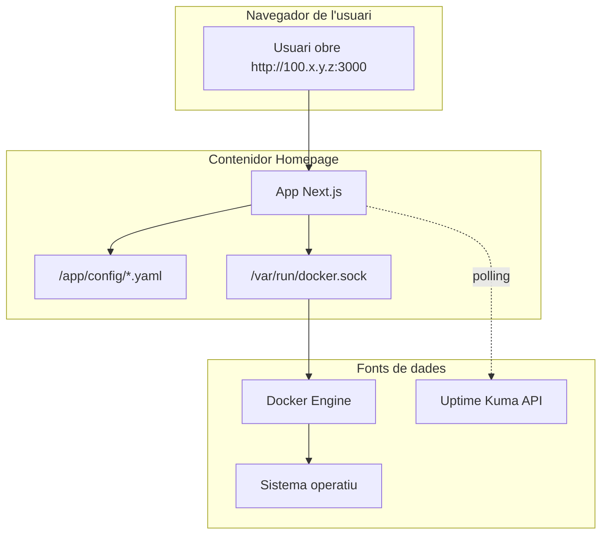

# Capítol 8 — Homepage

> *"Quan algú entra al BernatLab, el primer que ha de veure és ordre. Homepage és el porter que dóna la benvinguda."*

## 8.1 Què és Homepage

**Homepage** és una aplicació web moderna, escrita en Next.js, que ens permet crear un **panell d'entrada** personalitzat per al nostre servidor. La pàgina mostra una graella de targetes, cadascuna de les quals és un enllaç directe a un dels nostres serveis. A més, pot incloure **widgets** que mostren informació en temps real: ús de CPU, memòria, temperatura, estat dels contenidors, estadístiques diverses.

Homepage va ser creada per iurylab, un desenvolupador europeu, i publicada el 2022. Des de llavors, s'ha convertit en una de les aplicacions d'autoallotjament més populars, amb milers d'estrelles a GitHub, una comunitat activa, i una documentació excel·lent.

La gràcia de Homepage és la seva **configuració totalment basada en fitxers YAML**. No hi ha base de dades externa, no hi ha interfície d'administració web: tot es configura editant fitxers, que viuen dins del contenidor (o al bind mount que hem definit). Això pot semblar poc amigable al principi, però en realitat és una virtut: podem versionar la configuració amb Git, podem replicar-la en una altra màquina, podem entendre exactament què està passant.

## 8.2 Per què l'utilitzem al BernatLab

Al BernatLab tenim, avui, tres serveis principals: Portainer, Uptime Kuma i Homepage mateix. Més endavant, tindrem Grafana, InfluxDB, Node-RED, File Browser, una base de dades, l'API de sensors, etc. Si entrem al servidor per la IP Tailscale, què trobem?

Sense Homepage, hauríem de recordar totes les adreces i ports: `https://100.x.y.z:9443` per a Portainer, `http://100.x.y.z:3001` per a Uptime Kuma, etc. Un malson.

Amb Homepage, posem `http://100.x.y.z:3000` i veiem una pàgina maca amb totes les targetes organitzades. Un clic, i entrem al servei. A més, podem veure d'un cop d'ull quin servei està caigut, quina temperatura té la CPU, quanta RAM queda.

Homepage és, per tant, la **porta d'entrada visual** al BernatLab. També és un bon lloc per mostrar el sistema a visites (o a un mateix, per fer-se'n una foto mental).

## 8.3 Instal·lació al BernatLab

Homepage ja està instal·lat a `http://100.x.y.z:3000`. Vegem com està configurat.

### Definició al docker-compose.yml

```yaml
services:
  homepage:
    image: ghcr.io/gethomepage/homepage:latest
    container_name: homepage
    restart: unless-stopped
    ports:
      - "3000:3000"
    environment:
      - HOMEPAGE_ALLOWED_HOSTS=gethomepage.local:3000
    volumes:
      - /var/run/docker.sock:/var/run/docker.sock:ro
      - /home/bernat/homelab/data/homepage:/app/config
      - /home/bernat/homelab/stacks/homepage:/app/config/widgets
```

Detalls importants:

- **Imatge**: `ghcr.io/gethomepage/homepage:latest`. Compte: la imatge oficial NO és a Docker Hub, sinó a GitHub Container Registry. Si busquem a Docker Hub, trobarem imatges no oficials que poden estar desactualitzades.
- **Port 3000**: el port estàndard de Homepage.
- **Variable HOMEPAGE_ALLOWED_HOSTS**: explicada més avall.
- **Tres volums**:
  - `/var/run/docker.sock`: per accedir a la informació de Docker (contenidors, volums, etc.).
  - `/home/bernat/homelab/data/homepage`: on viuen els fitxers de configuració principals.
  - `/home/bernat/homelab/stacks/homepage`: on posarem els fitxers dels widgets personalitzats.

## 8.4 El socket de Docker: per què és tan important

Un dels aspectes clau de Homepage és que pot mostrar informació sobre els nostres **contenidors en temps real**: si estan corrent, quina CPU consumeixen, etc. Per fer-ho, necessita accedir al socket de Docker de l'amfitrió.

El socket és un fitxer especial a `/var/run/docker.sock` que Docker exposa com a API. Quan muntem aquest fitxer dins del contenidor de Homepage (amb la línia `/var/run/docker.sock:/var/run/docker.sock:ro`), estem donant a Homepage permisos per **llegir** l'estat de Docker. La `ro` (read-only) és important: així Homepage només pot veure, no pas canviar coses.

Això és molt poderós, però també és un risc potencial. Si algú entrés a Homepage amb intencions malicioses, podria obtenir informació detallada sobre el sistema. Per això:

- Muntem el socket en mode només lectura.
- Mantenim Homepage en una xarxa privada (Tailscale).
- Estem atents a actualitzacions de seguretat.

## 8.5 HOMEPAGE_ALLOWED_HOSTS: el host validation

Aquesta és una de les configuracions més importants i menys enteses de Homepage. La variable `HOMEPAGE_ALLOWED_HOSTS` indica a quins **noms de host** o adreces pot servir la interfície Homepage.

Per què existeix? Per defecte, Next.js (el framework sobre el qual corre Homepage) bloqueja les peticions que arriben amb un `Host` header que no coincideix amb cap dels seus hosts coneguts. Això és una **mesura de seguretat** per evitar atacs de tipus **host header injection**.

Al BernatLab, hem configurat:

```
HOMEPAGE_ALLOWED_HOSTS=gethomepage.local:3000
```

Això vol dir que si entrem a Homepage amb l'URL `http://gethomepage.local:3000`, funcionarà. Si entrem amb una altra URL, com `http://100.x.y.z:3000`, rebré un error 400 de Next.js: "Invalid host header".

Hi ha dues solucions possibles:

1. **Configurar DNS perquè `gethomepage.local` apunti a la IP de la Raspberry**. Això es pot fer afegint una entrada al DNS local, o simplement al fitxer `hosts` de la nostra màquina client.
2. **Modificar HOMEPAGE_ALLOWED_HOSTS per permetre múltiples hosts**. Per exemple:
   ```
   HOMEPAGE_ALLOWED_HOSTS=gethomepage.local:3000,100.x.y.z:3000,hortosona:3000
   ```

Al BernatLab, segon la documentació oficial, la manera correcta és:

```
HOMEPAGE_ALLOWED_HOSTS=gethomepage.local:3000,100.x.y.z:3000
```

Així podem accedir tant per la IP Tailscale com pel nom `gethomepage.local` (si tenim el DNS configurat).

També podem posar `*` per permetre tots els hosts, però això és menys segur:

```
HOMEPAGE_ALLOWED_HOSTS=*
```

A la pràctica, al BernatLab, si veiem l'error "Invalid host header", sabem que hem de revisar aquesta variable.

## 8.6 L'estructura de configuració

La configuració de Homepage viu a `/home/bernat/homelab/data/homepage` (el bind mount). Dins hi trobem:

```
/home/bernat/homelab/data/homepage/
├── settings.yaml          # configuració general (tema, fons, etc.)
├── bookmarks.yaml         # enllaços externs
├── services.yaml          # definició dels serveis
├── widgets/               # configuració dels widgets
│   ├── resources.yaml     # CPU, RAM, etc.
│   ├── docker.yaml        # estat dels contenidors
│   ├── uptime.yaml        # integració amb Uptime Kuma
│   └── ...
└── ...
```

Quan editem un fitxer, els canvis s'apliquen automàticament — Homepage llegeix els fitxers cada pocs segons i actualitza la interfície.

### settings.yaml: configuració general

```yaml
title: BernatLab
background:
  opacity: 50
  blur: sm
  saturate: 100
  brightness: 50
  image: https://images.unsplash.com/...
theme: dark
color: slate
headerStyle: boxed
```

Aquest fitxer controla el títol de la pàgina, el fons (podem posar una imatge, un color sòlid, o un degradat), el tema (clar/fosc), el color d'accent, l'estil de la capçalera.

### services.yaml: la llista de serveis

```yaml
---
- Gestió:
    - Portainer:
        href: https://100.x.y.z:9443
        description: Gestió Docker
        icon: portainer
        siteMonitor: http://100.x.y.z:9443

    - Homepage:
        href: http://100.x.y.z:3000
        description: Aquesta pàgina
        icon: homepage
        siteMonitor: http://100.x.y.z:3000

- Monitorització:
    - Uptime Kuma:
        href: http://100.x.y.z:3001
        description: Monitoratge de serveis
        icon: uptimekuma
        siteMonitor: http://100.x.y.z:3001

    - Hort Osona:
        href: https://bernatmora.github.io/hort-osona/
        description: Projecte hort familiar
        icon: hortosona
        siteMonitor: https://bernatmora.github.io/hort-osona/
```

La sintaxi és simple:

- Cada entrada és un **grup** (per exemple, "Gestió", "Monitorització").
- Dins de cada grup, hi ha **serveis**, cadascun amb:
  - **Nom**: el que es mostra a la targeta.
  - **href**: l'enllaç.
  - **description**: una descripció breu.
  - **icon**: la icona. Pot ser el nom d'un icon pack predefinit (com `portainer`, `uptimekuma`) o una URL externa.
  - **siteMonitor**: si volem que la targeta mostri l'estat del servei (integració amb Uptime Kuma o ping).

## 8.7 Widgets: informació en temps real

A més de les targetes, Homepage pot mostrar **widgets** que aporten informació dinàmica. Hi ha molts widgets disponibles:

### Widget de recursos del sistema

Mostra CPU, memòria, disc, xarxa del sistema amfitrió. Es connecta al socket de Docker per obtenir les dades.

```yaml
# widgets/resources.yaml
resources:
  cpu: true
  memory: true
  disk: /
  network: true
  uptime: true
  temperature: true
  load: 5
```

Això ens mostra una secció amb l'ús actual de recursos, molt útil d'un cop d'ull.

### Widget de Docker

Mostra l'estat dels contenidors: quins estan corrent, quins aturats, quins han caigut.

```yaml
# widgets/docker.yaml
docker:
  server:
    socket: /var/run/docker.sock
    containers:
      onlyAvailable: true
```

### Widget d'Uptime Kuma

Integra l'estat dels monitors d'Uptime Kuma directament a Homepage. Per configurar-lo:

1. A Uptime Kuma, creem una **Status Page** pública.
2. A Homepage, configurem el widget amb l'URL d'aquesta pàgina.

Això ens permet veure a Homepage, sense canviar de pestanya, l'estat dels nostres serveis.

## 8.8 Personalització

Homepage és altament personalitzable. Algunes idees:

- **Títol personalitzat**: "BernatLab — el meu servidor".
- **Fons**: una foto de l'hort, una imatge de la Raspberry, un degradat subtil.
- **Icones personalitzades**: podem pujar les nostres icones (PNG, SVG) i referenciar-les per URL.
- **Bookmarks**: enllaços externs que volem tenir a mà (documentació de Docker, fòrums, etc.).
- **Widgets personalitzats**: podem escriure'ls nosaltres si tenim coneixements de JavaScript.

## 8.9 Integració amb altres serveis

Homepage es pot integrar amb molts serveis. Algunes integracions útils per al BernatLab:

- **Uptime Kuma**: ja l'hem vist.
- **Sonarr, Radarr, Plex, Jellyfin**: per a la gestió de continguts multimèdia.
- **Pi-hole**: per a la gestió de DNS i bloqueig d'anuncis.
- **Pihole, AdGuard Home**: per a DNS.
- **Nextcloud**: per a emmagatzematge al núvol.
- **Jellyseerr**: per a gestió de peticions multimèdia.

Tots aquests serveis tenen integracions preconfigurades o exemples a la documentació de Homepage.

## 8.10 Manuals de referència i resolució de problemes

Quan alguna cosa falla a Homepage, hi ha tres llocs on mirar:

1. **Logs del contenidor**: `docker logs homepage` o `docker compose logs homepage`. Aquí veurem errors d'inici, problemes de permisos amb el socket, errors de configuració.
2. **Documentació oficial**: [gethomepage.dev](https://gethomepage.dev). Molt completa, amb exemples de tots els widgets i serveis.
3. **GitHub Issues**: [github.com/gethomepage/homepage](https://github.com/gethomepage/homepage/issues). Sovint trobem algú que ha tingut el mateix problema.

Problemes habituals:

- **"Invalid host header"**: hem de revisar `HOMEPAGE_ALLOWED_HOSTS`.
- **El socket de Docker no funciona**: cal revisar que estigui muntat correctament al `docker-compose.yml`.
- **Les icones no apareixen**: el nom de la icona no és correcte, o la URL no és accessible.
- **Els canvis no s'apliquen**: cal esperar uns segons, o forçar un refresh (`Ctrl+Shift+R`).

## 8.11 Esquema conceptual



## 8.12 Errors habituals

**Error 1: "Invalid host header"**. Símptoma: la pàgina no carrega i veiem un error 400. Solució: afegir la IP/host a `HOMEPAGE_ALLOWED_HOSTS`.

**Error 2: icones que no apareixen**. Símptoma: les targetes es mostren sense icona, o amb una icona per defecte. Solució: revisar que el nom de la icona és correcte a la llista de icones suportades.

**Error 3: widgets buits**. Símptoma: la secció de widgets no mostra dades. Solució: comprovar els logs, revisar que el socket de Docker estigui muntat.

**Error 4: canvis que no s'apliquen**. Símptoma: editem un fitxer YAML, refresquem, i res canvia. Solució: validar la sintaxi YAML (un espai mal posat pot fer-ho fallar), esperar uns segons, refrescar forçadament.

## 8.13 Bones pràctiques

1. **Configurar `HOMEPAGE_ALLOWED_HOSTS` correctament** des del primer moment.
2. **Versionar la configuració** amb Git (la carpeta `data/homepage` conté només fitxers de configuració, ideals per a Git).
3. **Usar el socket de Docker en mode només lectura** (`ro`).
4. **Triar icones consistents**. Barrejar molts estils queda malament.
5. **Documentar els serveis** amb descripcions clares, per si algú altre ha d'entendre què fa cadascun.
6. **Fer còpies de seguretat** periòdiques de la carpeta de configuració.

## 8.14 Resum

Homepage és la porta d'entrada visual al BernatLab. Ens permet organitzar tots els nostres serveis en una sola pàgina, amb informació en temps real. La configuració és totalment basada en fitxers, cosa que ens permet versionar-la amb Git. El socket de Docker, en mode lectura, ens permet accedir a informació dels contenidors. `HOMEPAGE_ALLOWED_HOSTS` és una de les variables clau per evitar errors. En el proper capítol veurem com versionar tota aquesta feina amb Git i com mantenir una bona documentació.

## 8.15 Exercicis pràctics

1. Entra a `http://100.x.y.z:3000` i observa la configuració actual.
2. Mira el fitxer `services.yaml` dins de `/home/bernat/homelab/data/homepage/`. Quants grups té? Quants serveis?
3. Comprova la variable `HOMEPAGE_ALLOWED_HOSTS` amb `docker inspect homepage | grep -A 5 Env`. Què hi ha?
4. Afegeix un servei nou a `services.yaml` (per exemple, un enllaç a la documentació de Docker). Refresca la pàgina. Hauries de veure la nova targeta.
5. Mira els logs de Homepage: `docker logs homepage --tail 20`. Hi ha algun error?
6. Mira el widget de recursos del sistema. Quina és la temperatura actual? Quanta RAM s'està usant?
7. Si tens Docker socket, comprova que el widget Docker funciona i mostra els teus contenidors.

Comandes útils:
```bash
docker logs homepage
docker inspect homepage
ls /home/bernat/homelab/data/homepage/
ls /home/bernat/homelab/data/homepage/widgets/
nano /home/bernat/homelab/data/homepage/services.yaml
```

Paraules clau: **Homepage, panell, targetes, widgets, YAML, socket Docker, read-only, HOMEPAGE_ALLOWED_HOSTS, host validation, status page, integració, configuració**.
