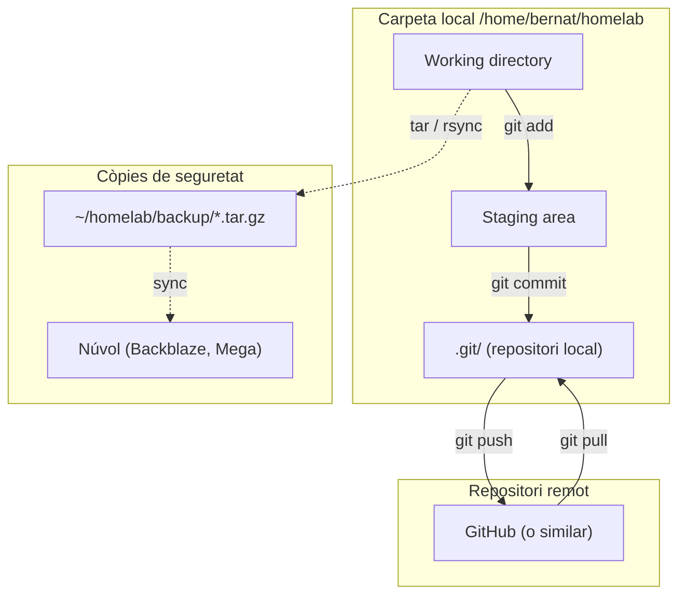

# Capítol 9 — Git i documentació

> *"Un servidor sense documentació és un misteri. Un servidor amb Git és una història."*

## 9.1 Per què versionar la configuració

Al BernatLab tenim una quantitat creixent de configuració: fitxers `docker-compose.yml`, configuracions de serveis, scripts, documentació, decisions preses. Sense un sistema de control de versions, aquesta informació viu escampada: en fitxers, en missatges, en notes al mòbil, en la memòria. I quan arriba el moment de recordar per què vam prendre una decisió fa tres mesos, o de recuperar un fitxer que hem esborrat per error, no podem.

**Git** és el sistema de control de versions estàndard de la indústria. El fan servir des de projectes petits fins a Linux, passant per Microsoft, Google, Meta i qualsevol empresa tecnològica que puguis imaginar. És robust, distribuït (cada còpia és completa), gratuït, i molt ben documentat.

Al BernatLab, el farem servir per:

1. **Versionar la configuració** dels nostres serveis: tots els fitxers `docker-compose.yml`, configuracions YAML, scripts.
2. **Tenir un historial de canvis**: qui ha canviat què, quan, i per què.
3. **Recuperar versions anteriors**: si una actualització trenca alguna cosa, podem tornar enrere.
4. **Documentar**: els missatges de commit són una mena de diari del sistema.
5. **Treballar des de diverses màquines**: podem clonar el repositori des del PC, fer-hi canvis, i fer push quan estiguin validats.

## 9.2 Què versionar i què no

Abans de posar res a Git, cal tenir clar què hi va i què no:

### SÍ versionar

- `docker-compose.yml` i tots els fitxers relacionats.
- Configuracions de serveis (YAML, JSON, TOML, etc.) que estiguin a `/home/bernat/homelab/data/*/config/...`.
- Scripts de manteniment.
- `README.md`, `CHANGELOG.md`, documentació.
- `.gitignore`, `.gitattributes`.
- Plantilles de configuració (per exemple, `config.example.yaml`).

### NO versionar

- **Secrets**: contrasenyes, tokens, claus privades. Això va a `.env`, que s'afegeix al `.gitignore`.
- **Dades binàries grans**: bases de dades SQLite, còpies de seguretat, fitxers multimèdia. Això va a `/home/bernat/homelab/data/` però NO a Git.
- **Caches i logs**: són regenerables.
- **Configuracions personalitzades** que canvien a cada màquina: fitxers amb IPs locals, noms d'usuari específics, etc.

La regla pràctica: **versionem la configuració, no les dades**.

## 9.3 Inicialitzar el repositori

Entrem a la carpeta de treball i inicialitzem un repositori Git:

```bash
cd /home/bernat/homelab
git init
```

Això crea una carpeta `.git/` amagada amb tota la infraestructura de versionat. A partir d'ara, Git començarà a seguir els canvis dels fitxers dins d'aquesta carpeta.

Comprovem l'estat:

```bash
git status
```

Ens mostrarà una llista de fitxers "untracked" — fitxers que encara no estan sota control de versions.

## 9.4 El fitxer .gitignore

Aquest és un dels fitxers més importants. Li diu a Git quins fitxers o patrons **ignorar** — no versionar, ni tan sols mostrar. La sintaxi és simple, un patró per línia:

```gitignore
# Secrets
.env
*.env
!.env.example

# Dades
data/
backup/
*.db
*.sqlite
*.sqlite3

# Logs
*.log
logs/

# Configuració local
.vscode/
.idea/
*.swp
.DS_Store

# Build artifacts
node_modules/
__pycache__/
*.pyc

# Caches
.cache/
```

Cal crear aquest fitxer **abans** de fer el primer commit. Si no, podem acabar versionant fitxers sensibles sense adonar-nos-en.

Al BernatLab, el `.gitignore` recomanat és:

```gitignore
# Secrets
.env
.env.*
!.env.example

# Dades
data/
backup/

# Logs
*.log

# Editor
.vscode/
*.swp

# OS
.DS_Store
Thumbs.db
```

Això ignora `.env`, totes les dades, els logs, i les configuracions locals d'editor. L'única cosa que es versiona són els fitxers de configuració i la documentació.

## 9.5 Primer commit

Ara podem afegir els fitxers al repositori:

```bash
git add .
git status
```

Això prepara tots els fitxers (excepte els ignorats) per al commit. `git status` ens hauria de mostrar una llista del que s'afegirà.

Si tot és correcte, fem el primer commit:

```bash
git commit -m "Configuració inicial del BernatLab"
```

El missatge de commit ha de ser clar i descriptiu. Aquest és el primer missatge, i marca l'inici de la història del projecte.

## 9.6 Estratègia de branques

Per a un homelab personal, la complexitat de les branques no cal que sigui gran. Hi ha dues estratègies raonables:

### Opció A: una sola branca (main)

Tot va a `main`. Fem commits regulars, endavant. Si volem provar alguna cosa arriscada, podem crear una branca temporal, experimentar, i tornar a `main`. Però la majoria de canvis són petits i no justifiquen una branca.

### Opció B: main + dev

Una branca principal (`main`) que sempre ha de funcionar, i una branca `dev` on anem acumulant canvis abans de validar-los. Quan estem segurs que tot funciona a `dev`, fusionem a `main`. Això ens dóna una mica més de seguretat.

Al BernatLab, **una sola branca és suficient**. La regla és: només fem commit quan els canvis funcionen. Si un canvi és arriscat, el fem servir per aprendre, i quan funciona, fem commit.

## 9.7 Flux de treball diari

El dia a dia amb Git al BernatLab segueix aquest patró:

```bash
# 1. Fer canvis (editar fitxers, crear-ne, esborrar-ne)
nano /home/bernat/homelab/data/homepage/services.yaml

# 2. Veure què ha canviat
git status
git diff

# 3. Afegir els canvis
git add .

# 4. Fer commit amb un missatge clar
git commit -m "Afegeix targeta Grafana a Homepage"

# 5. Tornar a la vida normal
```

Aquest patró el repetirem cada vegada que fem un canvi. Si treballem des del PC amb SSH, podem fer els canvis des de qualsevol lloc.

## 9.8 Missatges de commit clars

El missatge de commit és la **documentació del canvi**. Val la pena dedicar-hi un moment. Bones pràctiques:

- **Primera línia curta** (50-72 caràcters), en present, que resumeixi el canvi.
- **Línia en blanc**.
- **Cos del missatge** (opcional) amb més detalls.

Exemples bons:

```
Afegeix monitorització de Tailscale a Uptime Kuma

Afegeix un monitor de tipus ping a 100.115.134.76 amb
interval de 5 minuts. Si Tailscale deixa de funcionar,
rebrarem una alerta per Telegram.
```

Exemples dolents:

```
canvis
wip
probe coses
```

Un bon missatge de commit és or quan, al cap de tres mesos, volem entendre per què vam canviar aquella línia de configuració.

## 9.9 El fitxer README.md

A l'arrel de `/home/bernat/homelab/`, el `README.md` és la **porta d'entrada** al projecte. Ha d'explicar:

- Què és el BernatLab.
- Com està organitzat.
- Com començar (clonar, instal·lar, configurar).
- Enllaços a la documentació (aquest manual, la carpeta `docs/`).

Un bon `README.md` té aquesta estructura:

```markdown
# BernatLab

[Descripció breu]

## Estructura

[Llista de carpetes principals]

## Com començar

1. Requisits
2. Instal·lació
3. Configuració

## Documentació

[Enllaços a altres documents]

## Contacte

[Com trobar-me]
```

## 9.10 El fitxer CHANGELOG.md

Mentre que el `README.md` explica **què és** el projecte, el `CHANGELOG.md` explica **què ha canviat** al llarg del temps. És un registre cronològic.

```markdown
# CHANGELOG — BernatLab

## 2026-07-08
- Afegit monitor de Tailscale a Uptime Kuma
- Canviat fons de Homepage
- Actualitzat Portainer a 2.21.0

## 2026-07-01
- Versió inicial amb Portainer, Uptime Kuma, Homepage
```

Aquest fitxer el mantenim a mà. No cal que sigui perfecte, només que reflecteixi els canvis importants.

## 9.11 Còpies de seguretat

Versionar amb Git ens dóna seguretat davant d'errors humans, però **no ens protegeix** de fallades de maquinari. Si la targeta microSD mor, perdem el `.git/` i, amb ell, tota la història.

Per això, al BernatLab tenim una política de **còpies de seguretat periòdiques**:

### Què copiem

- Tota la carpeta `/home/bernat/homelab/` (configuració + dades + .git).
- Bases de dades d'Uptime Kuma, Grafana, etc.
- La carpeta `/home/bernat/homelab/backup/` allotja les còpies.

### On copiem

Tres opcions:

1. **Un altre disc de la mateixa Raspberry** (per exemple, un SSD USB muntat a `/mnt/backup/`).
2. **Un altre ordinador de la xarxa** (per exemple, el PC, amb `rsync` o `scp`).
3. **Un servei al núvol** (Backblaze B2, Mega.nz, un repositori Git privat a GitHub).

La millor opció és una combinació: còpies locals ràpides + còpies al núvol periòdiques.

### Com copiem

Un script senzill:

```bash
#!/bin/bash
# /home/bernat/homelab/scripts/backup.sh

DATA=$(date +%F)
DEST="/home/bernat/homelab/backup"

# Comprimir tota la carpeta homelab
tar czf $DEST/homelab-$DATA.tar.gz \
  -C /home/bernat \
  homelab \
  --exclude='homelab/backup/*.tar.gz' \
  --exclude='homelab/data/*/.git'

# Mantenir només les últimes 7 còpies
ls -t $DEST/homelab-*.tar.gz | tail -n +8 | xargs -r rm
```

Podem programar aquest script amb `cron` o systemd timers perquè s'executi diàriament, per exemple.

### Restauració

Si hem de restaurar:

```bash
# Aturar serveis
cd /home/bernat/homelab
docker compose down

# Restaurar des de la còpia
tar xzf backup/homelab-2026-07-08.tar.gz -C /home/bernat

# Tornar a aixecar serveis
docker compose up -d
```

Aquesta és la operativa bàsica de recuperació de desastres. Sovint no cal restaurar-ho tot; n'hi ha prou amb un fitxer de configuració concret.

## 9.12 GitHub: el repositori remot

Per a una capa extra de seguretat i per poder treballar des del PC, podem **pujar el repositori a GitHub** (o a un altre servei similar: GitLab, Codeberg, Gitea autoallotjat).

```bash
# Crear un repositori nou a GitHub (sense README ni .gitignore, ja els tenim)
# Aleshores:

cd /home/bernat/homelab
git remote add origin git@github.com:bernatmora/bernatlab.git
git branch -M main
git push -u origin main
```

A partir d'ara, podem fer `git push` per pujar canvis i `git pull` per baixar-los des d'una altra màquina.

Per a informació sensible, podem fer servir **repositoris privats**. El pla gratuït de GitHub permet repositoris privats il·limitats.

## 9.13 Treballar des del PC

Si volem editar fitxers de configuració des del PC, podem clonar el repositori i treballar-hi:

```bash
# Al PC
git clone git@github.com:bernatmora/bernatlab.git
cd bernatlab

# Fer canvis amb el nostre editor preferit
nano services.yaml

# Pujar canvis
git add .
git commit -m "Canvia el fons de Homepage"
git push

# Aplicar els canvis a la Raspberry
ssh bernat@hortosona
cd /home/bernat/homelab
git pull
```

Aquest patró és molt poderós: ens permet treballar des d'un entorn còmode (el nostre PC, amb un editor potent), validar els canvis visualment, i només aplicar-los a la Raspberry quan estiguem segurs.

Alternativament, podem editar directament a la Raspberry per SSH, usant `nano` o un altre editor. Per a canvis petits, això és més ràpid. Per a canvis grans, treballar des del PC és més còmode.

## 9.14 Bones pràctiques

1. **Fer commits sovint**, amb missatges clars.
2. **Mai no versionar secrets**. Usar `.env` i `.gitignore`.
3. **Documentar al `README.md` i al `CHANGELOG.md`**.
4. **Fer còpies de seguretat periòdiques** de tota la carpeta.
5. **Pujar a un remot** (GitHub, GitLab) per seguretat addicional.
6. **Revisar abans de fer commit**: `git status` i `git diff` són els nostres amics.
7. **Mantenir la història neta**: podem fer `git rebase` per reorganitzar commits locals abans de pujar-los.

## 9.15 Esquema del versionat



## 9.16 Errors habituals

**Error 1: versionar secrets per accident**. Símptoma: pugem un `.env` amb contrasenyes a GitHub. Solució: configurar `.gitignore` des del primer moment; usar `git secret` o solucions equivalents per a informació crítica.

**Error 2: fer commits amb missatges buits o inútils**. Símptoma: la història és il·legible. Solució: dedicar 30 segons a escriure un bon missatge.

**Error 3: oblidar fer `git pull` abans d'editar**. Símptoma: conflictes quan intentem fer push. Solució: sempre `git pull` abans d'editar.

**Error 4: no fer còpies de seguretat**. Símptoma: quan la microSD mor, perdem tot. Solució: backup periòdic, idealment al núvol.

**Error 5: editar fitxers de dades directament**. Símptoma: canvis que es perden en actualitzar un contenidor. Solució: editar fitxers de configuració, no pas dades binàries.

## 9.17 Resum

Git ens permet tenir un historial complet i versionat de la configuració del BernatLab, amb seguretat davant d'errors i la possibilitat de treballar des de múltiples màquines. Combinat amb bones pràctiques de `.gitignore`, fitxers `README.md` i `CHANGELOG.md`, i còpies de seguretat periòdiques, tenim un sistema robust i fàcil de mantenir. En el proper i últim capítol d'aquest mòdul, veurem què vindrà al BernatLab: la full de ruta dels pròxims mesos.

## 9.18 Exercicis pràctics

1. Entra a `/home/bernat/homelab` i comprova si ja hi ha un repositori Git (`ls -la .git`).
2. Si no n'hi ha, inicialitza'l: `git init`.
3. Crea un fitxer `.gitignore` adequat per a la carpeta.
4. Fes el primer commit: `git add . && git commit -m "Configuració inicial"`.
5. Crea un `README.md` i un `CHANGELOG.md` a l'arrel.
6. Prova de fer una modificació: edita un fitxer, fes `git status`, veu els canvis amb `git diff`, i fés commit.
7. Crea un script de backup a `scripts/backup.sh` i programa'l amb `cron`.
8. Si tens compte a GitHub, puja el repositori.

Comandes útils:
```bash
git init, git status, git add, git commit
git log, git diff
git push, git pull
git clone
git remote add origin URL
```

Paraules clau: **Git, control de versions, .gitignore, README.md, CHANGELOG.md, còpia de seguretat, rsync, tar, GitHub, repositori, commit, push, pull, homelab**.
