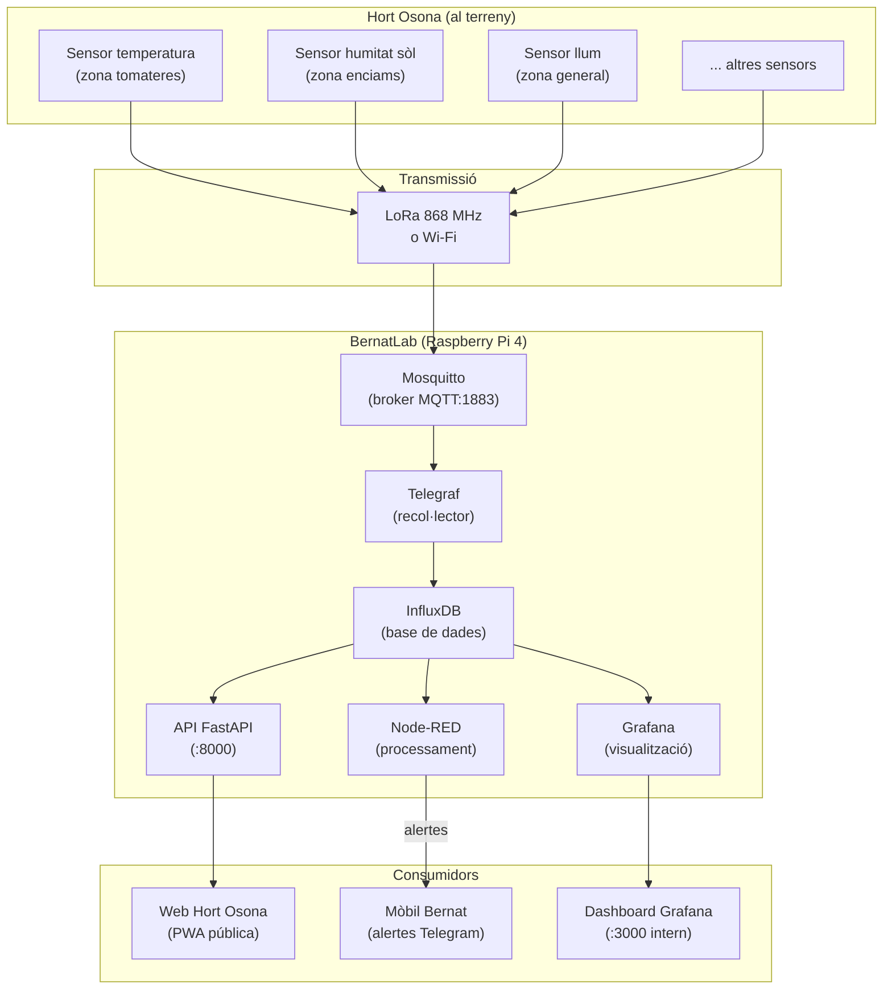
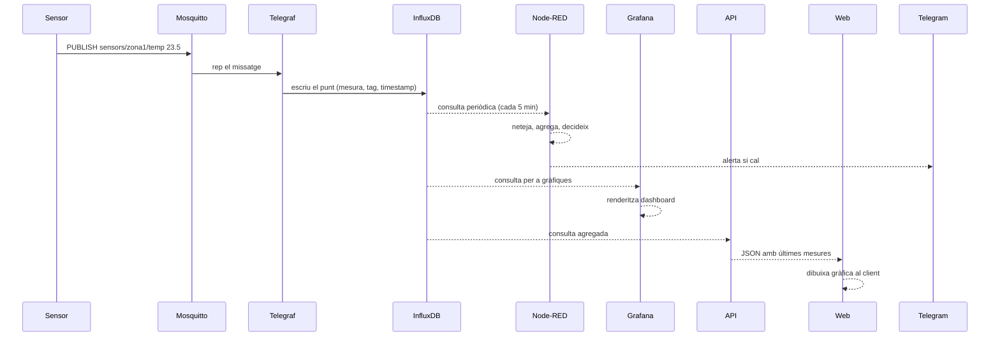

# Capítol 11 — Del Mòdul 1 al M2: què construïm

> *"Quan un homelab comença a fer coses útils, deixa de ser un joguina i es converteix en una eina. Aquest mòdul és el pas d'una cosa a l'altra."*

## 11.1 On érem

Al final del Mòdul 1 teníem:

- Un servidor Raspberry Pi 4 que funciona 24/7.
- Tailscale, que ens permet accedir-hi des de qualsevol lloc.
- Portainer, Uptime Kuma, Homepage com a serveis principals.
- Una estructura de carpetes clara a `/home/bernat/homelab/`.
- Un sistema de documentació i versionat amb Git.
- Una full de ruta amb deu o quinze idees pendents.

Però el sistema, ara com ara, **no fa res productiu**. Vigila els seus propis serveis, ensenya un panell bonic, i poca cosa més. Això és perfecte per aprendre, però arriba un punt en què volem que la màquina treballi per a nosaltres, no pas que només existeixi.

Aquest mòdul és el punt d'inflexió. A partir d'ara, cada peça que afegim al BernatLab tindrà una finalitat concreta dins del projecte Hort Osona: rebre dades de sensors, guardar-les, transformar-les, visualitzar-les, alertar-nos, i finalment servir-les a una web pública que qualsevol pugui consultar.

## 11.2 Què és Hort Osona

Hort Osona és un projecte personal que combina agricultura familiar amb monitorització electrònica. La idea és senzilla: a 245 metres de casa hi ha un hort amb tomaqueres, enciams, pebrots, herbes aromàtiques i fruiters. Volem saber, en temps real o quasi-real:

- La temperatura ambient i la humitat relativa.
- La temperatura del sòl a diferents profunditats.
- La humitat del sòl a diferents zones de l'hort.
- La il·luminació (per saber si les plantes tenen prou llum).
- Potser, en el futur, la pluja acumulada, la velocitat del vent, la radiació solar.

Aquestes dades han de servir per:

- **Decidir quan regar**. Si la humitat del sòl baixa del 30%, és hora de regar.
- **Detectar gelades**. Si la temperatura ambient baixa de 2 °C a la nit, volem una alerta immediata al mòbil.
- **Avaluar l'evolució de la temporada**. Comparar la temperatura mitjana del juny d'enguany amb la del juny de l'any passat.
- **Documentar l'experiment**. Tenir un registre històric de com ha anat cada cultiu.
- **Compartir el projecte**. La web pública Hort Osona permet que altres persones interessades en l'hort urbà vegin què estem fent.

## 11.3 Per què una cadena completa

Podríem fer les coses de manera més simple: connectar els sensors directament a una base de dades, fer una web que hi connecti, i llest. Però al llarg dels anys, la indústria ha après que per a projectes IoT reals, hi ha una cadena d'eines que funciona millor que les alternatives:

- **MQTT** per rebre dades: protocol lleuger, dissenyat per a xarxes inestables i dispositius de baix consum.
- **InfluxDB** per guardar-les: base de dades optimitzada per a sèries temporals, molt més eficient que una base de dades relacional per a aquest cas.
- **Telegraf** per moure-les: agent lleuger que recull dades de moltes fonts i les escriu a molts destins.
- **Node-RED** per transformar-les: eina visual que ens permet netejar, agregar i reaccionar a les dades sense escriure codi complicat.
- **Grafana** per visualitzar-les: l'eina de gràfiques més potent del món del codi obert.
- **API REST** per servir-les: perquè la web pública les pugui consumir sense accedir directament a la base de dades.

Cadascuna d'aquestes peces fa una sola cosa i la fa bé. Combinades, formen un sistema modular: podem canviar una peça sense tocar les altres, podem entendre cada peça per separat, podem créixer gradualment.

## 11.4 Arquitectura del sistema

Aquí tenim el diagrama general del que construirem en aquest mòdul:



Aquesta arquitectura té moltes virtuts. Vegem-les:

1. **Separació de responsabilitats**. Cada component té un paper clar. Si un falla, els altres poden continuar treballant (amb degradació).
2. **Escalabilitat**. Si volem afegir més sensors, només cal que parlin MQTT i el sistema els acull sense canvis.
3. **Observabilitat**. Grafana ensenya l'estat del sistema; Uptime Kuma vigila que estigui tot dret; els logs de cada servei expliquen què ha passat.
4. **Testabilitat**. Podem simular sensors publicant amb `mosquitto_pub` i veure com es comporta tot el sistema sense tenir el hardware al camp.
5. **Independència del transport**. Avui els sensors poden parlar per Wi-Fi; demà per LoRa; passat demà per 4G. Mentre parlin MQTT, el sistema els acull.

## 11.5 Què aprendrem en aquest mòdul

En capítols posteriors, aprendrem a:

- **Capítol 12**: entendre el protocol MQTT a fons, des dels conceptes fins a les particularitats que el fan ideal per a IoT.
- **Capítol 13**: instal·lar i configurar Mosquitto al BernatLab, amb autenticació, ACLs i un esquema de topics clar.
- **Capítol 14**: dissenyar l'esquema de publicació dels sensors, amb exemples de codi Python i, opcionalment, C++ per a microcontroladors.
- **Capítol 15**: instal·lar InfluxDB 2.x, entendre els seus conceptes (orgs, buckets, tokens, series) i practicar el llenguatge de consultes Flux.
- **Capítol 16**: configurar Telegraf per rebre dades de MQTT i escriure-les a InfluxDB de forma eficient.
- **Capítol 17**: instal·lar Node-RED i entendre com es programa visualment.
- **Capítol 18**: veure fluxos reals: netejar dades, agregar, detectar anomalies, enviar alertes a Telegram.
- **Capítol 19**: instal·lar Grafana, connectar-lo a InfluxDB, crear dashboards útils, configurar alertes visuals.
- **Capítol 20**: construir una API REST amb FastAPI que serveixi les dades a la web pública, amb autenticació, documentació OpenAPI i bones pràctiques.
- **Capítol 21**: modificar la web Hort Osona perquè consumeixi l'API i mostri gràfiques en temps real (o quasi-real).
- **Capítol 22**: tot el que envolta el sistema un cop està en marxa: còpies de seguretat d'InfluxDB, retenció, alerting avançat, quan caldrà pujar de hardware.

## 11.6 Què NO farem en aquest mòdul

Igual d'important que la llista de coses que farem és la llista de coses que no farem (encara):

- **LoRa SX1262 en detall**. Això serà el **Mòdul 3**, perquè la part de ràdio té massa detalls per tractar-los de passada. Aquí, però, ja preveurem que la cadena de dades és compatible amb sensors LoRa, deixant la interfície MQTT com a punt d'entrada.
- **IA local amb Ollama i RAG sobre les dades**. Això serà el **Mòdul 4**, quan tinguem prou dades per entrenar res útil i la Raspberry estigui en marxa amb prou solvència.
- **Balanceig de càrrega, alta disponibilitat, Kubernetes**. No tenim dues Raspberry i no les tindrem. Com al Mòdul 1, acceptem que el sistema pot caure i ens preparem per recuperar-lo.
- **Criptografia avançada, TLS per a MQTT, certificats propis**. En el Mòdul 1 ja vam comentar que la xarxa Tailscale ja xifra tot el tràfic, de manera que afegir TLS a MQTT seria redundar. Si mai traiem el servidor de Tailscale, caldria reconsiderar.

## 11.7 Requisits previs

Per treure profit d'aquest mòdul, has de tenir:

- El Mòdul 1 complet i el BernatLab funcionant.
- Coneixements bàsics de Docker i Docker Compose.
- Coneixements bàsics de Python (per als capítols 14 i 20).
- Paciència: configurar tota aquesta cadena porta dies, no hores.

També has de tenir clar que **la Raspberry Pi 4 encara no ha arribat** (juliol 2026). Això vol dir que tot el que es descriu en aquest mòdul s'ha preparat per fer-se tan bon punt la màquina estigui disponible, però no s'ha pogut provar amb el sistema en producció. Les configuracions s'han validat conceptualment, comparant-les amb la documentació oficial i amb exemples de la comunitat. Quan la RPi arribi, serà el moment d'ajustar els detalls que inevitablement caldrà ajustar (ports, IPs, volums, etc.).

Això, però, no ens ha d'aturar. Aprendre la teoria ara, quan la màquina no hi és, ens permetrà fer les coses més de pressa i amb més criteri quan sí que hi sigui.

## 11.8 Estat de cada component abans de començar

Fem un repàs de quin és l'estat previst de cada eina al començar aquest mòdul:

| Component | Estat inicial | El que farem |
|---|---|---|
| Mosquitto | No instal·lat | Instal·lar, configurar, securitzar |
| InfluxDB | No instal·lat | Instal·lar, crear org i bucket, definir retenció |
| Telegraf | No instal·lat | Instal·lar, configurar inputs i outputs |
| Node-RED | No instal·lat | Instal·lar, configurar paleta MQTT i InfluxDB |
| Grafana | No instal·lat | Instal·lar, connectar a InfluxDB, primer dashboard |
| API FastAPI | No instal·lat | Desenvolupar, dockeritzar, documentar |
| Web Hort Osona | Versió actual a GitHub Pages | Modificar per consumir l'API |

Això és el "to-do list" d'aquest mòdul. Al final, haurem afegit **sis serveis nous** al BernatLab i haurem modificat la web pública.

## 11.9 Com afecta al BernatLab

A nivell pràctic, afegir aquesta cadena implica:

- **Més contenidors Docker**. Passarem de 3 serveis principals a 9 o 10.
- **Més consum de RAM**. InfluxDB i Grafana, especialment, mengen RAM. Hauríem d'estar atents als 4 GB totals.
- **Més volums de dades**. InfluxDB pot créixer ràpidament si no controlem la retenció.
- **Més complexitat operacional**. Cadascun d'aquests serveis té la seva pròpia configuració, els seus propis logs, les seves pròpies alertes.
- **Més valor real**. Per contra, tindrem un sistema que ens avisa quan l'hort es gel·la, ensenya gràfiques boniques, i comparteix informació amb el món.

L'arquitectura triada és **la més comuna a la indústria** per a sistemes IoT petits i mitjans. Si mai cal migrar a una plataforma professional (AWS IoT, Azure IoT Hub, Google Cloud IoT), el coneixement serà directament transferible.

## 11.10 Filosofia d'aquest mòdul

Com al Mòdul 1, ens regim per uns quants principis:

1. **Construir pas a pas**. Afegirem un servei, l'entendrem, el configurarem, el validarem, i només després passarem al següent.
2. **Provar sense hardware**. Durant el desenvolupament, simularem sensors amb `mosquitto_pub` i petits scripts Python. Això ens permet avançar sense dependre del terreny.
3. **Documentar cada decisió**. Cada configuració, cada error, cada solució, va al `CHANGELOG.md` del BernatLab.
4. **Mesurar constantment**. Uptime Kuma vigila que els serveis estiguin vius. Grafana ens dirà quantes dades entren, quantes en surten, quantes es perden.
5. **No obsessionar-se amb la perfecció**. Un sistema que funciona al 80 % durant un any és millor que un sistema que funciona al 100 % durant una setmana i després s'abandona perquè era massa complicat de mantenir.

## 11.11 Esquema de la cadena



Aquesta seqüència és el que passa des que el sensor fa una lectura fins que la gràfica apareix a la web. Pot trigar des d'un segon (si tot va bé) fins a uns quants minuts (si hi ha cua o problemes de xarxa). Aquest retard és acceptable per al nostre cas: no estem controlant una central nuclear, estem mirant tomateres.

## 11.12 Resum

En aquest capítol hem vist què construirem en els pròxims dotze capítols: la cadena completa que porta les dades des dels sensors de l'hort fins a la pantalla del mòbil i la web pública. Hem après per què cada eina és necessària, com es connecten entre elles, quin és l'estat inicial i quin serà el final. Hem recordat que la Raspberry encara no ha arribat i que tot el que es descriu està preparat per implementar tan bon punt estigui disponible. En el proper capítol començarem pel primer element de la cadena: el protocol MQTT.

## 11.13 Exercicis pràctics

1. Fes una llista dels components que tens al BernatLab ara i compara-la amb la que tindràs al final d'aquest mòdul.
2. Dibuixa, a mà, el diagrama de la secció 11.4, amb els teus propis noms per als components.
3. Inventa un cas d'ús nou: una cosa que no sigui Hort Osona, que podries monitorar amb aquesta cadena. Explica-ho en cinc línies.
4. Mira el `docker-compose.yml` actual del BernatLab. Quants serveis té? Quanta RAM consumeixen en total? Tens prou recursos per afegir-ne sis més?
5. Obre Grafana o una eina equivalent i mira els gràfics de l'ús de recursos de la teva màquina actual. Anota els valors en repòs i sota càrrega, si pots.

Comandes útils:
```bash
docker ps
docker stats --no-stream
free -h
df -h
```

Paraules clau: **arquitectura, MQTT, InfluxDB, Telegraf, Node-RED, Grafana, API, Hort Osona, cadena IoT, sensors, sèries temporals, full de ruta, Mòdul 2, Mòdul 3, Mòdul 4, Tailscale**.
