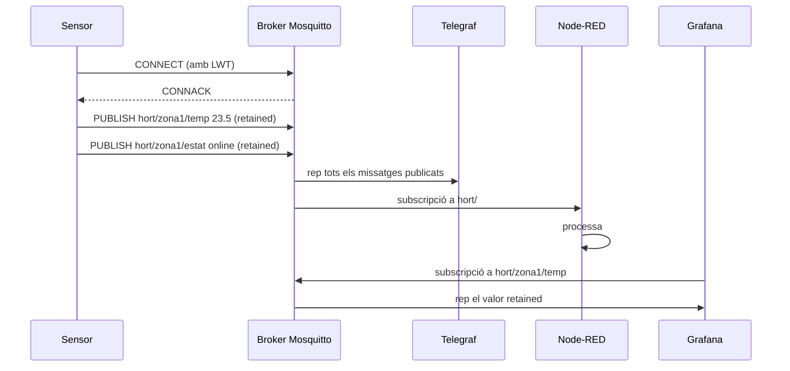

# Capítol 12 — MQTT des de zero

> *"MQTT és la mena de tecnologia que, un cop l'entens, et sembla òbvia. Abans, sembla màgia."*

## 12.1 Per què MQTT i no HTTP

Si volem que un sensor enviï dades a un servidor, la solució més immediata seria fer una petició HTTP. Un sensor connectat a la Wi-Fi, fent un `POST` a una URL, amb les dades en format JSON. Això funciona, i molts sistemes petits ho fan servir. Però per a sistemes amb molts sensors, durant molt de temps, en xarxes poc fiables, MQTT és molt millor. Vegem per què.

### HTTP: el model de petició-resposta

HTTP està dissenyat per al patró "un client demana, un servidor respon". Cada interacció és independent: el client obre una connexió, envia la petició, rep la resposta, tanca. Si volem que el sensor envii dades periòdicament, el sensor ha de:

1. Obrir una connexió TCP (o reutilitzar-ne una).
2. Enviar una petició HTTP.
3. Esperar la resposta.
4. Tancar la connexió.
5. Tornar a començar d'aquí 30 segons.

Això és car en termes d'energia, ample de banda, i complexitat. Per a un sensor que ha de funcionar amb piles durant mesos, és inviable.

### MQTT: el model de publicació-subscripció

MQTT (Message Queuing Telemetry Transport) va ser inventat el 1999 per Andy Stanford-Clark (IBM) i Arlen Nipper (Eurotech). L'objectiu era clar: un protocol que permeti a sensors amb poca energia, poca capacitat de càlcul i connexions intermitents enviar dades a un servidor de manera eficient.

MQTT funciona amb un model de **publicació-subscripció** (pub/sub):

- Hi ha un **broker** central, que és un programa que rep tots els missatges i els distribueix.
- Hi ha **publishers** (publicadors), que envien missatges amb un **topic** (tema).
- Hi ha **subscribers** (subscriptors), que diuen al broker "vull rebre tots els missatges amb aquest patró de topic".

La gràcia és que **els publicadors i els subscriptors no es coneixen entre ells**. El sensor que publica la temperatura no sap qui l'escolta. Pot ser cap, pot ser un, poden ser mil. Això fa el sistema molt flexible.

### Comparació pràctica

| Característica | HTTP | MQTT |
|---|---|---|
| Model | Petició-resposta | Publicació-subscripció |
| Connexió | Nova per a cada petició (o Keep-Alive) | Persistent, sempre oberta |
| Quantitat de dades en una transmissió | Centenars de bytes (capçaleres HTTP) | 2-100 bytes |
| Consum d'energia | Alt | Molt baix |
| Latència | Variable | Molt baixa |
| Fiabilitat | Depèn del codi de l'aplicació | QoS configurable |
| Ús típic | Pàgines web, APIs REST | IoT, missatgeria, telemetria |

Per a un sensor de temperatura que envia una lectura cada 5 minuts, MQTT és com un cartutx de diana: precís, econòmic, fiable.

## 12.2 Conceptes fonamentals

### El broker

El **broker** és el cor del sistema MQTT. És un programa que escolta en un port TCP (per defecte, 1883 per a MQTT sense xifrar, 8883 per a MQTT sobre TLS) i que rep, distribueix i desa missatges segons les regles que rep dels clients.

Al BernatLab farem servir **Mosquitto**, el broker de referència de la comunitat de codi obert. El coneixerem a fons al Capítol 13.

### Els clients

Un **client** MQTT és qualsevol programa que es connecta al broker. Pot ser:

- Un sensor que publica dades (publisher).
- Un consumidor de dades (subscriber).
- Tots dos alhora.

Els clients poden ser:

- Aplicacions en un llenguatge qualsevol (Python, JavaScript, Go, C++, etc.).
- Dispositius encastats (ESP32, ESP8266, Arduino amb Wi-Fi, Raspberry Pi Pico W).
- Altres brokers (per connectar dos brokers entre ells, el que s'anomena "bridge").

### Els topics

Un **topic** és una cadena de text organitzada jeràrquicament amb barres (`/`) com a separadors. Exemples:

```
sensors/hort/zona-tomateres/temperatura
sensors/hort/zona-enciams/humitat-solo
actuadors/hort/reg/zona-1
casa/temp/sala
```

Els topics no cal que estiguin predefinits. El broker els accepta tots. El que importa és que tots els participants del sistema segueixin el mateix esquema.

### Wildcards

Quan un client vol subscriure's a molts topics, pot fer servir **wildcards**:

- **`+`**: un sol nivell. Per exemple, `sensors/+/temperatura` selecciona tots els sensors de temperatura independentment de la zona.
- **`#`**: múltiples nivells (ha d'estar al final). Per exemple, `sensors/#` selecciona tot el que comenci per `sensors/`.

Els wildcards només serveixen per subscriure's, mai per publicar.

### QoS (Quality of Service)

MQTT defineix tres nivells de qualitat de servei:

- **QoS 0 — "at most once"**. El broker fa el que pot per entregar el missatge, però si alguna cosa falla, el missatge es perd. És el mode més eficient. Adequat per a dades que es renoven constantment (temperatura actual: si en perdem una, la següent ja la substitueix).
- **QoS 1 — "at least once"**. El broker garanteix que el missatge arriba almenys un cop. Pot arribar duplicat. Adequat per a dades que no es poden perdre, com ara una comanda d'actuador.
- **QoS 2 — "exactly once"**. El broker garanteix que el missatge arriba exactament un cop. És el mode més car, però l'únic que garanteix la univocitat.

Per a sensors de temperatura o humitat, **QoS 0** és perfectament adequat. Per a comandes d'actuadors (obrir una vàlvula de reg), **QoS 1 o 2** són convenients.

### Retained messages

Un **retained message** és un missatge que el broker desa i l'entrega immediatament a qualsevol subscriptor nou. Pensa en això: si subscrius un client a `sensors/zona1/temperatura` i mai s'ha publicat res, el client no rebrà res. Però si el darrer missatge publicat s'ha marcat com a "retained", el client el rebrà immediatament en connectar-se.

Això és útil per a l'últim valor conegut d'un sensor. No cal esperar el proper cicle de publicació per tenir-ne dades.

### Last Will and Testament (LWT)

Quan un client es connecta al broker, pot registrar un **testament**: un missatge que el broker publicarà automàticament quan detecti que el client s'ha desconnectat de manera no esperada (per exemple, perquè s'ha quedat sense bateria).

Això ens permet saber, sense haver de fer pings constantment, si un sensor ha mort. Patró típic: el sensor es connecta, registra el seu testament a `sensors/zona1/status` amb valor `online`, i quan es desconnecta, el broker publica automàticament `offline` al mateix topic.

### Clean session

Quan un client es connecta, pot especificar si vol una **clean session** o no:

- **Clean session = true**: el broker no desa cap estat del client. Si es desconnecta, quan torni, no rebrà cap missatge que s'hagi publicat durant la seva absència.
- **Clean session = false**: el broker desa les subscripcions i els missatges pendents. Quan el client torni, rebrà tot el que s'hagi publicat durant la seva absència (segons QoS).

Per a sensors que es desconnecten sovint (per estalviar energia), **clean session = true** és el normal.

## 12.3 Anatomia d'un missatge MQTT

Un missatge MQTT és molt senzill. Consta de:

- **Topic**: la cadena que identifica el tema.
- **Payload**: les dades (pot ser text, números, JSON, binari).
- **QoS**: el nivell de servei desitjat.
- **Retain**: si és un retained message o no.
- **Packet ID**: identificador intern (per a QoS > 0).

Exemple d'un missatge publicat amb `mosquitto_pub`:

```bash
mosquitto_pub -h broker.local -t sensors/zona1/temperatura \
  -m '{"valor": 23.5, "unitat": "graus", "ts": 1717823400}' \
  -q 0 -r
```

Aquí estem publicant:

- Al topic `sensors/zona1/temperatura`.
- Amb un payload JSON de 60 bytes aproximadament.
- Amb QoS 0.
- Marcat com a retained (`-r`).

Això és tot. La simplicitat és el que fa MQTT tan eficient.

## 12.4 Seguretat: autenticació i xifrat

MQTT en la seva forma més bàsica és **obert**: qualsevol pot subscriure's o publicar a qualsevol topic. Això, evidentment, no és acceptable per a un sistema en producció.

MQTT suporta:

- **Autenticació per usuari i contrasenya**. El client envia un nom d'usuari i una contrasenya en connectar-se. El broker els valida i accepta o rebutja la connexió.
- **Xifrat TLS/SSL**. Tot el tràfic viatja xifrat, com en HTTPS. Això és important si el broker està exposat a una xarxa que no controlem.
- **Control d'accés (ACL)**. El broker pot tenir una llista que diu quin usuari pot subscriure's o publicar a quin topic. Per exemple, el sensor `temp-zona1` pot publicar a `sensors/zona1/#` però no a `sensors/zona2/#`.

Al BernatLab, **no activarem TLS per a MQTT perquè la xarxa Tailscale ja xifra tot el tràfic**. Això ens estalvia la complexitat de gestionar certificats. Si mai traiem el servidor de Tailscale, caldria reconsiderar.

Sí que activarem **autenticació i ACLs**, que són la base de la seguretat lògica: cada sensor té el seu usuari i només pot parlar dels seus topics.

## 12.5 Com es comparen les adreces i els topics

Una analogia útil: els topics MQTT són com les adreces de correu electrònic, però jeràrquiques i sense registre central. Pots inventar-te un topic nou en qualsevol moment i el broker l'acceptarà. La convenció és seguir un esquema consistent a tot el sistema.

Un esquema típic per a un sistema de sensors és:

```
{sistema}/{zona}/{tipus_sensor}/{identificador}
```

Per exemple:

- `hort/zona1/temperatura/aire`
- `hort/zona1/humitat/sol`
- `hort/zona1/lluminositat/par`
- `hort/zona1/estat`
- `casa/sala/temperatura`
- `casa/sala/humitat`

A l'Hort Osona farem servir un esquema semblant, tot i que el detall el veurem al Capítol 14.

## 12.6 Exemple pràctic: conversa MQTT

Imaginem un termòmetre que vol enviar la temperatura a un servidor. La conversa seria:

**Termòmetre → Broker** (en connectar-se):
```
CONNECT
  client_id: "term-hort-zona1"
  username: "sensor-temp-zona1"
  password: "********"
  clean_session: true
  will_topic: "hort/zona1/estat"
  will_message: "offline"
  will_qos: 1
  will_retain: true
```

**Termòmetre → Broker** (cada 30 segons):
```
PUBLISH
  topic: "hort/zona1/temperatura/aire"
  payload: "23.5"
  qos: 0
  retain: true
```

**Termòmetre → Broker** (en connectar-se, després d'establir subscripcions buides):
```
SUBSCRIBE
  topic: "" (cap subscripció)
```

Això és tot. La informació viatja en 30-50 bytes per cicle, perfectament assumible per a una xarxa LoRa de baixa capacitat o per a una Wi-Fi domèstica.

## 12.7 Avantatges i inconvenients de MQTT

### Avantatges

- **Lleuger**: payload de pocs bytes, molt poc overhead.
- **Eficient en energia**: ideal per a dispositius amb piles.
- **Desacoblat**: publishers i subscribers no es coneixen.
- **Escalable**: un sol broker pot gestionar milers de clients.
- **QoS configurable**: podem triar entre velocitat i fiabilitat.
- **Comunitat gran**: hi ha llibreries per a tots els llenguatges i plataformes.
- **Estàndard obert**: especificació pública, implementacions múltiples.

### Inconvenients

- **No és HTTP**: cal aprendre un protocol nou.
- **El broker és un punt únic de fallada**: si cau, tot el sistema deixa de funcionar. Solució: brokers redundants.
- **No té esquema de dades**: cal definir el format del payload (típicament JSON).
- **Compleixitat afegida**: en sistemes molt petits, pot ser excessiu.

Al BernatLab, els avantatges superen de llarg els inconvenients. MQTT és l'estàndard de facto per a IoT i mereix la pena aprendre'l.

## 12.8 Clients MQTT: eines habituals

Per treballar amb MQTT al BernatLab, necessitarem clients. Els més habituals són:

### mosquitto-clients

El paquet estàndard que ve amb Mosquitto. Inclou dues eines de línia d'ordres:

- `mosquitto_pub`: per publicar missatges.
- `mosquitto_sub`: per subscriure's i rebre missatges.

Exemple:

```bash
# Publicar
mosquitto_pub -h 100.115.134.76 -t test -m "hola"

# Subscriure
mosquitto_sub -h 100.115.134.76 -t "sensors/#" -v
```

### paho-mqtt (Python)

Llibreria Python de referència per a MQTT. Suporta Python 3.6+ i té versions síncrones i asíncrones.

```python
import paho.mqtt.client as mqtt

client = mqtt.Client()
client.connect("100.115.134.76", 1883, 60)
client.publish("test", "hola des de Python")
client.loop_start()
```

### mqtt.js (JavaScript)

Llibreria MQTT per a Node.js i navegadors. Molt popular per a clients web.

### Llibreries per a microcontroladors

Per a ESP32, ESP8266, Arduino, Raspberry Pi Pico W, hi ha llibreries MQTT específiques. Les més populars són `PubSubClient` per a Arduino, i les integracions natives de frameworks com ESPHome, Tasmota o PlatformIO.

## 12.9 Exemple complet: simulant un sensor

Vegem un exemple de Python que simula un sensor de temperatura. És el que farem servir per provar tot el sistema sense tenir el hardware real:

```python
"""
simula_sensor.py
Simula un sensor de temperatura que publica cada 5 segons.
"""
import json
import random
import time
import paho.mqtt.client as mqtt

BROKER = "100.115.134.76"
PORT = 1883
USERNAME = "sensor-temp-zona1"
PASSWORD = "elmeupassword"
TOPIC = "hort/zona1/temperatura/aire"
LWT_TOPIC = "hort/zona1/estat"

client = mqtt.Client(client_id="simula-temp-zona1", clean_session=True)
client.username_pw_set(USERNAME, PASSWORD)
client.will_set(LWT_TOPIC, payload="offline", qos=1, retain=True)

def publicar_temperatura():
    valor = 20 + random.gauss(0, 3)
    payload = json.dumps({
        "valor": round(valor, 2),
        "unitat": "graus",
    })
    client.publish(TOPIC, payload, qos=0, retain=True)
    print(f"Publicat: {payload}")

def on_connect(client, userdata, flags, rc, properties=None):
    if rc == 0:
        print("Connectat al broker")
        client.publish(LWT_TOPIC, "online", qos=1, retain=True)
    else:
        print(f"Error de connexió: {rc}")

client.on_connect = on_connect
client.connect(BROKER, PORT, 60)
client.loop_start()

try:
    while True:
        publicar_temperatura()
        time.sleep(5)
except KeyboardInterrupt:
    print("Aturant...")
    client.publish(LWT_TOPIC, "offline", qos=1, retain=True)
    client.loop_stop()
    client.disconnect()
```

Aquest script, executat des de qualsevol màquina amb Python i paho-mqtt, ens permet provar tot el sistema sense sensors reals. Quan la RPi arribi, l'executarem des d'allà mateix com a test d'integració.

## 12.10 Esquema de la conversa MQTT



## 12.11 Errors habituals

**Error 1: oblidar el username/password**. Símptoma: el client no es connecta. Solució: configurar l'autenticació correctament tant al client com al broker.

**Error 2: subscriure's a un topic massa ampli**. Símptoma: el client rep tants missatges que satura la xarxa. Solució: subscriure's només al que necessitem, fer servir wildcards amb compte.

**Error 3: usar QoS 2 per a tot**. Símptoma: el sistema va lent, el broker es satura. Solució: QoS 0 o 1 per a sensors, QoS 1 o 2 només per a comandes.

**Error 4: no marcar els missatges de "estat" com a retained**. Símptoma: quan un client es connecta, no rep l'estat actual del sensor. Solució: usar retained per a l'últim valor conegut.

**Error 5: dissenyar un esquema de topics inconsistent**. Símptoma: alguns sensors publiquen a un esquema, d'altres a un altre, i Grafana mostra gràfiques incompletes. Solució: documentar l'esquema al README del projecte i fer-lo complir per tothom.

## 12.12 Bones pràctiques

1. **Esquema de topic clar i consistent**. Documentar-lo al README.
2. **Retained per a l'últim valor**. Especialment útil per a sensors.
3. **LWT per saber l'estat**. Permet detectar sensors morts.
4. **QoS adequat**. QoS 0 per a telemetria periòdica, QoS 1 o 2 per a comandes.
5. **Autenticació i ACLs**. Encara que la xarxa sigui privada.
6. **Payload compacte**. JSON és còmode, però podem optimitzar amb formats binaris (CBOR, MessagePack) si cal.
7. **Logs al broker**. Mosquitto pot guardar tots els missatges; activem-ho només quan calgui depurar.

## 12.13 Resum

Hem après què és MQTT, per què s'usa a IoT en comptes d'HTTP, com funciona el model publicació-subscripció, què són els topics, els wildcards, el QoS, els retained messages i el Last Will and Testament. Hem vist un exemple complet de sensor simulat en Python, i hem après les bones pràctiques i els errors habituals. En el proper capítol instal·larem Mosquitto al BernatLab i el configurarem amb autenticació i ACLs.

## 12.14 Exercicis pràctics

1. Instal·la `mosquitto-clients` al teu PC: `apt install mosquitto-clients` o `brew install mosquitto`.
2. Connecta't a un broker MQTT públic de prova (com `test.mosquitto.org`) i publica un missatge: `mosquitto_pub -h test.mosquitto.org -t bernatlab/test -m "hola"`.
3. En una altra terminal, subscriu-te al mateix topic: `mosquitto_sub -h test.mosquitto.org -t "bernatlab/#" -v`. Publica un altre missatge des de la primera terminal i observa'l.
4. Escriu un petit script Python amb paho-mqtt que publiqui un missatge cada 3 segons durant 30 segons.
5. Experimenta amb wildcards: subscriu-te a `sensors/+/temperature` i a `sensors/#`, i mira la diferència.
6. Llegeix l'especificació oficial de MQTT (3.1.1 o 5.0) si vols aprofundir. Comença per la secció "Architecture".

Comandes útils:
```bash
# Instal·lar clients
apt install mosquitto-clients

# Publicar
mosquitto_pub -h BROKER -t TOPIC -m MISSATGE

# Subscriure
mosquitto_sub -h BROKER -t TOPIC -v

# Amb QoS i retain
mosquitto_pub -h BROKER -t TOPIC -m MISSATGE -q 1 -r
```

Paraules clau: **MQTT, broker, publisher, subscriber, topic, wildcard, QoS, retained, LWT, clean session, pub/sub, Mosquitto, paho-mqtt, IoT, telemetria, sensors, payload**.
