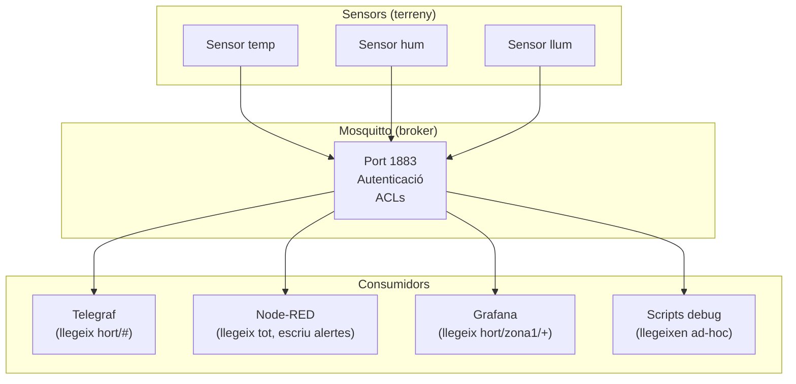

# Capítol 13 — Mosquitto al BernatLab

> *"Un bon broker és un broker que no es nota. Si tot funciona, és que està fent la seva feina."*

## 13.1 Què és Mosquitto

**Eclipse Mosquitto** és un broker MQTT de codi obert, lleuger, ràpid i àmpliament utilitzat. Va ser creat per Roger Light el 2010, mantingut per la Eclipse Foundation, i és una de les implementacions de referència del protocol MQTT.

Mosquitto destaca per:

- **Lleugeresa**: el binari del broker ocupa pocs megabytes i consumeix poca RAM.
- **Velocitat**: pot gestionar desenes de milers de missatges per segon en màquines modestes.
- **Compliment del protocol**: suporta MQTT 3.1.1 i MQTT 5.0.
- **Seguretat**: autenticació per usuari/contrasenya, ACLs, TLS opcional.
- **Bridge**: pot connectar-se a altres brokers, permetent arquitectures distribuïdes.
- **Comunitat**: una de les comunitats més actives del món MQTT.

Al BernatLab és la opció natural: és oficial, està mantingut, i té una imatge Docker oficial que ens permet desplegar-lo fàcilment.

## 13.2 Instal·lació al BernatLab

Mosquitto es desplega com un contenidor Docker amb la imatge oficial `eclipse-mosquitto`. La configuració la farem amb tres fitxers:

- `mosquitto.conf`: configuració principal del broker.
- `passwordfile`: base de dades d'usuaris i contrasenyes.
- `aclfile`: llistes de control d'accés.

### Estructura de carpetes

A `/home/bernat/homelab/`:

```
homelab/
├── docker-compose.yml
├── stacks/
│   └── iot/
│       ├── docker-compose.yml
│       ├── mosquitto.conf
│       ├── passwordfile
│       └── aclfile
└── data/
    └── mosquitto/    (volum persistent)
```

### Definició al docker-compose.yml

```yaml
services:
  mosquitto:
    image: eclipse-mosquitto:2.0
    container_name: mosquitto
    restart: unless-stopped
    ports:
      - "1883:1883"     # MQTT
      - "9001:9001"     # WebSockets (opcional)
    volumes:
      - ./mosquitto.conf:/mosquitto/config/mosquitto.conf:ro
      - ./passwordfile:/mosquitto/config/passwordfile:ro
      - ./aclfile:/mosquitto/config/aclfile:ro
      - /home/bernat/homelab/data/mosquitto:/mosquitto/data
      - /home/bernat/homelab/data/mosquitto/log:/mosquitto/log
```

### Primera configuració

El fitxer `mosquitto.conf` bàsic:

```
# Configuració del broker Mosquitto per al BernatLab

# Escoltem a totes les interfícies (Tailscale ho xifra tot)
listener 1883
allow_anonymous false

# Persistència
persistence true
persistence_location /mosquitto/data/

# Logs
log_dest file /mosquitto/log/mosquitto.log
log_type error
log_type warning
log_type notice
log_type information
connection_messages true
log_timestamp true

# Autenticació
password_file /mosquitto/config/passwordfile
acl_file /mosquitto/config/aclfile

# WebSockets (opcional, útil per a clients web)
listener 9001
protocol websockets
```

Detalls a notar:

- **`listener 1883`**: el broker escolta al port estàndard MQTT.
- **`allow_anonymous false`**: cap connexió sense usuari/contrasenya.
- **`persistence true`**: el broker desa els missatges retained i les subscripcions, de manera que si es reinicia, no es perd res.
- **`log_dest file`**: els logs van a un fitxer, accessible al bind mount.
- **`password_file` i `acl_file`**: apunten als fitxers de seguretat.

## 13.3 Crear usuaris i contrasenyes

Mosquitto emmagatzema usuaris i contrasenyes en un format propi, amb hashing. La comanda per crear-los és:

```bash
mosquitto_passwd -c passwordfile USUARI
```

`-c` crea el fitxer nou. Ens demanarà la contrasenya dues vegades. Per afegir un altre usuari al fitxer existent:

```bash
mosquitto_passwd -b passwordfile USUARI CONTRASENYA
```

`-b` ens permet passar la contrasenya com a argument (útil en scripts). Compte amb la seguretat: la contrasenya quedarà a la història de la shell.

Al BernatLab crearem aquests usuaris inicials:

| Usuari | Contrasenya | Propòsit |
|---|---|---|
| `bernat` | (força) | Administrador, pot fer tot |
| `sensor-temp-zona1` | (força) | Publica a `hort/zona1/temp/*` |
| `sensor-hum-zona1` | (força) | Publica a `hort/zona1/humitat/*` |
| `telegraf` | (força) | Llegeix tot per a InfluxDB |
| `nodered` | (força) | Llegeix i publica alertes |
| `grafana` | (força) | Llegeix alguns topics per a alertes |

Totes les contrasenyes les guardarem al fitxer `.env` del projecte, que és al `.gitignore` (Capítol 9 del Mòdul 1). Al `passwordfile` hi aniran les contrasenyes amb hash.

## 13.4 Llistes de control d'accés (ACLs)

Les ACLs defineixen, per a cada usuari, a quins topics pot subscriure's i a quins pot publicar. La sintaxi és:

```
# Comentaris
user USUARI
topic [read|write|readwrite] PATRÓ

# O per defecte, aplicable a tothom
topic [read|write|readwrite] PATRÓ
```

L'ordre és important: les primeres línies tenen prioritat. Si un usuari té múltiples regles, s'aplica la primera que coincideix.

Exemple d'`aclfile` per al BernatLab:

```
# ====================================================================
# ACLs per al BernatLab
# ====================================================================

# L'administrador bernat té accés total
user bernat
topic readwrite #

# Els sensors de temperatura publiquen a la seva zona
user sensor-temp-zona1
topic write hort/zona1/temperatura/+
topic write hort/zona1/estat
topic read hort/zona1/control/+

# Els sensors d'humitat publiquen a la seva zona
user sensor-hum-zona1
topic write hort/zona1/humitat/+
topic write hort/zona1/estat
topic read hort/zona1/control/+

# Telegraf llegeix tot el que hi ha a hort/
user telegraf
topic read hort/#

# Node-RED llegeix tot i pot publicar alertes
user nodered
topic read #
topic write alertes/#
topic write hort/control/#

# Grafana llegeix alguns topics per alertes
user grafana
topic read hort/zona1/+
topic read alertes/#
```

Aquest esquema garanteix que cada usuari només pot fer el que li toca. Si un sensor és compromès, l'atacant només pot publicar als seus topics, no pas a tot el sistema.

### Bona pràctica: noms d'usuari únics per dispositiu

Cada sensor físic ha de tenir el seu propi usuari i contrasenya. No compartir credencials entre dispositius. Això ens permet revocar l'accés d'un sensor concret sense afectar els altres, i ens permet rastrejar quin sensor ha publicat cada missatge als logs.

## 13.5 Posar en marxa

Un cop creats els fitxers, podem aixecar el servei:

```bash
cd /home/bernat/homelab/stacks/iot
docker compose up -d mosquitto
docker compose logs mosquitto
```

Si tot ha anat bé, veurem línies com:

```
mosquitto    | 1717823400: mosquitto version 2.0.18 starting
mosquitto    | 1717823400: Config loaded from /mosquitto/config/mosquitto.conf
mosquitto    | 1717823400: Opening ipv4 listen socket on port 1883
mosquitto    | 1717823400: Opening ipv6 listen socket on port 1883
mosquitto    | 1717823400: mosquitto ready to accept connections
```

Per comprovar que escolta:

```bash
docker ps
# Ha de mostrar el contenidor mosquitto amb status "Up"
ss -tulpn | grep 1883
# Ha de mostrar el port 1883 escoltant
```

## 13.6 Provar el broker

Un cop en marxa, podem provar-lo des de qualsevol màquina de la xarxa Tailscale.

### Provar amb mosquitto_sub

En una terminal, ens subscriurem a tot:

```bash
mosquitto_sub -h 100.x.y.z -t "#" -v \
  -u bernat -P LACONTRASENYA
```

Hem de veure els missatges que es publiquin, amb el format `topic payload`.

### Provar amb mosquitto_pub

En una altra terminal, publiquem un missatge de prova:

```bash
mosquitto_pub -h 100.x.y.z \
  -t "test/bernatlab" \
  -m "Hola des del BernatLab" \
  -u bernat -P LACONTRASENYA \
  -r
```

Si hem fet les coses bé, a la primera terminal veurem:

```
test/bernatlab Hola des del BernatLab
```

### Provar amb retenció

Com que hem marcat el missatge amb `-r` (retained), si ens connectem ara sense publicar res, rebré el missatge de seguida:

```bash
mosquitto_sub -h 100.x.y.z -t "test/bernatlab" -v \
  -u bernat -P LACONTRASENYA
```

Hauríem de rebre el missatge immediatament en connectar.

### Provar ACLs

Iniciem sessió amb l'usuari del sensor i intentem accedir a un topic no permès:

```bash
# Això hauria de funcionar (el sensor pot publicar a la seva zona)
mosquitto_pub -h 100.x.y.z \
  -t "hort/zona1/temperatura/aire" \
  -m "23.5" \
  -u sensor-temp-zona1 -P LACONTRASENYADELSENSOR

# Això hauria de FALLAR (el sensor no pot accedir a una altra zona)
mosquitto_pub -h 100.x.y.z \
  -t "hort/zona2/temperatura/aire" \
  -m "20.0" \
  -u sensor-temp-zona1 -P LACONTRASENYADELSENSOR
```

Si el broker està ben configurat, la primera ordre funciona i la segona retorna un error. Si tot funciona, tenim un broker segur.

## 13.7 Monitoratge

Mosquitto pot ser monitorat per Uptime Kuma afegint un monitor de tipus **TCP Port** al port 1883. Si el broker cau, Uptime Kuma ens avisarà per Telegram.

A més, podem afegir un monitor més avançat amb un script que enviï un missatge MQTT i comprovi que arriba. Però això és opcional.

Pel que fa a mètriques internes, Mosquitto ofereix un sistema de `$SYS` topics que contenen estadístiques del broker en temps real. Per accedir-hi:

```bash
mosquitto_sub -h 100.x.y.z -t '$SYS/#' -v -u bernat -P LACONTRASENYA
```

Veurem coses com:

```
$SYS/broker/version mosquitto version 2.0.18
$SYS/broker/uptime 1234 seconds
$SYS/broker/clients/connected 5
$SYS/broker/messages/received 1234
$SYS/broker/messages/sent 1234
$SYS/broker/load/messages/received/5min 2.5
```

Això és or pur per a depurar i entendre com es comporta el sistema. Si volem, podem connectar Grafana a InfluxDB i visualitzar aquestes mètriques, però això és opcional.

## 13.8 WebSockets: per a clients web

El port 9001 (WebSockets) ens permet que aplicacions web es connectin directament al broker MQTT sense necessitat d'un servidor intermedi. Això és útil si volem que la web Hort Osona consumeixi directament dades en temps real.

Tanmateix, **al BernatLab, la web Hort Osona consumirà les dades a través de l'API REST** (Capítols 20 i 21), no pas directament per MQTT. Per tant, podem desactivar WebSockets si volem, o deixar-lo activat per si el necessitem més endavant.

Per desactivar-lo, eliminem les dues línies de `listener 9001` i `protocol websockets` del `mosquitto.conf`.

## 13.9 Bridge entre brokers (avançat)

Mosquitto pot actuar com a **bridge** entre dos brokers. Això ens permetria, per exemple:

- Un broker a la Raspberry del BernatLab.
- Un altre broker a la Raspberry del Camp (quan el sistema creixi).

El bridge replica missatges entre ells. Per configurar-lo, afegim al `mosquitto.conf`:

```
connection camp
address camp.bernatlab.local:1883
username bernat
password CONTRASENYA
topic hort/camp/# both 0
topic # out 0
```

Això replica tots els missatges d'`hort/camp/#` entre el broker del BernatLab i el del camp. Però això és una optimització que farem molt més endavant, quan tinguem el sistema bàsic funcionant.

## 13.10 Configuració avançada: limitació de recursos

Mosquitto permet limitar l'ús de recursos per evitar que un client maliciós o un error de programació saturi el broker:

```
# Màxim nombre de connexions
max_connections 100

# Mida màxima dels payloads (per defecte, sense límit)
max_packet_size 1024

# Màxim de missatges en cua per a un client amb QoS > 0
max_queued_messages 1000

# Temps de vida dels missatges en cua
max_queued_bytes 65536
```

Al BernatLab, com que tenim pocs sensors i tot és en xarxa privada, podem deixar els valors per defecte. Però és bo saber que existeixen.

## 13.11 Logs: què mirar quan alguna cosa falla

Els logs de Mosquitto són la primera pista quan alguna cosa no va bé. Per defecte, els tenim a `/home/bernat/homelab/data/mosquitto/log/mosquitto.log`. Cada línia porta un timestamp i un missatge.

Tipus de missatges habituals:

- **Error**: alguna cosa ha fallat (per exemple, un client ha intentat accedir a un topic prohibit).
- **Warning**: possible problema, però el sistema continua.
- **Notice**: informació general (connexions, desconnexions).
- **Information**: detalls addicionals.

Per depurar un problema concret, podem augmentar el nivell de log afegint al `mosquitto.conf`:

```
log_type all
log_priority debug
```

I reiniciar el contenidor. Compte: això genera molt de volum. Per a ús normal, `log_type error warning notice information` és suficient.

## 13.12 Còpies de seguretat

Què hem de copiar de Mosquitto?

- El fitxer `mosquitto.conf`.
- El fitxer `passwordfile`.
- El fitxer `aclfile`.
- Opcionalment, els logs (per a anàlisi posterior).

La carpeta `/mosquitto/data` (on es guarden els missatges retained i les subscripcions) és regenerable: si la perdem, els sensors tornaran a publicar i el sistema es referà. Per tant, no cal copiar-la estrictament, però és bona pràctica fer-ho per si de cas.

Al BernatLab, tots aquests fitxers viuen dins de `/home/bernat/homelab/stacks/iot/`, que ja està versionat amb Git. Les còpies periòdiques es fan seguint el procediment del Capítol 9 del Mòdul 1.

## 13.13 Actualització

Per actualitzar Mosquitto a una nova versió:

```bash
cd /home/bernat/homelab/stacks/iot
docker compose pull mosquitto
docker compose up -d mosquitto
```

Els fitxers de configuració solen ser compatibles entre versions 2.x, però sempre cal revisar les notes de versió a [mosquitto.org/documentation](https://mosquitto.org/documentation/).

## 13.14 Integració amb la resta del BernatLab

Un cop tenim Mosquitto funcionant, podem afegir serveis que el consumeixin:

- **Telegraf** (Capítol 16): s'hi subscriu i escriu les dades a InfluxDB.
- **Node-RED** (Capítols 17 i 18): s'hi subscriu, processa, i publica alertes.
- **Grafana** (Capítol 19): s'hi pot subscriure directament per a mètriques en temps real, tot i que és més eficient fer-ho via InfluxDB.
- **Scripts Python** puntuals: podem subscriure'ns des d'un script per depurar o fer experiments.

Tots aquests serveis s'autenticaran al broker amb els seus propis usuaris, cadascun amb els seus permisos d'ACL.

## 13.15 Esquema d'integració



## 13.16 Errors habituals

**Error 1: oblidar `allow_anonymous false`**. Símptoma: qualsevol es pot connectar sense autenticació. Solució: posar `allow_anonymous false` i configurar usuaris.

**Error 2: ACL massa permissiva**. Símptoma: qualsevol pot accedir a qualsevol topic. Solució: aplicar el principi de mínim privilegi, un usuari per dispositiu.

**Error 3: contrasenyes en text pla al passwordfile**. Símptoma: si el fitxer es filtra, tothom veu les contrasenyes. Solució: `mosquitto_passwd` ja les emmagatzema amb hash (per defecte, SHA-512). Mai no editar-lo a mà.

**Error 4: el port 1883 exposat a Internet**. Símptoma: intents de connexió massius des d'arreu del món. Solució: mantenir el port 1883 només a la xarxa Tailscale. Si cal accedir des de fora, fer-ho sempre a través de Tailscale.

**Error 5: no persistir la configuració**. Símptoma: en actualitzar el contenidor, es perd la configuració. Solució: bind mounts per a `mosquitto.conf`, `passwordfile`, `aclfile`.

**Error 6: només un usuari per a tots els sensors**. Símptoma: no podem saber quin sensor ha fallat, i revocar-ne un afecta tots. Solució: un usuari per dispositiu.

## 13.17 Bones pràctiques

1. **Un usuari per dispositiu**. Això ens permet rastreig i revocació granular.
2. **ACLs estrictes**. Cada usuari només pot fer el que li toca.
3. **Contrasenyes llargues**. Mínim 16 caràcters, millor 20+.
4. **Bind mounts per a la configuració**. Que pugui ser versionada amb Git.
5. **Logs a disc**. Per poder analitzar incidents.
6. **Monitoratge amb Uptime Kuma**. Un monitor TCP al port 1883.
7. **TLS opcional, no necessari amb Tailscale**. Si mai traiem el broker de Tailscale, caldrà reconsiderar.
8. **Documentar l'esquema de topics**. Al README del projecte.
9. **Testejant les ACLs**. Assegurar-nos que els sensors no poden accedir a topics aliens.
10. **Auditar periòdicament**. Qui s'ha connectat, què ha publicat, quantes vegades.

## 13.18 Resum

Hem après a instal·lar i configurar Mosquitto al BernatLab: la configuració bàsica, la creació d'usuaris amb `mosquitto_passwd`, les ACLs per aplicar el principi de mínim privilegi, com provar que tot funciona, com monitorar el servei, i com resoldre els problemes habituals. En el proper capítol dissenyarem l'esquema de publicació dels sensors i veurem exemples de codi per simular i capturar dades.

## 13.19 Exercicis pràctics

1. Desplega Mosquitto al BernatLab amb la configuració que hem vist.
2. Crea un usuari administrador (`bernat`) i un usuari sensor (`sensor-test`).
3. Configura les ACLs perquè `sensor-test` només pugui publicar a `test/bernatlab/#`.
4. Prova de subscriure't a `test/#` amb l'usuari `bernat`.
5. Publica un missatge de prova i comprova que arriba.
6. Intenta publicar amb `sensor-test` a `altres/topic` i comprova que el broker rebutja la connexió/publicació.
7. Comprova els `$SYS` topics per veure les estadístiques del broker.
8. Afegeix un monitor a Uptime Kuma per al port 1883.
9. Mira els logs de Mosquitto i explica què signifiquen les primeres 10 línies.

Comandes útils:
```bash
# Crear usuaris
mosquitto_passwd -c passwordfile bernat
mosquitto_passwd -b passwordfile sensor-test password

# Provar
mosquitto_sub -h 100.x.y.z -t "#" -v -u bernat -P CONTRASENYA
mosquitto_pub -h 100.x.y.z -t test/bernatlab -m "hola" -u bernat -P CONTRASENYA -r

# Estadístiques
mosquitto_sub -h 100.x.y.z -t '$SYS/#' -v -u bernat -P CONTRASENYA

# Logs
docker compose logs mosquitto
tail -f /home/bernat/homelab/data/mosquitto/log/mosquitto.log
```

Paraules clau: **Mosquitto, broker, eclipse-mosquitto, passwordfile, ACL, mosquitto_passwd, listener, allow_anonymous, persistence, retained, $SYS, QoS, Tailscale, autenticació, principi de mínim privilegi, un-usuari-per-dispositiu**.
