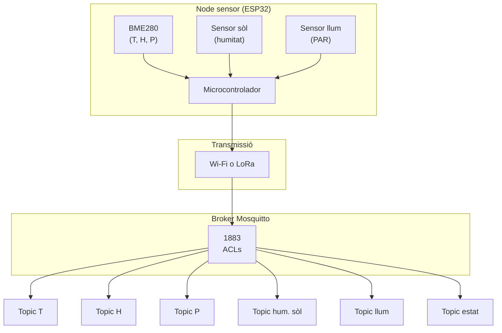

# Capítol 14 — Publicar dades: els sensors

> *"Un sensor ben dissenyat és un sensor que sabem què està fent, des d'on, i amb quin propòsit. La clau no és el sensor, sinó l'esquema."*

## 14.1 El punt de vista del sensor

En el capítol anterior hem vist el broker des del costat del servidor. Ara posem-nos al costat del sensor.

Un sensor, en el context del BernatLab, és un petit dispositiu electrònic que mesura alguna propietat física (temperatura, humitat, llum, etc.) i l'envia al broker MQTT. Pot ser:

- Un **microcontrolador** (ESP32, ESP8266, Arduino Nano Connect, Raspberry Pi Pico W) connectat a un sensor físic (DHT22, BME280, SHT31, etc.).
- Una **Raspberry Pi** amb un sensor connectat per GPIO o USB.
- Un **dispositiu comercial** que ja parla MQTT (com els sensors Xiaomi Mi Flora que ja tenim al projecte Hort Osona).
- Un **script Python** en execució al servidor, simulant un sensor per a proves.

Tots ells, des del punt de vista del protocol, són iguals: clients MQTT que es connecten al broker, es subscriuen (opcionalment) i publiquen dades.

## 14.2 Què hem de tenir clar abans de connectar un sensor

Tres coses:

1. **L'esquema de topics**. Com es diran els topics? Quin patró seguir?
2. **El format del payload**. Com es codifiquen les dades? JSON? Binari? Text pla?
3. **La freqüència de publicació**. Cada quan publiquem? Massa sovint, saturarem; massa poc, perdrem detall.

Aquestes tres decisions es prenen una sola vegada, al principi, i tots els sensors les han de respectar. Per això és fonamental documentar-les al README del projecte.

## 14.3 L'esquema de topics de Hort Osona

Per a Hort Osona, proposem el següent esquema:

```
hort/{zona}/{tipus_sensor}/{identificador}
hort/{zona}/estat
hort/control/{zona}/{actuador}
alertes/{tipus}
```

Exemples concrets:

- `hort/zona-tomateres/temperatura/aire`: temperatura ambient a la zona de les tomateres.
- `hort/zona-tomateres/temperatura/sol-10cm`: temperatura del sòl a 10 cm de profunditat.
- `hort/zona-enciams/humitat/sol-20cm`: humitat del sòl a 20 cm a la zona dels enciams.
- `hort/zona-enciams/lluminositat/par`: lluminositat PAR (radiació fotosintèticament activa).
- `hort/zona-tomateres/estat`: estat del node sensor (online/offline).
- `hort/control/zona-enciams/reg`: comanda per obrir/tancar el reg dels enciams.
- `alertes/gelada`: alerta de gelada imminent.
- `alertes/sol-sec`: alerta de sòl massa sec.

Aquest esquema és extensible: quan afegim un nou sensor, triem una zona, un tipus, i un identificador. Si el sensor té múltiples lectures (com un BME280, que mesura temperatura, humitat i pressió), publica a tres topics:

```
hort/zona-x/temperatura/aire
hort/zona-x/humitat/relativa
hort/zona-x/pressio/atmosferica
```

## 14.4 El format del payload

Tenim diverses opcions. Vegem-les:

### Opció A: text pla (un sol valor)

```
mosquitto_pub -t hort/zona1/temperatura/aire -m "23.5"
```

Avantatges: molt simple, ocupació mínima. Inconvenients: no podem afegir metadades (unitats, qualitat, etc.).

### Opció B: JSON

```json
{
  "valor": 23.5,
  "unitat": "graus_C",
  "ts": 1717823400,
  "qualitat": 95
}
```

Avantatges: extensible, llegible, autocontingut. Inconvenients: ocupa més bytes (entre 30 i 100 bytes típicament).

### Opció C: JSON minimalista

```json
{"v": 23.5, "u": "C", "t": 1717823400}
```

Avantatges: ocupació reduïda, encara extensible. Inconvenients: menys llegible.

### Opció D: binari (CBOR, MessagePack)

Avantatges: molt compacte. Inconvenients: no llegible, cal una biblioteca per codificar/decodificar.

### Recomanació per al BernatLab

Per a sensors amb comunicació Wi-Fi (que tenen ample de banda de sobres), **JSON complet** és la millor opció. Per a sensors amb LoRa (que tenen limitacions d'ample de banda), JSON minimalista o fins i tot CBOR pot ser necessari.

Al BernatLab, començarem amb **JSON complet** perquè la claredat supera l'estalvi de bytes:

```json
{
  "valor": 23.5,
  "unitat": "graus_C",
  "ts": 1717823400
}
```

El camp `ts` (timestamp en segons Unix) ens permet correlacionar les dades encara que el sensor no estigui sincronitzat amb l'hora del servidor. Alternativament, podem ometre'l i deixar que InfluxDB assigni el timestamp quan rep el missatge (que és el que farem servir per defecte, per simplicitat).

## 14.5 Freqüència de publicació

Cada quan ha de publicar un sensor? Depèn del que mesurem:

| Tipus de mesura | Freqüència recomanada |
|---|---|
| Temperatura ambient | 1 minut |
| Humitat relativa | 1 minut |
| Temperatura del sòl | 5 minuts |
| Humitat del sòl | 5-10 minuts |
| Lluminositat | 5-15 minuts (pot variar ràpid) |
| Pluja | immediat (esdeveniment) |
| Vent | 1-5 minuts |

A l'Hort Osona, cada zona tindrà un node sensor que publicarà:

- Temperatura ambient: cada 60 segons.
- Humitat relativa: cada 60 segons.
- Temperatura del sòl: cada 300 segons (5 min).
- Humitat del sòl: cada 300 segons.
- Lluminositat: cada 300 segons.
- Estat del node: cada 60 segons (canvia a "online"/"offline").

## 14.6 Exemple: simulant un sensor en Python

Aquest script és el que farem servir per provar tot el sistema sense tenir el hardware. Simula un node sensor BME280 (temperatura, humitat, pressió) amb valors aleatoris realistes:

```python
"""
simula_bme280.py
Simula un node sensor BME280 que publica a MQTT.
"""
import json
import random
import time
import paho.mqtt.client as mqtt

BROKER = "100.x.y.z"
PORT = 1883
USERNAME = "sensor-bme-zona1"
PASSWORD = "elmeupassword"
ZONA = "zona-tomateres"
LWT_TOPIC = f"hort/{ZONA}/estat"

client = mqtt.Client(client_id=f"simula-bme-{ZONA}", clean_session=True)
client.username_pw_set(USERNAME, PASSWORD)
client.will_set(LWT_TOPIC, payload="offline", qos=1, retain=True)


def publicar(topic, valor, unitat):
    payload = json.dumps({
        "valor": round(valor, 2),
        "unitat": unitat,
        "ts": int(time.time()),
    })
    client.publish(topic, payload, qos=0, retain=True)
    print(f"  → {topic}: {payload}")


def on_connect(client, userdata, flags, rc, properties=None):
    if rc == 0:
        print(f"[{ZONA}] Connectat al broker")
        client.publish(LWT_TOPIC, "online", qos=1, retain=True)
    else:
        print(f"[{ZONA}] Error de connexió: {rc}")


client.on_connect = on_connect
client.connect(BROKER, PORT, 60)
client.loop_start()

temperatura_base = 22.0
humitat_base = 60.0
pressio_base = 1013.0

try:
    while True:
        # Simulació amb soroll gaussià
        temperatura = temperatura_base + random.gauss(0, 0.5)
        humitat = max(20, min(100, humitat_base + random.gauss(0, 2)))
        pressio = pressio_base + random.gauss(0, 0.3)

        publicar(f"hort/{ZONA}/temperatura/aire", temperatura, "graus_C")
        publicar(f"hort/{ZONA}/humitat/relativa", humitat, "%")
        publicar(f"hort/{ZONA}/pressio/atmosferica", pressio, "hPa")

        time.sleep(60)
except KeyboardInterrupt:
    print(f"[{ZONA}] Aturant...")
    client.publish(LWT_TOPIC, "offline", qos=1, retain=True)
    client.loop_stop()
    client.disconnect()
```

Aquest script, executat al servidor, ens permet:

- Validar que el broker accepta connexions.
- Veure com es comporten les ACLs.
- Generar dades per provar Telegraf, InfluxDB, Node-RED i Grafana.
- Estalviar-nos el viatge al camp mentre posem a punt el sistema.

## 14.7 Exemple: ESP32 amb MicroPython

Per als sensors reals al terreny, un microcontrolador com l'ESP32 és la opció natural. Pot funcionar amb piles durant setmanes, té Wi-Fi integrat, i adafruit/MicroPython fan que programar-lo sigui relativament fàcil.

Exemple de codi MicroPython per a un ESP32 amb un sensor DHT22:

```python
"""
ESP32 + DHT22 + MQTT
Llegeix temperatura i humitat cada 60 segons i publica via MQTT.
"""
import network
import time
import dht
from machine import Pin
from umqtt.simple import MQTTClient

WIFI_SSID = "elmeuSSID"
WIFI_PASSWORD = "elmeupassword"

BROKER = "100.x.y.z"
PORT = 1883
CLIENT_ID = "esp32-dht-zona1"
USERNAME = "sensor-dht-zona1"
PASSWORD = "elmeupassword"

ZONA = "zona-tomateres"
LWT_TOPIC = f"hort/{ZONA}/estat"

# Connexió Wi-Fi
wlan = network.WLAN(network.STA_IF)
wlan.active(True)
wlan.connect(WIFI_SSID, WIFI_PASSWORD)
while not wlan.isconnected():
    print("Connectant a Wi-Fi...")
    time.sleep(1)
print("Wi-Fi connectat:", wlan.ifconfig())

# Sensor DHT22 al pin 4
sensor = dht.DHT22(Pin(4))

# Client MQTT
def publicar(client, topic, valor, unitat):
    import ujson
    payload = ujson.dumps({
        "valor": round(valor, 2),
        "unitat": unitat,
    })
    client.publish(topic, payload, retain=True)

client = MQTTClient(CLIENT_ID, BROKER, PORT, USERNAME, PASSWORD)
client.set_last_will(LWT_TOPIC, "offline", retain=True, qos=1)
client.connect()
client.publish(LWT_TOPIC, "online", retain=True, qos=1)
print("MQTT connectat")

try:
    while True:
        try:
            sensor.measure()
            temperatura = sensor.temperature()
            humitat = sensor.humidity()
            publicar(client, f"hort/{ZONA}/temperatura/aire", temperatura, "graus_C")
            publicar(client, f"hort/{ZONA}/humitat/relativa", humitat, "%")
            print(f"Temp: {temperatura} °C, Hum: {humitat} %")
        except OSError as e:
            print("Error de lectura:", e)
        time.sleep(60)
except KeyboardInterrupt:
    client.publish(LWT_TOPIC, "offline", retain=True, qos=1)
    client.disconnect()
```

Aquest codi és un punt de partida. En el Mòdul 3 (LoRa), veurem variants que usen SX1262 en lloc de Wi-Fi.

## 14.8 Exemple: integració amb sensors Xiaomi Mi Flora

Hort Osona ja té sensors **Xiaomi Mi Flora** (o "Flower Care"), que mesuren temperatura, humitat del sòl, lluminositat, fertilitat i salinitat. Aquests sensors es comuniquen per Bluetooth, no pas per Wi-Fi. Per integrar-los al BernatLab, tenim dues opcions:

### Opció 1: Home Assistant + bridge MQTT

Home Assistant té una integració nativa per a Mi Flora, i pot publicar les dades a un broker MQTT. Però afegir Home Assistant al BernatLab seria excessiu per a un sol tipus de sensor.

### Opció 2: miflora-mqtt-daemon

Hi ha un projecte de codi obert, **miflora-mqtt-daemon**, que escolta els sensors Mi Flora per Bluetooth i publica les dades directament a un broker MQTT. És la solució més neta.

El projecte es pot trobar a GitHub: [github.com/ThomDietrich/miflora-mqtt-daemon](https://github.com/ThomDietrich/miflora-mqtt-daemon).

Configuració típica:

```yaml
# /etc/miflora-mqtt-daemon/config.yaml
mqtt:
  host: 100.x.y.z
  port: 1883
  username: miflora
  password: elmeupassword
  topic_prefix: hort/miflora
  availability_topic: hort/miflora/estat

daemon:
  poll_interval: 300  # 5 minuts
  period: 600
  bluetooth_scan_timeout: 20

miflora:
  cache: /tmp/miflora-cache
  enabled: true
  report_unknown: false
  sensors:
    - mac: C4:7C:8D:6A:XX:XX
      name: zona-tomateres
    - mac: C4:7C:8D:6A:YY:YY
      name: zona-enciams
```

Un cop configurat, el daemon:

1. Busca els sensors per Bluetooth cada 5 minuts.
2. Llegeix les dades.
3. Publica a MQTT amb el patró:

```
hort/miflora/zona-tomateres/temperature 23.5
hort/miflora/zona-tomateres/moisture 45
hort/miflora/zona-tomateres/light 12000
hort/miflora/zona-tomateres/conductivity 800
hort/miflora/zona-tomateres/battery 85
```

Això és exactament el que volem: les dades dels sensors al broker MQTT, llestes per ser processades per Telegraf i emmagatzemades a InfluxDB.

## 14.9 Patrons de publicació

Hi ha tres patrons habituals:

### Patró 1: un missatge per mesura

El sensor publica cada mesura a un topic separat:

```
hort/zona1/temperatura/aire → 23.5
hort/zona1/humitat/relativa → 60
hort/zona1/pressio/atmosferica → 1013
```

**Avantatges**: fàcil de subscriure individualment, fàcil d'indexar. **Inconvenients**: més missatges, més overhead.

### Patró 2: un missatge amb múltiples mesures

El sensor publica un sol missatge amb totes les mesures:

```
hort/zona1/mesures → {"temperatura": 23.5, "humitat": 60, "pressio": 1013}
```

**Avantatges**: menys missatges, menys overhead. **Inconvenients**: cal parsejar JSON, no es pot subscriure a una sola mesura.

### Patró 3: híbrid

El sensor publica cada mesura individualment, però en un sol "cicle" amb múltiples publicacions. Per exemple, un node BME280 publica:

```
hort/zona1/temperatura/aire → 23.5
hort/zona1/humitat/relativa → 60
hort/zona1/pressio/atmosferica → 1013
hort/zona1/estat → online
```

En quatre publicacions separades, dins d'un bucle. Aquest és el patró que farem servir al BernatLab perquè combina les avantatges dels altres dos.

## 14.10 Estructura del payload en detall

Per a cada topic, el payload serà un objecte JSON amb tres camps:

```json
{
  "valor": 23.5,
  "unitat": "graus_C",
  "ts": 1717823400
}
```

- **valor**: el valor numèric de la mesura. Pot ser un enter o un decimal.
- **unitat**: una cadena curta que indica la unitat (graus_C, %, hPa, etc.).
- **ts**: el timestamp Unix en segons. Opcional, però recomanable.

Si volem afegir camps extra (qualitat de la mesura, identificador del sensor, etc.), ho podem fer sense trencar el patró:

```json
{
  "valor": 23.5,
  "unitat": "graus_C",
  "ts": 1717823400,
  "sensor_id": "bme280-zona1",
  "qualitat": 95
}
```

Telegraf i InfluxDB ignoraran els camps que no coneguin, de manera que el sistema és tolerant a extensions.

## 14.11 Ús de retained

Quins missatges han de ser retained?

**Tots els que representen l'últim valor conegut d'un sensor.** Això inclou:

- Temperatura, humitat, pressió, lluminositat, etc.
- L'estat del node (online/offline).

**No** han de ser retained:

- Les alertes (ja que volem que es processin, no que es quedin al broker).
- Els missatges de control (comandes a actuadors).

## 14.12 Ús del Last Will and Testament

Cada node sensor ha de registrar un LWT al topic d'estat:

```
client.will_set(
    topic=f"hort/{ZONA}/estat",
    payload="offline",
    qos=1,
    retain=True
)
```

Això garanteix que, si el node es desconnecta de manera no esperada (per pèrdua de Wi-Fi, bateria esgotada, etc.), el broker publicarà automàticament "offline" al topic d'estat. Si el node es desconnecta correctament (per exemple, amb `client.disconnect()`), hauria de publicar "offline" explícitament abans de desconnectar.

Node-RED pot subscriure's a aquests topics i generar una alerta si un sensor porta més de X minuts sense publicar.

## 14.13 Consideracions de seguretat

Cada node sensor ha de tenir:

- El seu propi **usuari i contrasenya** a Mosquitto.
- Les seves pròpies **ACLs** que limiten els topics als quals pot accedir.
- Connexió per **Tailscale** (si escau) o per una xarxa aïllada.

Si un node és compromès (per exemple, per un atac físic), l'atacant només podrà:

- Publicar als topics permesos.
- Rebre els topics als quals està subscrit.

Per tant, és fonamental que les ACLs siguin estrictes.

## 14.14 Proves d'integració

Un cop tenim el sensor (real o simulat) publicant, hem de poder verificar que:

1. El broker accepta les connexions.
2. Les dades arriben al topic correcte.
3. El payload té el format esperat.
4. El LWT funciona correctament (desconnectem el node i veiem com canvia l'estat).

Per fer aquestes proves, podem fer servir:

```bash
# Subscriure's a tot el que publica el node
mosquitto_sub -h 100.x.y.z \
  -t "hort/zona1/#" -v \
  -u bernat -P CONTRASENYA

# En una altra terminal, executar el sensor

# En una tercera, comprovar $SYS
mosquitto_sub -h 100.x.y.z \
  -t '$SYS/broker/clients/#' -v \
  -u bernat -P CONTRASENYA
```

Si tot és correcte, veurem un flux continu de missatges.

## 14.15 Quan falla un sensor: com reaccionar

Els sensors, al camp, fallen. La bateria s'esgota, la Wi-Fi es perd, l'electrònica es rovella. Hem d'estar preparats.

### Detecció de fallada

Node-RED, al Capítol 18, aprendrà a:

- Detectar quan un sensor no ha publicat en X minuts.
- Enviar una alerta a Telegram.
- Publicar l'estat al topic `hort/zona1/estat` com a "stale".

### Recuperació

Quan el sensor torna, simplement:

- Es reconnecta al broker.
- Publica "online" al LWT topic.
- Comença a enviar dades de nou.

Node-RED detecta la recuperació i ens avisa.

## 14.16 Exemple complet: node amb múltiples sensors

Un node sensor pot tenir múltiples sensors connectats. Per exemple, un node ESP32 amb un BME280 (temperatura, humitat, pressió) i un sensor de sòl capacitiu:

```python
# Pseudocodi
import time
import bme280
import soil_sensor
import paho.mqtt.client as mqtt

client = mqtt.Client()
client.connect("100.x.y.z", 1883, 60)
client.will_set("hort/zona1/estat", "offline", qos=1, retain=True)
client.loop_start()

bme = bme280.BME280(i2c_bus=1, address=0x76)
soil = soil_sensor.Capacitive(pin=34)

while True:
    # BME280
    t, p, h = bme.read_compensated_data()
    publicar("hort/zona1/temperatura/aire", t/100, "graus_C")
    publicar("hort/zona1/humitat/relativa", h/1024, "%")
    publicar("hort/zona1/pressio/atmosferica", p/25600, "hPa")

    # Sensor de sòl
    hum_sol = soil.read()
    publicar("hort/zona1/humitat/sol-20cm", hum_sol, "%")

    # Estat
    client.publish("hort/zona1/estat", "online", qos=1, retain=True)

    time.sleep(60)
```

Aquest és el patró que farem servir a tots els nodes: lectures periòdiques, publicació a múltiples topics, manteniment de l'estat.

## 14.17 Esquema conceptual



## 14.18 Errors habituals

**Error 1: esquema de topics inconsistent**. Símptoma: alguns sensors publiquen a un esquema, d'altres a un altre, Grafana mostra gràfiques incompletes. Solució: documentar l'esquema al README i fer-lo complir.

**Error 2: payload en format inconsistent**. Símptoma: Telegraf no sap parsejar les dades, InfluxDB rebutja les insercions. Solució: validar el format amb JSON Schema o, com a mínim, amb un test.

**Error 3: publicar massa sovint**. Símptoma: el broker es satura, la xarxa es congestiona, la bateria dels sensors s'esgota ràpidament. Solució: ajustar la freqüència a la necessitat real.

**Error 4: oblidar el LWT**. Símptoma: no sabem quan un sensor ha caigut. Solució: configurar el LWT a tots els clients.

**Error 5: no testejar el payload**. Símptoma: arriba un missatge buit, o amb un valor impossible (temperatura de 200 °C, humitat del 500%). Solució: validar les dades al sensor abans de publicar-les.

**Error 6: compartir credencials entre sensors**. Símptoma: un sensor compromès permet accedir a tots els altres. Solució: un usuari per dispositiu, com ja hem vist al Capítol 13.

## 14.19 Bones pràctiques

1. **Esquema de topics documentat al README**. Tots els participants l'han de conèixer.
2. **Format de payload consistent**. Validar-lo.
3. **Freqüència de publicació adequada**. Ni massa sovint, ni massa poc.
4. **LWT configurat a tots els clients**.
5. **Un usuari per dispositiu a Mosquitto**.
6. **ACLs estrictes**.
7. **Validació al sensor**. Si una lectura és impossible, no la publiquem.
8. **Logs locals al sensor**. Per depurar problemes al camp.
9. **Mode de test abans de desplegar**. Publicar a un topic de proves abans de passar a producció.
10. **Monitoratge extern**. Node-RED ha de poder detectar sensors que no publiquen.

## 14.20 Resum

Hem après com es connecten els sensors al broker MQTT, quin esquema de topics i quin format de payload són adequats per a Hort Osona, com simular sensors amb Python per desenvolupar sense hardware, i com integrar sensors comercials com els Xiaomi Mi Flora. Hem vist exemples reals per a ESP32 amb MicroPython, i hem après les bones pràctiques i els errors habituals. En el proper capítol veurem on i com es guarden aquestes dades: a InfluxDB.

## 14.21 Exercicis pràctics

1. Dibuixa, a mà, l'esquema de topics que faries servir per al teu hort o un altre sistema de sensors.
2. Escriu un script Python que simuli un node sensor amb tres lectures (temperatura, humitat, llum) i publiqui cada 10 segons.
3. Connecta't al broker del BernatLab i subscriu-te a `hort/#`. Fes que el teu script publiqui durant 2 minuts i comprova que reps tots els missatges.
4. Afegeix una alerta al teu script: si la temperatura baixa de 5 °C, publica una alerta a `alertes/gelada`.
5. Investiga com connectar un sensor Xiaomi Mi Flora al teu PC amb Linux i Bluetooth. Prova de llegir-ne les dades amb `gatttool` o `bluetoothctl`.
6. Documenta l'esquema de topics al README del teu projecte.

Comandes útils:
```bash
# Subscriure's a tots els topics d'una zona
mosquitto_sub -h 100.x.y.z -t "hort/zona1/#" -v -u bernat -P CONTRASENYA

# Publicar amb LWT
python3 -c "
import paho.mqtt.client as mqtt
c = mqtt.Client()
c.username_pw_set('bernat', 'CONTRASENYA')
c.will_set('hort/zona1/estat', 'offline', qos=1, retain=True)
c.connect('100.x.y.z', 1883, 60)
c.publish('hort/zona1/estat', 'online', qos=1, retain=True)
c.publish('hort/zona1/temperatura/aire', '{\"valor\": 23.5}', retain=True)
c.loop_forever()
"
```

Paraules clau: **sensor, ESP32, DHT22, BME280, Mi Flora, miflora-mqtt-daemon, payload JSON, LWT, retained, esquema de topics, simulació, ACL, un-usuari-per-dispositiu,MicroPython, paho-mqtt, integració de sensors, Hort Osona, validació de dades**.
