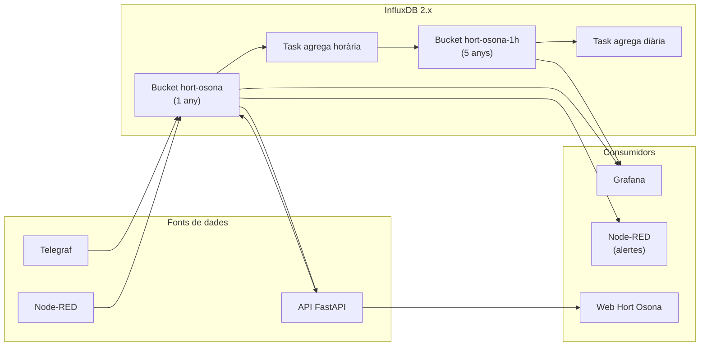

# Capítol 15 — InfluxDB: base de dades de sèries temporals

> *"Guardar dades d'un sensor és fàcil. Guardar-ne milions i poder-hi fer consultes ràpides és el que diferencia una base de dades de sèries temporals d'una base de dades normal."*

## 15.1 Què és una base de dades de sèries temporals

Una **base de dades de sèries temporals** (TSDB, Time Series Database) és un tipus especialitzat de base de dades dissenyat per emmagatzemar i consultar **dades associades a marques de temps**. Exemples clars:

- Lectures de sensors cada minut.
- Preus d'una acció cada segon.
- Mètriques d'un servidor cada 5 segons.
- Temperatura d'una ciutat cada hora.

Aquestes dades tenen tres propietats que les fan diferents de les dades "normals" d'una base de dades relacional:

1. **Sempre tenen un timestamp**. Sense excepció.
2. **Arriben en ordre cronològic**. Normalment no es reescriuen valors antics.
3. **El volum és enorme**. Un sistema amb 100 sensors publicant cada minut genera 100 × 60 × 24 = 144.000 punts per dia.

Una base de dades relacional com PostgreSQL pot guardar aquestes dades, però no està optimitzada per fer-ho. Les consultes sobre intervals temporals grans es tornen lentes. La compressió de dades és pobra. La gestió d'índexos temporals és complicada.

Una TSDB, en canvi, està dissenyada des de zero per a aquest cas:

- **Emmagatzematge column-oriented**: les dades de cada sèrie temporal s'emmagatzemen en columnes, la qual cosa permet una compressió excel·lent.
- **Índexs temporals natius**: les consultes per rangs temporals són ràpides per disseny.
- **Agregacions natives**: promitjos, màxims, mínims per finestres temporals.
- **Retenció configurable**: podem dir "guarda les dades a resolució original durant 30 dies, i les dades agregades a resolució horària durant 5 anys".

InfluxDB és una de les TSDB de codi obert més populars, juntament amb TimescaleDB (que és una extensió de PostgreSQL), Prometheus (orientada a mètriques), i OpenTSDB. Al BernatLab farem servir InfluxDB per la seva senzillesa i potència.

## 15.2 InfluxDB: versions i edicions

InfluxDB té dues línies principals:

- **InfluxDB 1.x**: la versió clàssica, amb el seu propi llenguatge de consultes (InfluxQL), una interfície web (Chronograf), i un agent de recollida (Telegraf, compartit amb 2.x). Encara àmpliament usada.
- **InfluxDB 2.x**: la nova versió, que unifica la base de dades, la interfície web, i el sistema d'autenticació. Té el seu propi llenguatge de consultes (Flux), una interfície web moderna, i una API REST.

Al BernatLab farem servir **InfluxDB 2.x** perquè:

- La interfície web està integrada.
- L'autenticació basada en tokens és moderna i còmoda.
- Té millor suport per a nous llenguatges de consulta.
- InfluxData l'està desenvolupant activament.

## 15.3 Conceptes clau d'InfluxDB 2.x

InfluxDB 2.x introdueix una sèrie de conceptes nous respecte a 1.x. Val la pena entendre'ls bé abans de posar-nos a instal·lar.

### Organització (Organization)

Una **organització** (org) és un contenidor d'alt nivell. Tots els recursos (buckets, tasques, tokens, usuaris) viuen dins d'una organització. Al BernatLab només en tindrem una, anomenada `bernatlab`.

### Bucket

Un **bucket** és l'equivalent d'una base de dades o una taula en el món relacional. Totes les dades s'emmagatzemen en un bucket. Cada bucket té:

- Un **nom** (per exemple, `hort-osona`).
- Una **política de retenció**: quant de temps es guarden les dades.
- Un **període de retenció** opcional.

InfluxDB 2.x ja no distingeix entre "base de dades" i "política de retenció" com feia 1.x. Tot es configura al bucket.

Al BernatLab, crearem un bucket `hort-osona` amb una retenció prou llarga (per exemple, 1 any) i un bucket `hort-osona-downsampled` amb dades agregades a resolució horària per a visualitzacions a llarg termini.

### Mesures, tags i camps

Una **mesura** (measurement) és l'equivalent d'una taula. El seu nom és arbitrari, normalment coincideix amb el tipus de dada (per exemple, `temperatura`, `humitat`).

Cada punt dins d'una mesura té:

- **Tag**: una metadada indexada (per exemple, `zona="zona-tomateres"`). Els tags s'indexen, de manera que les consultes que filtren per tag són ràpides.
- **Camp** (field): el valor numèric (per exemple, `valor=23.5`). Els camps no s'indexen.

La regla d'or:

- Si volem **filtrar** per una propietat, és un **tag**.
- Si volem **agregar** (sumar, fer mitjana) una propietat, és un **camp**.

Al BernatLab:

- Tag: `zona` (zona-tomateres, zona-enciams, ...), `sensor` (bme280, dht22, ...).
- Camp: `valor` (la mesura en si), `qualitat` (opcional, % de fiabilitat).

### Series

Una **series** és la combinació d'una mesura + un conjunt de tags. Per exemple:

```
temperatura, zona=zona-tomateres, sensor=bme280
```

Aquesta és una sèrie. Tots els punts amb aquesta combinació formen una seqüència temporal.

### Punt (point)

Un **punt** és l'equivalent d'una fila en una taula. Té:

- Una mesura.
- Un o més tags.
- Un o més camps.
- Un timestamp.

Exemple de punt en Line Protocol (veure més avall):

```
temperatura, zona=zona-tomateres, sensor=bme280 valor=23.5,qualitat=95 1717823400000000000
```

### Token

Un **token** és una cadena que autentica una aplicació davant InfluxDB. Al BernatLab crearem tokens específics per a cada consumidor:

- `telegraf-token`: per a Telegraf.
- `nodered-token`: per a Node-RED.
- `grafana-token`: per a Grafana.
- `api-token`: per a la nostra API FastAPI.

Cada token té els seus permisos (lectura, escriptura, lectura+escriptura) sobre els seus buckets.

## 15.4 Instal·lació al BernatLab

InfluxDB 2.x es desplega amb Docker. La imatge oficial és `influxdb:2.7` (o la darrera versió estable).

### Definició al docker-compose.yml

```yaml
services:
  influxdb:
    image: influxdb:2.7
    container_name: influxdb
    restart: unless-stopped
    ports:
      - "8086:8086"     # API
    volumes:
      - /home/bernat/homelab/data/influxdb:/var/lib/influxdb2
      - /home/bernat/homelab/data/influxdb/config:/etc/influxdb2
    environment:
      - DOCKER_INFLUXDB_INIT_MODE=setup
      - DOCKER_INFLUXDB_INIT_USERNAME=bernat
      - DOCKER_INFLUXDB_INIT_PASSWORD=ELMEUPASSWORD
      - DOCKER_INFLUXDB_INIT_ORG=bernatlab
      - DOCKER_INFLUXDB_INIT_BUCKET=hort-osona
      - DOCKER_INFLUXDB_INIT_RETENTION=8760h  # 1 any
      - DOCKER_INFLUXDB_INIT_ADMIN_TOKEN=ELMEUTOKENINICIAL
```

Aquesta configuració aprofita la inicialització automàtica de la imatge Docker: quan es crea el contenidor per primera vegada, InfluxDB es configura sol amb l'usuari, organització, bucket i token inicial que li hem passat.

### Primer accés

Un cop en marxa, podem accedir a la interfície web a `http://100.115.134.76:8086`. Ens demanarà l'usuari (`bernat`) i la contrasenya que hem definit.

La interfície web d'InfluxDB 2.x és molt completa:

- **Data Explorer**: per explorar les dades i construir consultes.
- **Dashboards**: per crear gràfiques senzilles (per a les complexes, farem servir Grafana).
- **Tasks**: per programar consultes periòdiques (per exemple, agregacions).
- **Buckets**: per gestionar els contenidors de dades.
- **Tokens**: per crear i gestionar tokens d'accés.
- **Sources**: per configurar Telegraf o altres clients.
- **Settings**: per configurar l'organització i altres paràmetres.

### Crear els tokens

Un cop dins, anirem a **Load Data → Tokens** i crearem els tokens específics per a cada servei:

1. **telegraf-token**: permisos d'escriptura sobre `hort-osona`.
2. **nodered-token**: permisos de lectura i escriptura sobre `hort-osona`.
3. **grafana-token**: permisos de lectura sobre `hort-osona`.
4. **api-token**: permisos de lectura sobre `hort-osona`.

Cada token es mostra una sola vegada en crear-lo. **Cal guardar-los al `.env` immediatament** (no pas al codi, no pas a Git).

## 15.5 Line Protocol: el llenguatge de InfluxDB

InfluxDB accepta dades en un format anomenat **Line Protocol**, que és molt compacte i eficient. La sintaxi és:

```
measurement,tag1=value1,tag2=value2 field1=value1,field2=value2 timestamp
```

Exemple:

```
temperatura, zona=zona-tomateres, sensor=bme280 valor=23.5,qualitat=95 1717823400000000000
```

Detalls a notar:

- El **timestamp** és en nanosegons des de l'època Unix (1 de gener de 1970). Si no es proporciona, InfluxDB assigna el temps del servidor.
- Els **tags** sempre són strings, per la qual cosa els valors van sense cometes.
- Els **camps** poden ser floats, enters, strings, o booleans. Per a floats, podem posar el sufix `i` per a enters.
- Les **cadenes string** als camps van entre cometes dobles i escapen les cometes interiors amb `\"`.

Exemple complet:

```
temperatura, zona=zona-tomateres valor=23.5 1717823400000000000
humitat, zona=zona-tomateres valor=60 1717823400000000000
pressio, zona=zona-tomateres valor=1013 1717823400000000000
```

Cadascuna d'aquestes línies és un punt. Podem enviar-les una per una, o en bloc (una línia per punt, separades per `\n`).

## 15.6 Escriure dades: la API d'escriptura

InfluxDB ofereix diverses maneres d'escriure dades:

- **HTTP POST** a `/api/v2/write`, amb el Line Protocol al body.
- **Client libraries** (Python, JavaScript, Go, etc.) que encapsulen l'API.
- **Telegraf**, que és l'opció que farem servir al Capítol 16.

Exemple d'escriptura amb curl:

```bash
curl -i -XPOST "http://100.115.134.76:8086/api/v2/write?org=bernatlab&bucket=hort-osona" \
  --header "Authorization: Token ELMEUTOKEN" \
  --data-raw "temperatura, zona=zona-tomateres valor=23.5"
```

Exemple amb Python:

```python
from influxdb_client import InfluxDBClient
from influxdb_client.client.write_api import SYNCHRONOUS

client = InfluxDBClient(
    url="http://100.115.134.76:8086",
    token="ELMEUTOKEN",
    org="bernatlab"
)
write_api = client.write_api(write_options=SYNCHRONOUS)

punt = [
    {
        "measurement": "temperatura",
        "tags": {"zona": "zona-tomateres"},
        "fields": {"valor": 23.5},
        "time": 1717823400
    }
]
write_api.write(bucket="hort-osona", record=punt)
```

## 15.7 Llegir dades: Flux, el llenguatge de consultes

InfluxDB 2.x introdueix **Flux**, un llenguatge de consultes funcional inspirat en JavaScript. No és SQL, però té una estructura lògica:

```flux
from(bucket: "hort-osona")
  |> range(start: -1h)
  |> filter(fn: (r) => r._measurement == "temperatura")
  |> filter(fn: (r) => r.zona == "zona-tomateres")
  |> mean()
```

Aquesta consulta:

1. Agafa totes les dades del bucket `hort-osona` de l'última hora.
2. Filtra per mesura `temperatura`.
3. Filtra per zona `zona-tomateres`.
4. Calcula la mitjana.

Exemples habituals:

**Últim valor:**

```flux
from(bucket: "hort-osona")
  |> range(start: -1h)
  |> filter(fn: (r) => r._measurement == "temperatura")
  |> last()
```

**Mitjana per hora:**

```flux
from(bucket: "hort-osona")
  |> range(start: -24h)
  |> filter(fn: (r) => r._measurement == "temperatura")
  |> aggregateWindow(every: 1h, fn: mean, createEmpty: false)
```

**Màxim del dia:**

```flux
from(bucket: "hort-osona")
  |> range(start: -1d)
  |> filter(fn: (r) => r._measurement == "temperatura")
  |> max()
```

Aprendrem més sobre Flux a mesura que l'usem, però aquests exemples ja donen una idea.

## 15.8 InfluxDB UI: Data Explorer

El **Data Explorer** de la interfície web ens permet construir consultes visualment, sense escriure Flux a mà. Podem:

1. Triar el bucket.
2. Triar la mesura.
3. Triar els camps.
4. Aplicar filtres (tags, rangs temporals).
5. Aplicar agregacions.
6. Visualitzar el resultat en una taula o gràfica.

És una eina molt útil per aprendre i per depurar consultes abans de posar-les a Grafana o a la API.

## 15.9 Retenció de dades

La **retenció** és la política que determina quant de temps es guarden les dades. Al bucket `hort-osona` hem definit 1 any (8760 hores). Això vol dir que, passat un any, InfluxDB esborrarà les dades antigues.

Però no cal que esperem un any per tenir dades agregades. Podem crear **Tasks** (tasques) que periòdicament agreguin dades a resolucions més baixes i les desin en un altre bucket amb retenció més llarga:

- `hort-osona`: dades originals, retenció 1 any.
- `hort-osona-1h`: dades agregades a resolució horària, retenció 5 anys.
- `hort-osona-1d`: dades agregades a resolució diària, retenció 10 anys.

Exemple de task per agregar dades a resolució horària:

```flux
option task = {
    name: "agrega-horaria",
    every: 1h
}

from(bucket: "hort-osona")
  |> range(start: -1h)
  |> filter(fn: (r) => r._measurement == "temperatura")
  |> aggregateWindow(every: 1h, fn: mean, createEmpty: false)
  |> to(bucket: "hort-osona-1h")
```

Aquesta tasca s'executa cada hora, agafa les dades de l'última hora, n'agrega la mitjana, i les desa al bucket d'agregats. Així, podem consultar el comportament de la temperatura al llarg de 5 anys sense saturar el bucket principal.

## 15.10 Consultes útils per al dia a dia

A la interfície web o des de la CLI `influx`, podem fer consultes com:

**Quantes mesures tenim al bucket?**

```flux
import "influxdata/influxdb/schema"

schema.measurements(bucket: "hort-osona")
```

**Quines zones tenim registrades?**

```flux
import "influxdata/influxdb/schema"

schema.tagValues(bucket: "hort-osona", tag: "zona")
```

**Quin és el rànquing de zones per temperatura màxima les últimes 24 h?**

```flux
from(bucket: "hort-osona")
  |> range(start: -24h)
  |> filter(fn: (r) => r._measurement == "temperatura")
  |> max()
  |> group(columns: ["zona"])
  |> top(n: 5)
```

Aquestes consultes les explorarem a mesura que creem els dashboards de Grafana.

## 15.11 Rendiment i recursos

InfluxDB 2.x és bastant eficient, però en una Raspberry Pi 4 amb 4 GB de RAM, hem de ser curosos:

- **Bucket per defecte**: el que hem creat (`hort-osona`) és prou.
- **Memòria cache**: InfluxDB fa servir memòria per cachejar consultes. Amb 4 GB totals, no podem permetre que InfluxDB en consumeixi més de 500 MB.
- **Compactació periòdica**: InfluxDB compacta les dades periòdicament. Això consumeix CPU temporalment.

Si veiem que el sistema va lent o que InfluxDB consumeix massa RAM, podem ajustar:

```ini
# Al fitxer de configuració (configurat per variables d'entorn)
INFLUXD_BOLT_PATH=/var/lib/influxdb2/influxd.bolt
INFLUXD_ENGINE_PATH=/var/lib/influxdb2/engine
INFLUXD_QUERY_MEMORY_BYTES=536870912   # 512 MB
INFLUXD_QUERY_MAX_BUCKETS=20
```

Al BernatLab, amb pocs sensors i freqüències de publicació raonables, InfluxDB no hauria de ser un problema. Però estarem atents.

## 15.12 Còpies de seguretat

InfluxDB permet fer còpies de seguretat de tota la base de dades amb la comanda `influx backup`:

```bash
influx backup /path/al/backup \
  --bucket hort-osona \
  --org bernatlab \
  --token ELMEUTOKEN
```

Això crea una còpia completa del bucket, que podem restaurar amb:

```bash
influx restore /path/al/backup \
  --bucket hort-osona \
  --org bernatlab \
  --token ELMEUTOKEN
```

Important: les còpies s'han de fer amb el servei **aturat** o amb la còpia "online" (que InfluxDB 2.x sí que permet). Millor parar el servei per seguretat:

```bash
docker compose stop influxdb
influx backup /home/bernat/homelab/backup/influxdb-$(date +%F)
docker compose start influxdb
```

## 15.13 Integració amb la resta del BernatLab

Un cop tenim InfluxDB funcionant, podem connectar-hi:

- **Telegraf** (Capítol 16): subscriu's a MQTT i escriu punts a InfluxDB.
- **Node-RED** (Capítols 17 i 18): llegeix dades per prendre decisions.
- **Grafana** (Capítol 19): llegeix dades per visualitzar.
- **API FastAPI** (Capítol 20): llegeix dades agregades per servir a la web.

Tots aquests serveis s'autenticaran amb el seu propi token, amb els permisos adequats.

## 15.14 InfluxDB CLI

A més de la interfície web, InfluxDB ofereix una CLI (`influx`) que ens permet gestionar-ho tot des de la consola:

```bash
# Llistar buckets
influx bucket list --org bernatlab --token ELMEUTOKEN

# Crear un bucket
influx bucket create --name hort-osona-downsampled \
  --org bernatlab --retention 17520h --token ELMEUTOKEN

# Llistar tokens
influx auth list --org bernatlab --token ELMEUTOKEN

# Escriure un punt
influx write --bucket hort-osona \
  --org bernatlab --token ELMEUTOKEN \
  "temperatura, zona=zona-tomateres valor=23.5"
```

Aquesta CLI és molt útil per a scripts i per a la integració amb eines externes.

## 15.15 Esquema d'integració



## 15.16 Errors habituals

**Error 1: no protegir els tokens**. Símptoma: si un token es filtra, algú pot accedir a les dades o esborrar-les. Solució: tokens al `.env`, no pas al codi.

**Error 2: no configurar la retenció**. Símptoma: el bucket creix sense límit, la microSD s'omple. Solució: retenció adequada, monitorejar l'ús de disc.

**Error 3: confondre tags i camps**. Símptoma: consultes lentes o impossibles. Solució: llegir bé la regla d'or: filtre → tag, agrega → camp.

**Error 4: timestamp en segons en lloc de nanosegons**. Símptoma: les dades apareixen amb dates incorrectes. Solució: recordar que Line Protocol vol nanosegons.

**Error 5: no testejar les consultes abans de posar-les a Grafana**. Símptoma: gràfiques buides o errònies. Solució: usar el Data Explorer per validar.

**Error 6: no fer còpies de seguretat**. Símptoma: quan el sistema falla, perdem tot l'historial. Solució: backup periòdic, com ja hem vist.

## 15.17 Bones pràctiques

1. **Un token per servei**. Amb permisos mínims.
2. **Retenció definida des del primer moment**.
3. **Tasks d'agregació configurades** per a llarg termini.
4. **Buckets separats per a dades originals i agregades**.
5. **Backups periòdics**.
6. **Testejar consultes al Data Explorer** abans de posar-les a Grafana.
7. **Monitoratge amb Uptime Kuma** del port 8086.
8. **Documentar l'esquema** (quins tags, quins camps) al README.
9. **Limitar l'ús de memòria** amb les variables d'entorn adequades.
10. **Auditar l'accés** revisant els logs periòdicament.

## 15.18 Resum

Hem après què és una base de dades de sèries temporals i per què InfluxDB és una bona elecció. Hem vist els conceptes clau: organització, bucket, mesura, tag, camp, series, punt, token. Hem après a instal·lar InfluxDB 2.x al BernatLab, a crear tokens, a escriure dades amb Line Protocol i Python, i a consultar-les amb Flux. Hem vist com configurar la retenció i les tasques d'agregació. En el proper capítol aprendrem a connectar MQTT a InfluxDB amb Telegraf, l'agent que farà de pont entre els sensors i la base de dades.

## 15.19 Exercicis pràctics

1. Desplega InfluxDB 2.x al BernatLab amb la configuració que hem vist.
2. Accedeix a la interfície web i crea un bucket `hort-osona` amb retenció d'1 any.
3. Crea un token de lectura-escriptura per a Telegraf. Guarda'l al `.env`.
4. Escriu un punt de prova amb la CLI: `influx write --bucket hort-osona --org bernatlab --token TOKEN "temperatura, zona=test valor=23.5"`.
5. Llegeix el punt amb el Data Explorer.
6. Escriu un script Python que escrigui 100 punts aleatoris a InfluxDB, amb 5 segons d'interval entre ells.
7. Crea una task que agregui les dades a resolució horària.
8. Fes una còpia de seguretat del bucket amb `influx backup`.

Comandes útils:
```bash
# CLI
influx bucket list --org bernatlab --token TOKEN
influx bucket create --name hort-osona --org bernatlab --retention 8760h --token TOKEN
influx auth list --org bernatlab --token TOKEN
influx write --bucket hort-osona --org bernatlab --token TOKEN "mesura,tag=valor camp=123"

# Python
python3 -c "
from influxdb_client import InfluxDBClient
c = InfluxDBClient(url='http://100.115.134.76:8086', token='TOKEN', org='bernatlab')
print('Buckets:', c.buckets_api().find_buckets().buckets)
"

# Backup
docker compose stop influxdb
influx backup /home/bernat/homelab/backup/influxdb-$(date +%F) --token TOKEN
docker compose start influxdb
```

Paraules clau: **InfluxDB, TSDB, sèrie temporal, bucket, token, Line Protocol, Flux, tag, camp, mesura, organització, retenció, task, agregació, còpia de seguretat, Data Explorer, Telegraf, Node-RED, Grafana, API, sensors, Hort Osona, nanosegons, schemaless**.
