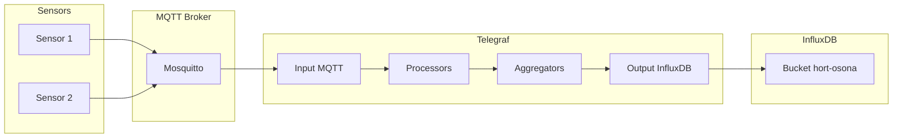

# Capítol 16 — Telegraf: el pont entre MQTT i InfluxDB

> *"Telegraf és el treballador silenciós. No es nota, però sense ell, les dades no arriben mai a bon port."*

## 16.1 Què és Telegraf

**Telegraf** és un agent de codi obert, escrit en Go, desenvolupat per InfluxData (la mateixa empresa que InfluxDB). La seva feina és recollir mètriques de tot tipus de fonts, processar-les, i escriure-les a una o més destinacions. És l'equivalent a un "conseller delegat" de la cadena de dades: sap com parlar amb centenars de serveis diferents.

Telegraf es basa en **plugins**:

- **Inputs**: llegeixen dades de fonts externes (MQTT, HTTP, fitxers, execució de comandes, etc.).
- **Processors**: transformen les dades (renomenar camps, agregar, parsejar, etc.).
- **Aggregators**: combinen múltiples punts en un de sol (mitjana, màxim, etc.).
- **Outputs**: escriuen les dades a destinacions (InfluxDB, Kafka, fitxers, etc.).

Cada plugin és un petit programa independent que es configura al fitxer `telegraf.conf`. La potència de Telegraf ve d'aquesta modularitat: podem combinar inputs i outputs com si fossin peces de Lego.

Al BernatLab, Telegraf serà el **pont entre Mosquitto i InfluxDB**: escoltarà tots els missatges MQTT del broker i els escriurà com a punts a InfluxDB. Per fer-ho, usarem dos plugins:

- **Input MQTT**: subsciu a topics MQTT, rep els missatges, parseja el payload.
- **Output InfluxDB v2**: escriu els punts a InfluxDB 2.x.

A més, afegirem un **processor** per renombrar camps i tags, i un **aggregator** per sumar lectures quan calgui.

## 16.2 Instal·lació al BernatLab

Telegraf es desplega amb Docker. La imatge oficial és `telegraf:1.30` (o l'última estable).

### Definició al docker-compose.yml

```yaml
services:
  telegraf:
    image: telegraf:1.30
    container_name: telegraf
    restart: unless-stopped
    user: telegraf:998
    volumes:
      - ./telegraf.conf:/etc/telegraf/telegraf.conf:ro
      - /home/bernat/homelab/data/telegraf:/var/lib/telegraf
    environment:
      - INFLUX_TOKEN=${TELEGRAF_INFLUX_TOKEN}
      - MQTT_USERNAME=telegraf
      - MQTT_PASSWORD=${TELEGRAF_MQTT_PASSWORD}
```

Telegraf necessita accedir al fitxer de configuració en mode lectura, i a una carpeta per emmagatzemar estat intern (caches, etc.). Les credencials les passem com a variables d'entorn des del `.env`.

## 16.3 Configuració bàsica

El fitxer `telegraf.conf` és un TOML (una variant de INI). Té tres seccions principals: `[agent]`, `[[inputs.mqtt_consumer]]`, `[[outputs.influxdb_v2]]`.

### Configuració de l'agent

```toml
[agent]
  interval = "30s"
  flush_interval = "30s"
  metric_batch_size = 1000
  metric_buffer_limit = 10000
  debug = false
  quiet = false
  hostname = "hortosona"
  omit_hostname = false
```

- **`interval`**: cada quan recollim dades de les fonts. Per a MQTT, no és rellevant (Telegraf reacciona als missatges), però és bona pràctica definir-lo.
- **`flush_interval`**: cada quan enviem les dades als outputs. 30 segons és un bon valor per defecte.
- **`metric_batch_size`**: mida màxima del lot de mètriques. 1000 és adequat.
- **`hostname`**: com s'identifica aquest agent a les mètriques. Aquest valor s'afegeix com a tag a cada punt.

### Configuració de l'input MQTT

```toml
[[inputs.mqtt_consumer]]
  servers = ["tcp://100.x.y.z:1883"]
  username = "telegraf"
  password = "${MQTT_PASSWORD}"
  client_id = "telegraf-bernatlab"
  qos = 0
  clean_session = true
  topics = [
    "hort/+/+/+",
    "hort/+/estat",
  ]
  data_format = "json"
  json_string_fields = []
  tag_keys = ["zona", "sensor", "unitat"]
  json_timestamp_units = "1s"
  tagexclude = ["host", "topic"]
```

- **`servers`**: el broker MQTT. Al BernatLab és `tcp://100.x.y.z:1883`.
- **`username` i `password`**: les credencials del compte `telegraf`.
- **`topics`**: els patrons de topics a subscriure. Aquí volem tot `hort/+/+/+` (zona + tipus + identificador) i els topics d'estat.
- **`data_format = "json"`**: Telegraf parsejarà cada missatge com a JSON.
- **`tag_keys`**: quins camps del JSON es converteixen en tags (indexats) en lloc de camps. Aquí volem `zona`, `sensor`, i `unitat` com a tags.
- **`json_timestamp_units`**: unitat del timestamp al JSON. Si el JSON té un camp `ts` en segons Unix, posem `"1s"`. Si no, podem ometre aquest paràmetre i Telegraf assignarà el temps del servidor.
- **`tagexclude`**: tags que volem excloure del punt final (per exemple, `topic` que és informatiu però no útil per a consultes).

### Configuració de l'output InfluxDB v2

```toml
[[outputs.influxdb_v2]]
  urls = ["http://influxdb:8086"]
  token = "${INFLUX_TOKEN}"
  org = "bernatlab"
  bucket = "hort-osona"
  timeout = "10s"
  user_agent = "telegraf-bernatlab"
  content_encoding = "gzip"
```

- **`urls`**: la URL d'InfluxDB. Com que és un servei del mateix `docker-compose.yml`, podem usar el nom del servei (`influxdb`).
- **`token`**: el token d'escriptura que hem creat per a Telegraf.
- **`org` i `bucket`**: l'organització i el bucket d'InfluxDB.
- **`content_encoding = "gzip"`: Telegraf comprimirà les dades abans d'enviar-les, la qual cosa estalvia ample de banda.

### Filtratge i processament

Podem afegir un processor per netejar les dades. Per exemple, per renombrar el camp `valor` a `value` (que és el nom convencional a InfluxDB) i afegir un tag de zona horària:

```toml
[[processors.rename]]
  [[processors.rename.replace]]
    field = "valor"
    dest = "value"

[[processors.converter]]
  [processors.converter.tags]
    string = ["zona", "sensor", "unitat"]
```

Això és opcional, però útil per mantenir la consistència.

## 16.4 Exemple: com es transforma un missatge

Imaginem que un sensor publica:

```
Topic: hort/zona-tomateres/temperatura/aire
Payload: {"valor": 23.5, "unitat": "graus_C", "ts": 1717823400}
```

Telegraf ho processa i crea un punt InfluxDB:

```
Measurement: hort/zona-tomateres/temperatura/aire
Tags: zona=zona-tomateres, sensor=bme280, unitat=graus_C, host=hortosona
Fields: valor=23.5
Time: 1717823400 (or server time if ts is missing)
```

Aquest punt s'escriu a InfluxDB al bucket `hort-osona`. A partir d'aquí, podem consultar-lo amb Flux o visualitzar-lo amb Grafana.

## 16.5 Treballar amb múltiples tipus de mesura

Quan tenim molts sensors i moltes mesures, podem voler organitzar les dades de manera més neta. Hi ha dues estratègies:

### Estratègia 1: una mesura per tipus

Tots els punts amb el camp `valor` que són temperatures van a la mesura `temperatura`; tots els que són humitat van a la mesura `humitat`, etc. Això s'aconsegueix amb un processor que renombra la mesura:

```toml
[[processors.regex]]
  [[processors.regex.tags]]
    key = "topic"
    pattern = "^hort/[^/]+/([^/]+)/.*$"
    replacement = "${1}"
```

Aquest processor extreu el tipus de mesura (temperatura, humitat, ...) del topic i l'assigna com a tag. Després, podem renombrar-lo a `_measurement` perquè InfluxDB l'usi com a mesura:

```toml
[[processors.rename]]
  [[processors.rename.replace]]
    tag = "topic_type"
    dest = "_measurement"
```

### Estratègia 2: mantenir el topic com a mesura

Deixar que el topic sigui directament la mesura (per exemple, `hort/zona-tomateres/temperatura/aire`). Això és més simple, però pot generar un gran nombre de mesures.

Al BernatLab, començarem amb l'estratègia 1 (una mesura per tipus) perquè és més neta per a Grafana.

## 16.6 Agregacions a Telegraf

Telegraf pot agregar dades abans d'enviar-les. Per exemple, podem calcular la mitjana de cada 5 minuts:

```toml
[[aggregators.basicstats]]
  period = "300s"
  drop_original = false
  stats = ["mean", "min", "max", "stddev"]
```

Aquest aggregator crea nous camps:

- `valor_mean`: mitjana del període.
- `valor_min`: mínim.
- `valor_max`: màxim.
- `valor_stddev`: desviació estàndard.

Útil per reduir el volum de dades quan tenim sensors que publiquen molt sovint.

## 16.7 Provar la configuració

Un cop escrit el fitxer `telegraf.conf`, podem validar-lo:

```bash
docker compose exec telegraf telegraf --config /etc/telegraf/telegraf.conf --test
```

Aquesta ordre fa una passada de prova, lllegint les dades durant uns segons i mostrant per pantalla el que enviaria a InfluxDB. Si veiem les mètriques correctes, la configuració és bona.

Alternativament, podem mirar els logs:

```bash
docker compose logs telegraf
```

Si tot va bé, veurem línies com:

```
2024-06-08T12:00:00Z I! Starting Telegraf 1.30.0
2024-06-08T12:00:00Z I! Loaded inputs: mqtt_consumer
2024-06-08T12:00:00Z I! Loaded outputs: influxdb_v2
2024-06-08T12:00:00Z I! Tags enabled: host=hortosona
2024-06-08T12:00:00Z I! [agent] Start: agent started
```

Si hi ha errors de connexió a MQTT o a InfluxDB, els veurem aquí.

## 16.8 Provar amb un simulador de sensor

Per validar tota la cadena, podem executar el simulador Python del Capítol 14 i comprovar que les dades apareixen a InfluxDB. Al Capítol 14 ja vàrem tenir:

```python
# simula_bme280.py - script que publica a MQTT cada 60 segons
```

Executem-lo en una terminal, i en una altra mirem si InfluxDB rep les dades:

```bash
# Mira les mètriques al Data Explorer
# O amb la CLI:
influx query '
from(bucket: "hort-osona")
  |> range(start: -5m)
  |> filter(fn: (r) => r._measurement == "temperatura")
  |> last()
' --org bernatlab --token TOKEN
```

Si tot és correcte, veurem les últimes lectures.

## 16.9 Consideracions de rendiment

Telegraf pot gestionar volums molt alts de dades, però en una Raspberry Pi hem de ser curosos:

- **`flush_interval`**: 30 segons és un bon equilibri. Més curt = més càrrega, més llarg = més memòria.
- **`metric_buffer_limit`**: 10.000 mètriques. Si el buffer s'omple, Telegraf llençarà mètriques. Ajustar segons la càrrega.
- **Processors**: cada processor afegeix latència. No abusar-ne.
- **Compressió**: `gzip` estalvia ample de banda però consumeix una mica de CPU.

Al BernatLab, amb 5-10 sensors publicant cada minut, el rendiment no serà un problema. Però estarem atents als logs per si Telegraf comença a perdre mètriques.

## 16.10 Quan fallen les coses: estratègies de recuperació

Quan Telegraf no pot escriure a InfluxDB (perquè InfluxDB està caigut, per exemple), què passa?

- **Telegraf desa les mètriques a memòria** (fins al `metric_buffer_limit`).
- Si InfluxDB torna, Telegraf buida el buffer.
- Si el buffer s'omple, Telegraf llença les mètriques més antigues (configurable).

Això vol dir que en una caiguda curta, no perdem dades. En una caiguda llarga, podem perdre'n.

Per minimitzar la pèrdua de dades, podem:

1. **Configurar Uptime Kuma** per alertar quan InfluxDB està caigut.
2. **Augmentar el `metric_buffer_limit`** si tenim RAM disponible.
3. **Configurar Telegraf per escriure a disc** quan el buffer estigui ple (configuració avançada, no sempre recomanable).

## 16.11 Logs i depuració

Quan alguna cosa no funciona, els logs són la primera pista. Per augmentar la verbositat:

```toml
[agent]
  debug = true
  quiet = false
```

I per veure exactament quin missatge arriba i quin punt genera:

```toml
[[inputs.mqtt_consumer]]
  # ... altres opcions ...
  json_debug_fields = true
```

Això ens permet veure, per a cada missatge, quin punt s'ha generat i quins tags i camps té. Molt útil quan estem afinant la configuració.

## 16.12 Configuracions avançades

### Processar payloads no-JSON

Si tenim sensors que publiquen en text pla (per exemple, `23.5`), podem canviar el format:

```toml
[[inputs.mqtt_consumer]]
  data_format = "value"
  data_type = "float"
```

Això crearà un punt amb el valor numèric directament.

### Afegir tags automàtics

Podem afegir tags addicionals a tots els punts, com ara el nom del projecte:

```toml
[agent]
  hostname = "hortosona"

[[inputs.mqtt_consumer]]
  # ... opcions ...
  [[inputs.mqtt_consumer.tagpass]]
    project = "bernatlab"
```

Això és útil per distingir dades de diferents projectes si en el futur en tenim més d'un.

### Múltiples brokers

Si tenim més d'un broker MQTT, podem afegir múltiples inputs:

```toml
[[inputs.mqtt_consumer]]
  servers = ["tcp://broker1:1883"]
  name = "broker1"
  # ...

[[inputs.mqtt_consumer]]
  servers = ["tcp://broker2:1883"]
  name = "broker2"
  # ...
```

Això ens permet consolidar dades de diversos brokers en un sol bucket d'InfluxDB.

## 16.13 Còpies de seguretat

La configuració de Telegraf és al fitxer `telegraf.conf`, que ja està versionat amb Git (a `stacks/iot/`). No cal fer-ne còpies addicionals, tret dels logs si els volem analitzar.

El volum persistent de Telegraf (`/var/lib/telegraf`) conté caches que es poden regenerar. No cal copiar-lo.

## 16.14 Integració amb la resta del BernatLab

Un cop tenim Telegraf funcionant:

- Les dades dels sensors flueixen de MQTT a InfluxDB automàticament.
- Grafana pot consultar InfluxDB per visualitzar les dades.
- Node-RED pot subscriure's directament a MQTT (o consultar InfluxDB) per prendre decisions.
- L'API FastAPI pot consultar InfluxDB per servir dades a la web.

Telegraf és, per tant, el **cor de la cadena de dades**. Sense ell, les dades no arribarien a InfluxDB.

## 16.15 Esquema conceptual



## 16.16 Errors habituals

**Error 1: subscriure's a massa topics**. Símptoma: Telegraf consumeix massa CPU, el buffer s'omple. Solució: ser específic amb els patrons de topics.

**Error 2: no parsejar correctament el JSON**. Símptoma: els punts arriben a InfluxDB amb camps buits o erronis. Solució: usar `--test` per validar la configuració.

**Error 3: token d'InfluxDB incorrecte**. Símptoma: errors d'autenticació als logs. Solució: revisar el `.env` i el token.

**Error 4: no excloure el tag `topic`**. Símptoma: cada missatge té un tag `topic` únic, cosa que multiplica les series a InfluxDB. Solució: afegir `tagexclude = ["topic"]`.

**Error 5: timestamps inconsistents**. Símptoma: les dades apareixen amb dates incorrectes. Solució: usar `json_timestamp_units` correctament o deixar que InfluxDB assigni el temps.

## 16.17 Bones pràctiques

1. **`tagexclude = ["topic"]`** sempre, per evitar multiplicar les series.
2. **Un topic_measurement clar**, normalment basat en el tipus de dada.
3. **Flush_interval de 30 segons** com a bon equilibri.
4. **Validar amb `--test`** abans de posar en marxa.
5. **Monitorar amb Uptime Kuma** que Telegraf està corrent.
6. **Backups del bucket** d'InfluxDB (no de Telegraf directament).
7. **Documentar els tags** al README del projecte.
8. **Limitar el nombre de processors** per minimitzar la latència.
9. **Usar compressió gzip** per estalviar ample de banda.
10. **Revisar els logs periòdicament** per detectar anomalies.

## 16.18 Resum

Hem après què és Telegraf, com es configura amb inputs i outputs, com es connecta a Mosquitto i a InfluxDB al BernatLab, com es parsegen els missatges JSON, com s'agreguen dades i com es filtra el que arriba a InfluxDB. Hem vist exemples reals de configuració, hem après a provar-la amb `--test`, i hem après les bones pràctiques. En el proper capítol veurem Node-RED, l'eina de programació visual que ens permetrà processar les dades d'una manera molt flexible.

## 16.19 Exercicis pràctics

1. Desplega Telegraf al BernatLab amb la configuració que hem vist.
2. Executa el simulador Python del Capítol 14 durant 5 minuts.
3. Comprova al Data Explorer d'InfluxDB que les dades hi arriben.
4. Consulta les últimes 10 lectures de temperatura amb una query Flux.
5. Afegeix un processor a Telegraf que calculi la mitjana de cada 5 minuts.
6. Prova de canviar el `flush_interval` a 5 segons i observa com canvia el comportament.
7. Fes una prova amb `--test` per veure què passaria amb la configuració actual.
8. Documenta al README l'esquema de tags que genera Telegraf.

Comandes útils:
```bash
# Validar la configuració
docker compose exec telegraf telegraf --config /etc/telegraf/telegraf.conf --test

# Veure els logs
docker compose logs -f telegraf

# Comprovar que escriu a InfluxDB
influx query '
from(bucket: "hort-osona")
  |> range(start: -5m)
  |> filter(fn: (r) => r._measurement == "temperatura")
  |> last()
' --org bernatlab --token TOKEN
```

Paraules clau: **Telegraf, agent, plugin, input, output, processor, aggregator, MQTT, InfluxDB, Line Protocol, JSON, telegraf.conf, tagexclude, flush_interval, --test, validació, simulador, sensors, hort, mesura, tags, camps, agregació, rendiment, memòria, buffer, depuració, monitoratge, Uptime Kuma, README**.
