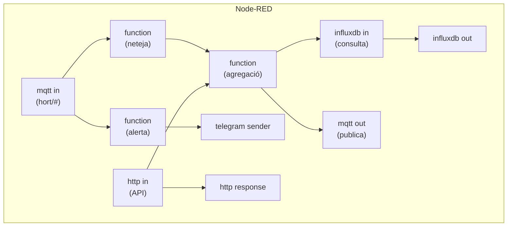

# Capítol 17 — Node-RED: programació visual

> *"Node-RED és l'eina que fa que la programació sembli un joc de nens. Però que sembli un joc no vol dir que sigui trivial: la disciplina continua sent necessària."*

## 17.1 Què és Node-RED

**Node-RED** és una eina de programació visual, basada en fluxos, desenvolupada originalment per IBM i ara mantinguda per la comunitat de codi obert. La seva interfície és una graella on arrosseguem **nodes** (blocs amb funcionalitats específiques) i els connectem amb **cables** per crear **fluxos** (flows).

La idea és senzilla: en lloc d'escriure codi Python o JavaScript, dibuixem la lògica. Cada node fa una cosa:

- Un node MQTT es subscriu a un topic i ens entrega els missatges.
- Un node InfluxDB consulta o escriu punts.
- Un node Telegram envia un missatge.
- Un node Function executa JavaScript personalitzat.

Connectem nodes amb cables per definir el flux de dades. Quan tot està connectat, el flux s'executa: cada vegada que un node rep un missatge, el processa i l'envia al següent node.

## 17.2 Per què Node-RED al BernatLab

Al BernatLab, Node-RED ens servirà per:

1. **Processar les dades dels sensors** un cop estan a InfluxDB. Per exemple, calcular una mitjana mòbil, detectar patrons, transformar unitats.
2. **Detectar anomalies** i generar alertes. Si la temperatura baixa de 2 °C, enviar un missatge a Telegram.
3. **Coordinar actuadors**. Si la humitat del sòl baixa del 30 %, obrir una vàlvula de reg.
4. **Crear APIs senzilles** amb un node HTTP in.
5. **Integrar serveis externs**: enviar dades a un webhook, rebre comandes de Telegram, etc.

Node-RED és molt adequat per a aquestes tasques perquè:

- La interfície visual fa que la lògica sigui entenedora d'un cop d'ull.
- Tenim centenars de nodes preconfigurats per a tot tipus de serveis.
- Permet incrustar JavaScript personalitzat als nodes Function quan calgui.
- Es pot desar el flux com a JSON, perfecte per a Git.

## 17.3 Instal·lació al BernatLab

Node-RED es desplega amb Docker. La imatge oficial és `nodered/node-red:3.1` (o l'última estable).

### Definició al docker-compose.yml

```yaml
services:
  nodered:
    image: nodered/node-red:3.1
    container_name: nodered
    restart: unless-stopped
    ports:
      - "1880:1880"
    volumes:
      - /home/bernat/homelab/data/nodered:/data
    environment:
      - TZ=Europe/Madrid
```

Cal un volum persistent per desar els fluxos i la configuració. El port 1880 és el port estàndard de Node-RED.

### Primer accés

Un cop en marxa, podem accedir a la interfície web a `http://100.115.134.76:1880`. Veurem una graella buida amb una paleta de nodes a l'esquerra i informació a la dreta.

La interfície té tres zones principals:

- **Paleta** (esquerra): llista de nodes disponibles, organitzats per categories.
- **Espai de treball** (centre): la graella on dibuixem els fluxos.
- **Informació** (dreta): informació del node seleccionat, debug, configuració.

## 17.4 Conceptes bàsics

### Nodes

Un **node** és un bloc amb una funcionalitat específica. Hi ha molts tipus:

- **Input**: comencen un flux. Per exemple, un node `mqtt in` que escolta un topic.
- **Output**: acaben un flux. Per exemple, un node `mqtt out` que publica un missatge.
- **Function**: processen dades. Per exemple, un node `function` que executa JavaScript.
- **Storage**: emmagatzemen dades. Per exemple, un node `influxdb out` que escriu un punt.

Cada node té:

- **Ports d'entrada** (a l'esquerra): reben missatges.
- **Ports de sortida** (a la dreta): envien missatges.
- **Configuració** (doble clic): propietats específiques.

### Missatges

Quan un node rep o envia un missatge, ho fa en forma d'objecte JavaScript. L'estructura bàsica és:

```javascript
{
  payload: ...,       // el contingut principal
  topic: "...",       // opcional, útil per MQTT
  _msgid: "uuid",     // identificador únic
  // ... camps personalitzats
}
```

La clau `payload` és la convenció: la majoria de nodes la fan servir per defecte.

### Fluxos

Un **flux** és una agrupació de nodes connectats. Podem tenir múltiples fluxos a la mateixa instància de Node-RED, cadascun amb el seu propi nom i la seva pròpia finalitat.

### Pestanya de flux

A la part superior de l'espai de treball tenim les **pestanyes de flux** (flow tabs). Cada pestanya és un flux independent. Això ens permet organitzar la lògica en parts clarament diferenciades.

## 17.5 Un primer flux: Hola Món

Comencem amb el clàssic "Hola Món". Crea un flux amb dos nodes:

1. Un node `inject` (categoria *input*).
2. Un node `debug` (categoria *output*).

Connecta'ls. Configura el node `inject` perquè dispari cada 5 segons amb el payload "Hola Món". Fes clic a **Deploy** (botó a la part superior dreta).

Ara, a la pestanya **Debug** (icona del panell dret), veuràs cada 5 segons un missatge amb el payload "Hola Món".

Aquest flux no fa res útil, però ensenya el patró bàsic: un node que origina dades, un node que les consumeix, i un cable que els connecta.

## 17.6 Nodes útils per al BernatLab

Vegem els nodes que farem servir més sovint.

### MQTT

- **mqtt in**: subscriu a un topic MQTT.
- **mqtt out**: publica un missatge MQTT.

Configuració típica de `mqtt in`:

```json
{
  "broker": "100.115.134.76:1883",
  "clientid": "nodered-bernatlab",
  "topic": "hort/+/+",
  "qos": "0",
  "name": "MQTT BernatLab"
}
```

Cal configurar el broker (adreça, port, credencials) fent doble clic a la secció "Broker".

### InfluxDB

Hi ha un node de la paleta `node-red-contrib-influxdb` que permet consultar i escriure a InfluxDB.

Per instal·lar-lo, anem al menú **Manage palette → Install** i busquem `node-red-contrib-influxdb`.

Un cop instal·lat, podem usar els nodes:

- **influxdb in**: consulta dades.
- **influxdb out**: escriu punts.

Exemple de configuració de `influxdb in`:

```json
{
  "bucket": "hort-osona",
  "query": "from(bucket: \"hort-osona\") |> range(start: -1h) |> filter(fn: (r) => r._measurement == \"temperatura\") |> last()"
}
```

### Telegram

Hi ha un node `node-red-contrib-telegrambot` que ens permet enviar i rebre missatges de Telegram.

Per instal·lar-lo, busquem `node-red-contrib-telegrambot` a la paleta.

Configuració típica: cal crear un bot de Telegram (com vam fer per a Uptime Kuma al Mòdul 1) i obtenir el token. Un cop configurat, podem enviar missatges amb un node `telegram sender`.

### Function

El node **function** ens permet executar JavaScript personalitzat. El codi s'executa per a cada missatge que arriba al node, i retorna un o més missatges a la sortida.

Exemple: comptar quantes temperatures hem rebut:

```javascript
let comptador = context.get("comptador") || 0;
comptador += 1;
context.set("comptador", comptador);

msg.payload = `Hem rebut ${comptador} lectures.`;
return msg;
```

Això és molt útil per a lògica personalitzada que no es pot expressar amb nodes visuals.

## 17.7 Debug i depuració

Node-RED té una eina de **debug** molt potent. Hi ha tres formes de depurar:

### Pestanya Debug

A la dreta de la interfície, una pestanya "Debug" mostra tots els missatges enviats a nodes `debug`. Podem filtrar per node, per topic, per tipus de missatge.

### Catch nodes

Si un flux llença un error, podem capturar-lo amb un **catch node** (categoria *function*). Connectem un catch node a un node que pot fallar, i ens avisa quan hi ha un error.

### Status nodes

Els **status nodes** mostren l'estat d'un node concret. Per exemple, podem veure si un node MQTT està connectat o desconnectat.

## 17.8 Persistència i còpies de seguretat

Node-RED desa tots els fluxos a un fitxer anomenat `flows.json` dins del volum persistent (`/data`). Aquest fitxer és el cor del sistema: conté tota la lògica.

Per fer còpies de seguretat:

```bash
cp /home/bernat/homelab/data/nodered/flows.json \
   /home/bernat/homelab/backup/nodered-flows-$(date +%F).json
```

Per restaurar:

```bash
cp /home/bernat/homelab/backup/nodered-flows-2026-XX-XX.json \
   /home/bernat/homelab/data/nodered/flows.json
docker compose restart nodered
```

Alternativament, podem versionar el `flows.json` amb Git. És un fitxer de text, perfectament versionable. Les diferències entre versions es poden veure clarament.

## 17.9 Bones pràctiques

### Organitzar els fluxos

Node-RED tendeix a créixer. Per evitar el caos:

- **Un flux per funcionalitat**. Per exemple, un flux "Alertes", un flux "Processament de dades", un flux "API".
- **Noms clars als nodes**. Un node anomenat "MQTT" no serveix; "Subscriu a hort/zona1/#" sí.
- **Comentaris als fluxos**. Podem afegir caixes de text descriptives al costat dels nodes.
- **Agrupar nodes relacionats**. Seleccionar múltiples nodes i agrupar-los.

### Evitar la complexitat

Node-RED pot gestionar fluxos complexos, però cada complexitat afegida és un risc de fallada. Recomanacions:

- **Mantenir els fluxos petits i llegibles**. Si un flux té 30 nodes, cal dividir-lo.
- **Reutilitzar sub-fluxos**. Node-RED permet crear sub-fluxos (subflows) que encapsulen lògica complexa.
- **Documentar la lògica** amb comentaris.

### Evitar nodes Function excessius

Els nodes `function` són útils, però si un flux té 10 nodes `function` seguits, potser és millor escriure un script Python independent. Node-RED és per a orquestració, no per a lògica de negoci complexa.

### Control de versions

Com ja hem dit, versionar `flows.json` amb Git. Cada canvi important, un commit.

## 17.10 Configuració avançada

### settings.js

El fitxer `settings.js` (a `/data/`) controla la configuració global de Node-RED. Algunes directives útils:

```javascript
module.exports = {
  // Port HTTP
  uiPort: 1880,

  // Autenticació (recomanable!)
  adminAuth: {
    type: "credentials",
    users: [{
      username: "bernat",
      password: "$2a$08$..."  // hash bcrypt
    }]
  },

  // HTTPS (opcional, ho faríem si exposéssim Node-RED a Internet)
  // https: { ... },

  // Timezone
  timezone: "Europe/Madrid",

  // Nivell de log
  logging: {
    console: {
      level: "info",
      metrics: false,
      audit: false
    }
  },

  // Directori de fluxos
  flowFile: "flows.json",

  // Configuració de nodes personalitzats
  // ...
}
```

Cal **activar l'autenticació** (adminAuth) si exposem Node-RED a una xarxa que no és totalment privada. Al BernatLab, amb Tailscale, és menys crític, però és bona pràctica.

### Còpies de seguretat automàtiques

Podem programar un node `exec` que periòdicament faci una còpia de `flows.json` a un altre lloc. Per exemple:

```bash
cp /data/flows.json /backup/nodered-$(date +%F).json
```

I cridar-lo amb un node `cron` o un node `inject` configurat per executar-se cada dia.

## 17.11 Integració amb la resta del BernatLab

Un cop tenim Node-RED funcionant, podem:

- Subscriure'ns a MQTT per rebre dades dels sensors.
- Consultar InfluxDB per obtenir dades històriques.
- Enviar alertes a Telegram.
- Crear API endpoints amb `http in` + `http response`.
- Publicar comandes a MQTT per controlar actuadors.
- Cridar serveis externs via HTTP.

Al Capítol 18 veurem fluxos concrets que posen tot això en pràctica.

## 17.12 El primer flux útil: comptador de missatges

Connectem-nos a MQTT i comptem quantes lectures de temperatura hem rebut:

1. Un node `mqtt in` subscrit a `hort/+/temperatura/aire`.
2. Un node `function` que compta missatges.
3. Un node `debug` que mostra el comptador periòdicament.

Codi del node `function`:

```javascript
let comptador = context.get("comptador") || 0;
comptador += 1;
context.set("comptador", comptador);

if (comptador % 10 === 0) {
    msg.payload = `Hem rebut ${comptador} lectures de temperatura.`;
    return msg;
} else {
    return null;
}
```

Aquest flux ens permet veure, cada 10 lectures, quantes hem rebut en total. Simple, però útil.

## 17.13 Codi JavaScript als nodes Function

Algunes pautes per escriure JavaScript als nodes Function:

- **`context`**: un magatzem de valors que persisteixen entre missatges. Útil per a estats, comptadors, etc.
- **`flow`**: un magatzem compartit per tots els nodes del mateix flux.
- **`global`**: un magatzem compartit per tota la instància.
- **`msg`**: l'objecte del missatge actual. Hem de retornar-lo (o un array) per enviar-lo a la sortida.
- **`node.warn(msg)` i `node.error(msg)`**: missatges d'avís i d'error que apareixen a la consola i a la pestanya debug.

Exemple: detectar temperatures extremes i generar un avís:

```javascript
if (msg.payload > 35) {
    node.warn("Temperatura massa alta: " + msg.payload);
}
if (msg.payload < 5) {
    node.warn("Temperatura massa baixa: " + msg.payload);
}
return msg;
```

## 17.14 Rendiment

Node-RED és un programa JavaScript que s'executa a Node.js. En una Raspberry Pi 4 amb 4 GB de RAM, podem allotjar Node-RED còmodament, sempre que no tinguem centenars de fluxos actius.

Recomanacions:

- **Evitar nodes `function` amb bucles infinits**.
- **Limitar el nombre de nodes `debug`**: cada missatge enviat a debug es guarda a memòria.
- **Usar `link nodes`** per dividir fluxos llargs en parts separades.
- **No abusar de nodes `delay`**: cusen el missatge a la memòria.

## 17.15 Esquema conceptual



## 17.16 Errors habituals

**Error 1: oblidar fer Deploy**. Símptoma: els canvis no s'apliquen. Solució: clicar el botó **Deploy** a la part superior dreta.

**Error 2: no connectar bé un node**. Símptoma: el flux no rep missatges. Solució: comprovar que els cables estan connectats als ports correctes.

**Error 3: credencials incorrectes al broker MQTT**. Símptoma: el node `mqtt in` mostra "Disconnected". Solució: revisar l'usuari, la contrasenya i el port.

**Error 4: nodes Function que retornen `null` quan no toca**. Símptoma: el flux s'atura. Solució: retornar sempre un `msg` o un array de `msg`.

**Error 5: cicles infinits**. Símptoma: Node-RED es penja o consumeix tota la CPU. Solució: dissenyar fluxos acíclics, o usar nodes `delay` per evitar bucles.

**Error 6: no desar els fluxos**. Símptoma: en reiniciar Node-RED, els fluxos es perden. Solució: fer Deploy sempre que fem canvis, i comprovar que el volum `/data` està muntat correctament.

## 17.17 Resum

Hem après què és Node-RED, com es programa visualment amb nodes i fluxos, quins nodes són útils per al BernatLab, com es connecta a MQTT, InfluxDB i Telegram, i com es depuren els fluxos. Hem vist un primer flux útil, hem après bones pràctiques d'organització i rendiment, i hem après a fer còpies de seguretat. En el proper capítol posarem tot això en pràctica amb exemples reals: neteja de dades, agregacions, detecció d'anomalies i alertes a Telegram.

## 17.18 Exercicis pràctics

1. Desplega Node-RED al BernatLab amb la configuració que hem vist.
2. Crea un flux "Hola Món" amb `inject` i `debug`. Deploy. Comprova que funciona.
3. Instal·la el node `node-red-contrib-influxdb` des de la paleta.
4. Crea un flux que es subscrigui a `hort/+/+` i compti missatges amb un node `function`.
5. Configura l'autenticació a `settings.js` per accedir a Node-RED.
6. Exporta els fluxos a JSON i guarda'ls a `~/homelab/backup/`.
7. Documenta al README del projecte quin és el patró de noms que fas servir per als nodes.

Comandes útils:
```bash
# Veure els logs
docker compose logs -f nodered

# Fer una còpia de seguretat
cp /home/bernat/homelab/data/nodered/flows.json \
   /home/bernat/homelab/backup/nodered-flows-$(date +%F).json

# Reiniciar Node-RED
docker compose restart nodered
```

Paraules clau: **Node-RED, flux, node, paleta, MQTT, InfluxDB, Telegram, Function, debug, deploy, context, flow, global, settings.js, adminAuth, còpia de seguretat, versionat, Git, HTTP, http in, http response, rendiment, organització, subflows, alertes, sensors, hort, BernatLab**.
