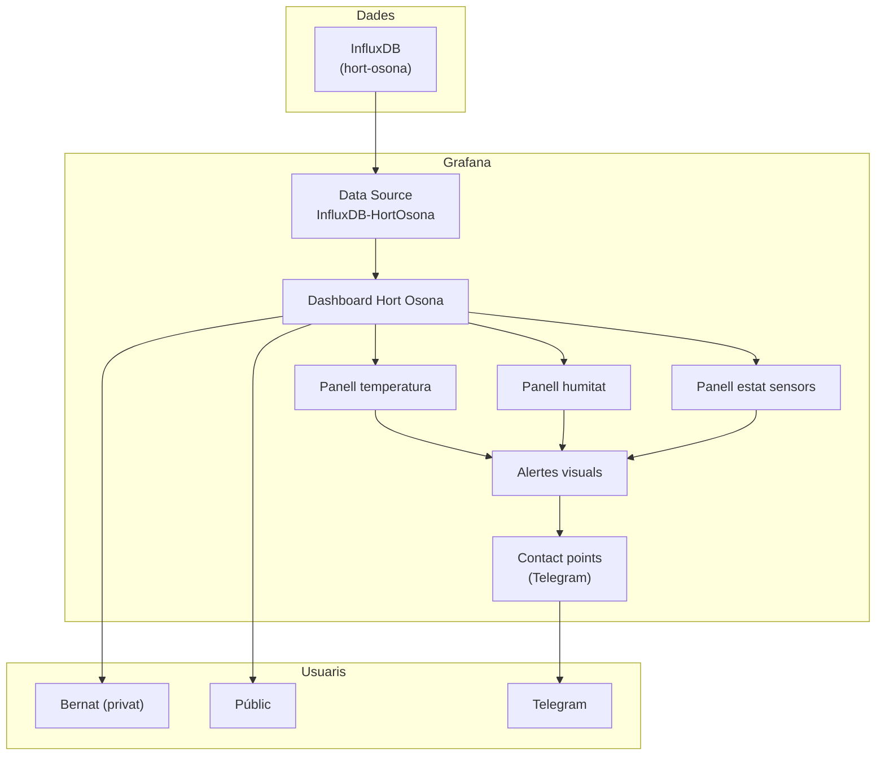

# Capítol 19 — Grafana: visualitzar les dades

> *"Una gràfica val més que mil números. I una alerta visual val més que mil correus."*

## 19.1 Què és Grafana

**Grafana** és una plataforma de codi obert per visualitzar, analitzar i monitorar dades. Originalment pensada per a mètriques de sistemes, s'ha convertit en l'eina de referència per a qualsevol cosa que es pugui representar en gràfiques, taules, gauges, heatmaps, i un llarg etcètera.

Grafana es connecta a **moltes fonts de dades** (InfluxDB, Prometheus, MySQL, PostgreSQL, Elasticsearch, Loki, fins i tot APIs HTTP) i ens permet crear **dashboards** combinant panells (visualitzacions individuals). Cada panell té la seva pròpia consulta, configuració visual, i opcionalment alertes.

Al BernatLab, Grafana serà la finestra visual del sistema Hort Osona. Aquí veurem:

- L'evolució de la temperatura al llarg del temps.
- La comparació entre zones.
- Les alertes visuals (un termòmetre que es posa vermell si la temperatura baixa de 2 °C).
- L'estat dels sensors (quins estan actius, quants porten més de X minuts sense publicar).
- Estadístiques agregades (mitjanes diàries, màxims mensuals, etc.).

## 19.2 Per què Grafana i no la UI d'InfluxDB

InfluxDB 2.x té la seva pròpia interfície web amb gràfiques bàsiques, però Grafana és molt més potent:

- **Més tipus de visualitzacions**: gauges, heatmaps, bar charts, pie charts, world maps, etc.
- **Més fonts de dades**: podem combinar InfluxDB amb altres fonts (Prometheus, MySQL) en un sol dashboard.
- **Templating**: podem crear variables que canvien el contingut del dashboard (per exemple, triar quina zona veure).
- **Alertes visuals**: podem configurar que un panell canviï de color segons el valor.
- **Compartició pública**: podem fer dashboards públics amb URLs específiques.
- **Anotacions**: podem afegir marques a les gràfiques (per exemple, "vàlvula de reg oberta" o "alerta de gelada").

## 19.3 Instal·lació al BernatLab

Grafana es desplega amb Docker. La imatge oficial és `grafana/grafana:11.0` (o l'última estable).

### Definició al docker-compose.yml

```yaml
services:
  grafana:
    image: grafana/grafana:11.0
    container_name: grafana
    restart: unless-stopped
    ports:
      - "3000:3000"     # interfície web
    volumes:
      - /home/bernat/homelab/data/grafana:/var/lib/grafana
    environment:
      - GF_SECURITY_ADMIN_USER=bernat
      - GF_SECURITY_ADMIN_PASSWORD=${GRAFANA_ADMIN_PASSWORD}
      - GF_USERS_ALLOW_SIGN_UP=false
      - GF_INSTALL_PLUGINS=
      - GF_SERVER_ROOT_URL=http://100.115.134.76:3000
      - GF_ANALYTICS_REPORTING_ENABLED=false
```

Cal un volum persistent per desar dashboards, fonts de dades, alertes i configuracions. Les credencials les passem com a variables d'entorn.

### Primer accés

Un cop en marxa, accedim a `http://100.115.134.76:3000`. Ens demanarà usuari (`bernat`) i contrasenya. El primer cop, Grafana ens portarà a la pantalla de benvinguda.

## 19.4 Configurar la font de dades: InfluxDB

El primer pas és connectar Grafana a InfluxDB. Anem a **Configuration → Data sources → Add data source** i seleccionem **InfluxDB**.

Configuració:

- **Name**: `InfluxDB-HortOsona` (o el nom que preferim).
- **Query language**: **Flux** (per InfluxDB 2.x).
- **URL**: `http://influxdb:8086` (el nom del servei dins del `docker-compose.yml`).
- **Organization**: `bernatlab`.
- **Token**: el token d'accés per a Grafana (el que hem creat al Capítol 15).
- **Default bucket**: `hort-osona`.

Fes clic a **Save & test**. Si tot és correcte, veureu "Data source is working".

## 19.5 Crear el primer panell

Ara crearem un panell per visualitzar la temperatura de les últimes 24 hores.

1. Anem a **Create → Dashboard → Add new panel**.
2. A la consulta, seleccionem la font de dades `InfluxDB-HortOsona`.
3. A la query, escrivim:

```flux
from(bucket: "hort-osona")
  |> range(start: v.timeRangeStart, stop: v.timeRangeStop)
  |> filter(fn: (r) => r._measurement == "temperatura")
  |> filter(fn: (r) => r._field == "valor")
  |> aggregateWindow(every: v.windowPeriod, fn: mean, createEmpty: false)
  |> yield(name: "mean")
```

Aquesta consulta agafa les dades del rang temporal seleccionat, les filtra per mesura `temperatura` i camp `valor`, i n'agrega la mitjana per finestres temporals.

4. A la dreta, configurem:
   - **Panel title**: "Temperatura".
   - **Unit**: Celsius.
   - **Visualization**: Time series.
5. Fem clic a **Apply**.

Veurem una gràfica amb l'evolució de la temperatura al llarg del temps. Si tenim dades al InfluxDB, apareixeran aquí.

## 19.6 Tipus de panells

Grafana ofereix molts tipus de panells. Els més útils per al BernatLab:

### Time series

Línies al llarg del temps. Perfecte per temperatures, humitats, etc.

### Stat

Un valor únic amb format gran. Útil per mostrar l'últim valor d'una mesura, l'estat d'un sensor, etc.

### Gauge

Un indicador circular amb un rang. Útil per mostrar una mesura dins d'un rang (per exemple, humitat del 0 al 100 %).

### Bar chart

Barres verticals o horitzontals. Útil per comparar valors entre zones.

### Table

Una taula. Útil per mostrar llistes de dades o resums.

### Heatmap

Una matriu de colors que mostra la densitat. Útil per veure patrons en dades de molts sensors.

## 19.7 Dashboard d'Hort Osona: estructura

Crearem un dashboard amb aquests panells:

1. **Temperatura actual**: un `stat` amb l'últim valor de temperatura per zona.
2. **Humitat actual**: un `stat` amb l'últim valor d'humitat per zona.
3. **Evolució de la temperatura**: un `time series` amb la temperatura de les últimes 24 h.
4. **Evolució de la humitat del sòl**: un `time series` amb la humitat del sòl.
5. **Lluminositat**: un `time series` amb la lluminositat.
6. **Estat dels sensors**: una taula amb l'última publicació de cada sensor.
7. **Alertes recents**: una taula amb les alertes de les últimes 24 h (si les tenim guardades).

Podem organitzar-los en files i columnes, i configurar el refresc automàtic (per exemple, cada 30 segons).

## 19.8 Variables: filtres dinàmics

Grafana permet crear **variables** que canvien el contingut dels panells. Per exemple, podem crear una variable `zona` que ens permet triar quina zona veure:

1. Anem a **Dashboard settings → Variables → New variable**.
2. **Name**: `zona`.
3. **Type**: `Query`.
4. **Data source**: `InfluxDB-HortOsona`.
5. **Query**:

```flux
import "influxdata/influxdb/schema"
schema.tagValues(bucket: "hort-osona", tag: "zona")
```

6. **Multi-value**: `true`.
7. **Include All option**: `true`.

Ara, a la part superior del dashboard, apareixerà un selector de zona. Els panells que usin la variable `$zona` es filtraran automàticament.

Per usar la variable a les queries:

```flux
from(bucket: "hort-osona")
  |> range(start: v.timeRangeStart, stop: v.timeRangeStop)
  |> filter(fn: (r) => r._measurement == "temperatura")
  |> filter(fn: (r) => r.zona =~ /^${zona:regex}$/)
  |> filter(fn: (r) => r._field == "valor")
  |> aggregateWindow(every: v.windowPeriod, fn: mean, createEmpty: false)
```

Aquí, `${zona:regex}` converteix la variable en una expressió regular. Si la variable permet múltiples valors, Grafana els combina amb `|`.

## 19.9 Alertes a Grafana

Grafana permet configurar **alertes visuals** que canvien el color d'un panell segons el valor. Per exemple, podem fer que el panell de temperatura es posi vermell si baixa de 2 °C.

1. Al panell de temperatura, anem a la secció **Thresholds**.
2. Afegim un llindar:
   - **Mode**: `Absolute`.
   - **Value**: `2`.
   - **Color**: vermell.
3. Afegim un altre:
   - **Value**: `0`.
   - **Color**: blau (per gelades severes).

Ara, el panell canviarà de color segons la temperatura. Això és una alerta visual molt intuïtiva.

A més de les alertes visuals, Grafana pot enviar alertes reals (per correu, webhook, Telegram, etc.) quan un panell compleix una condició. Per configurar alertes:

1. Al panell, anem a **Alert → Create alert rule**.
2. Definim la condició: `WHEN last() OF A IS BELOW 2`.
3. Definim la carpeta d'avaluació: cada 1 minut.
4. Afegim un contact point: Telegram (configurat prèviament).

Grafana avaluarà la condició periòdicament i enviarà un missatge a Telegram quan es compleixi.

## 19.10 Contact points: configurar Telegram

Per rebre alertes per Telegram, cal configurar un contact point.

1. Anem a **Alerting → Contact points → New contact point**.
2. **Name**: `Telegram Bernat`.
3. **Type**: `Telegram`.
4. **Telegram bot token**: el token del nostre bot.
5. **Telegram chat ID**: el nostre chat ID.
6. **Save**.

Ara, quan creem una regla d'alerta, podem triar aquest contact point com a destinatari.

## 19.11 Plantilles d'alerta

Quan Grafana envia una alerta, el missatge es pot personalitzar amb plantilles. Per exemple:

```
⚠️ ALERTA HORT OSONA

Temperatura massa baixa: {{ $values.A }} °C
Zona: {{ $labels.zona }}
Hora: {{ now }}
```

Podem definir la plantilla a la configuració de la regla d'alerta, secció **Message**.

## 19.12 Compartició i accés públic

Si volem, podem fer un dashboard accessible sense autenticació, compartint-lo amb un enllaç. Per fer-ho:

1. Anem a **Dashboard settings → Sharing**.
2. Activem **Public dashboard**.
3. Triem un nom d'enllaç (per exemple, `hort-osona-public`).
4. Configurem quin temps es pot consultar (per defecte, 30 dies).

Ara qualsevol pot accedir al dashboard a `http://100.115.134.76:3000/public-dashboards/hort-osona-public`.

Això és útil si volem ensenyar les dades a algú sense donar-li accés a tota la interfície de Grafana.

## 19.13 Exportar i importar dashboards

Quan tenim un dashboard ben configurat, podem **exportar-lo a JSON** per:

- Guardar-lo com a còpia de seguretat.
- Compartir-lo amb altres.
- Versionar-lo amb Git.

Anem a **Dashboard settings → JSON model → Copy to clipboard** o **Export**.

Per **importar**:

1. Anem a **Create → Import**.
2. Enganxem el JSON o pujem un fitxer.

Això ens permet moure dashboards entre instàncies de Grafana.

## 19.14 Provar el dashboard

Amb el simulador Python del Capítol 14 publicant, podem validar que Grafana mostra les dades correctament. Si no apareixen, cal revisar:

- La consulta Flux: és correcta?
- El rang temporal: estem mirant les últimes 24 h?
- Les dades són a InfluxDB? (Comprovar amb `influx query`)

També podem crear un panell "raw" que mostri les dades sense agregacions, per veure exactament què hi ha.

## 19.15 Rendiment

En una Raspberry Pi 4, hem de ser curosos amb el nombre de panells i la complexitat de les consultes:

- **Limitar el nombre de panells per dashboard**: 8-12 és un bon màxim.
- **Evitar consultes molt complexes** que triguin més de 5 segons.
- **Configurar el `cache`** correctament per no repetir consultes idèntiques.
- **Limitar el rang temporal per defecte**: les últimes 24 h en comptes de "tots els temps".

Si Grafana es torna lent, podem:

- Augmentar la memòria assignada (`GF_DATABASE_MEMORY_CACHE`).
- Optimitzar les consultes a InfluxDB.
- Reduir el nombre de panells.

## 19.16 Integració amb la resta del BernatLab

Grafana s'integra amb:

- **InfluxDB**: la font de dades principal.
- **Uptime Kuma**: podem afegir un panell que mostri l'estat dels serveis (via una API).
- **Homepage**: podem afegir una targeta amb l'enllaç al dashboard.
- **Telegram**: contact point per a alertes.

A més, podem fer que Grafana cridi webhooks quan passa alguna cosa. Per exemple, quan es detecta una gelada, Grafana pot trucar a un webhook de Node-RED, que al seu torn pot activar actuadors.

## 19.17 Esquema conceptual



## 19.18 Errors habituals

**Error 1: token incorrecte**. Símptoma: la font de dades no es connecta. Solució: revisar el token al `.env`.

**Error 2: consulta Flux massa lenta**. Símptoma: els panells trigem molt a carregar. Solució: simplificar la consulta, agregar abans.

**Error 3: no configurar el refresc automàtic**. Símptoma: les dades no s'actualitzen. Solució: configurar el refresh interval del dashboard.

**Error 4: alertes que no s'envien**. Símptoma: les condicions es compleixen però no rebem missatges. Solució: revisar el contact point i la regla d'alerta.

**Error 5: gràfiques buides**. Símptoma: no apareixen dades. Solució: comprovar que hi ha dades a InfluxDB, revisar la consulta, comprovar el rang temporal.

## 19.19 Bones pràctiques

1. **Exportar els dashboards a JSON** i versionar-los amb Git.
2. **Usar variables** per fer els dashboards reutilitzables.
3. **Configurar alertes visuals** (thresholds) a tots els panells crítics.
4. **Configurar alertes reals** per correu o Telegram als panells crítics.
5. **Limitar el nombre de panells** per dashboard.
6. **Documentar** què fa cada panell i què signifiquen les alertes.
7. **Provar les alertes** forçant condicions (per exemple, amb el simulador Python).
8. **Monitorar l'estat de Grafana** amb Uptime Kuma.
9. **Fer còpies de seguretat** periòdiques (exportar a JSON).
10. **Limitar l'accés** amb autenticació i, si cal, compartició pública selectiva.

## 19.20 Resum

Hem après què és Grafana, com es connecta a InfluxDB, com es creen panells i dashboards, com es configuren variables i alertes, i com es comparteixen resultats. Hem vist com crear un dashboard complet per a Hort Osona, amb gràfiques de temperatura, humitat, lluminositat i estat dels sensors. En el proper capítol veurem com exposar aquestes dades al món a través d'una API REST, perquè la web pública Hort Osona les pugui consumir.

## 19.21 Exercicis pràctics

1. Desplega Grafana al BernatLab amb la configuració que hem vist.
2. Configura la font de dades InfluxDB amb el token adequat.
3. Crea un dashboard amb almenys 4 panells: temperatura actual, temperatura 24h, humitat actual, humitat 24h.
4. Afegeix una variable `zona` que permeti filtrar els panells.
5. Configura un contact point de Telegram.
6. Crea una alerta visual al panell de temperatura (color vermell si < 2 °C).
7. Crea una regla d'alerta real que enviï un missatge a Telegram quan la temperatura baixa de 2 °C.
8. Exporta el dashboard a JSON i guarda'l a `~/homelab/stacks/grafana/dashboards/`.

Comandes útils:
```bash
# Veure els logs
docker compose logs -f grafana

# Reiniciar
docker compose restart grafana

# Exportar el dashboard (des de la UI)
# Dashboard settings → JSON model → Copy to clipboard
```

Paraules clau: **Grafana, dashboard, panell, time series, stat, gauge, bar chart, heatmap, table, variable, templating, alerta visual, threshold, alerta real, contact point, Telegram, JSON, export, import, InfluxDB, Flux, Font de dades, dades, gràfica, visualització, sensors, hort, BernatLab, Hort Osona, compartició pública, rendiment, monitoratge, Uptime Kuma**.
