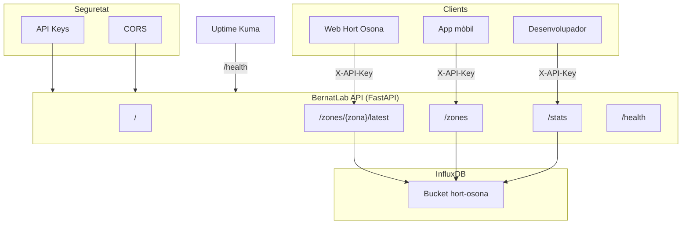

# Capítol 20 — API pública: servir les dades al món

> *"Una API ben dissenyada és com un bon mosaic: cada peça té el seu lloc, i el conjunt és més que la suma de les parts."*

## 20.1 Per què una API

Al BernatLab tenim les dades a InfluxDB, ben organitzades, amb un dashboard bonic a Grafana. Però ens falta una peça clau: **una manera de servir aquestes dades al món exterior**, en un format estandarditzat i documentat.

Les dades serveixen per molt més que visualitzar-les a Grafana. Volem:

- Que la **web pública Hort Osona** mostri gràfiques en temps quasi-real.
- Que una **aplicació mòbil** (que potser construirem en el futur) consumeixi les dades.
- Que altres **sistemes externs** integrin les dades d'Hort Osona.
- Que **desenvolupadors** puguin experimentar amb les dades sense haver de configurar InfluxDB.

La millor manera de fer tot això és amb una **API REST** que:

- Accepti peticions HTTP estàndard.
- Retorni dades en format JSON.
- Estigui documentada amb **OpenAPI** (Swagger).
- Tingui autenticació per API keys.
- Estigui versionada per a futures evolucions.

## 20.2 Quina tecnologia: FastAPI

Hi ha moltes opcions per construir una API en Python:

- **Flask**: senzill, flexible, però cal afegir moltes coses a mà.
- **Django REST Framework**: potent, però excessiu per al nostre cas.
- **FastAPI**: modern, ràpid, documentació automàtica, async.

Al BernatLab farem servir **FastAPI** perquè:

- Genera documentació OpenAPI automàticament.
- Suporta async/await de forma nativa.
- Valida les dades amb Pydantic.
- Té un rendiment comparable a Node.js o Go.
- És fàcil d'aprendre.

## 20.3 Estructura de l'API

L'API del BernatLab tindrà aquests endpoints principals:

```
GET  /                              → informació general
GET  /zones                         → llista de zones
GET  /zones/{zona}/latest           → últimes lectures d'una zona
GET  /zones/{zona}/measurements/{tipus} → últimes N lectures d'un tipus
GET  /measurements                  → últimes lectures de totes les zones
GET  /stats                         → estadístiques agregades
GET  /sensors/status                → estat dels sensors (última publicació)
GET  /health                        → estat del servei
```

Cada endpoint retornarà JSON. Alguns exemples de respostes:

**`/zones`**:
```json
{
  "zones": ["zona-tomateres", "zona-enciams", "zona-pebrots"]
}
```

**`/zones/zona-tomateres/latest`**:
```json
{
  "zona": "zona-tomateres",
  "last_update": "2026-07-08T12:34:56Z",
  "temperatura": {
    "valor": 23.5,
    "unitat": "graus_C"
  },
  "humitat": {
    "valor": 60,
    "unitat": "%"
  },
  "pressio": {
    "valor": 1013,
    "unitat": "hPa"
  }
}
```

## 20.4 Implementació

L'API serà un contenidor Docker amb Python 3.12 i FastAPI.

### Estructura del projecte

```
/home/bernat/homelab/stacks/api/
├── Dockerfile
├── pyproject.toml
├── requirements.txt
├── app/
│   ├── __init__.py
│   ├── main.py
│   ├── config.py
│   ├── auth.py
│   ├── influx.py
│   ├── models.py
│   └── routers/
│       ├── __init__.py
│       ├── zones.py
│       ├── measurements.py
│       ├── stats.py
│       ├── sensors.py
│       └── health.py
└── .env.example
```

### Dockerfile

```dockerfile
FROM python:3.12-slim

WORKDIR /app

# Dependències del sistema
RUN apt-get update && apt-get install -y --no-install-recommends \
    gcc \
    && rm -rf /var/lib/apt/lists/*

# Dependències Python
COPY requirements.txt .
RUN pip install --no-cache-dir -r requirements.txt

# Codi
COPY app/ ./app/

# Usuari no root
RUN useradd -m -u 1000 apiuser
USER apiuser

EXPOSE 8000
CMD ["uvicorn", "app.main:app", "--host", "0.0.0.0", "--port", "8000"]
```

### requirements.txt

```
fastapi==0.115.0
uvicorn[standard]==0.32.0
influxdb-client==1.43.0
pydantic==2.9.0
python-dotenv==1.0.1
pydantic-settings==2.5.2
```

### Configuració (config.py)

```python
from pydantic_settings import BaseSettings
from functools import lru_cache


class Settings(BaseSettings):
    # API
    api_title: str = "BernatLab API"
    api_version: str = "1.0.0"
    api_description: str = "API pública per a Hort Osona"
    
    # InfluxDB
    influx_url: str = "http://influxdb:8086"
    influx_token: str
    influx_org: str = "bernatlab"
    influx_bucket: str = "hort-osona"
    
    # Seguretat
    api_keys: str = ""  # llista separada per comes
    
    # CORS
    cors_origins: str = "https://bernatmora.github.io"
    
    class Config:
        env_file = ".env"
        env_prefix = "API_"


@lru_cache
def get_settings():
    return Settings()
```

### Client d'InfluxDB (influx.py)

```python
from influxdb_client import InfluxDBClient
from .config import get_settings

_client: InfluxDBClient | None = None


def get_influx_client() -> InfluxDBClient:
    global _client
    if _client is None:
        settings = get_settings()
        _client = InfluxDBClient(
            url=settings.influx_url,
            token=settings.influx_token,
            org=settings.influx_org,
        )
    return _client


def get_query_api():
    return get_influx_client().query_api()
```

### Autenticació (auth.py)

```python
from fastapi import Security, HTTPException, status
from fastapi.security import APIKeyHeader
from .config import get_settings

api_key_header = APIKeyHeader(name="X-API-Key", auto_error=False)


def get_api_key(api_key: str = Security(api_key_header)) -> str:
    settings = get_settings()
    claus_valides = settings.api_keys.split(",")
    
    if api_key in claus_valides:
        return api_key
    
    raise HTTPException(
        status_code=status.HTTP_401_UNAUTHORIZED,
        detail="API key invàlida o absent",
    )
```

### Model de dades (models.py)

```python
from pydantic import BaseModel, Field
from datetime import datetime
from typing import Optional


class Mesura(BaseModel):
    valor: float
    unitat: str


class UltimesLectures(BaseModel):
    zona: str
    last_update: datetime
    temperatura: Optional[Mesura] = None
    humitat: Optional[Mesura] = None
    pressio: Optional[Mesura] = None
    lluminositat: Optional[Mesura] = None


class ZonaInfo(BaseModel):
    zona: str
    last_update: Optional[datetime] = None
    sensor_count: int = 0


class SensorStatus(BaseModel):
    zona: str
    last_publish: Optional[datetime]
    status: str  # "online" | "stale" | "offline"
```

### Router principal (main.py)

```python
from fastapi import FastAPI, Depends
from fastapi.middleware.cors import CORSMiddleware
from .config import get_settings
from .routers import zones, measurements, stats, sensors, health

settings = get_settings()

app = FastAPI(
    title=settings.api_title,
    version=settings.api_version,
    description=settings.api_description,
    docs_url="/docs",
    redoc_url="/redoc",
)

# CORS
origins = settings.cors_origins.split(",")
app.add_middleware(
    CORSMiddleware,
    allow_origins=origins,
    allow_credentials=True,
    allow_methods=["GET"],
    allow_headers=["*"],
)

# Routers
app.include_router(health.router, tags=["health"])
app.include_router(
    zones.router,
    prefix="/zones",
    tags=["zones"],
    dependencies=[Depends(get_api_key)],
)
app.include_router(
    measurements.router,
    prefix="/zones",
    tags=["measurements"],
    dependencies=[Depends(get_api_key)],
)
app.include_router(
    stats.router,
    prefix="/stats",
    tags=["stats"],
    dependencies=[Depends(get_api_key)],
)
app.include_router(
    sensors.router,
    prefix="/sensors",
    tags=["sensors"],
    dependencies=[Depends(get_api_key)],
)


@app.get("/")
def root():
    return {
        "name": settings.api_title,
        "version": settings.api_version,
        "description": settings.api_description,
        "docs": "/docs",
    }
```

### Endpoint /zones (routers/zones.py)

```python
from fastapi import APIRouter, HTTPException
from ..influx import get_query_api
from ..models import ZonaInfo
import os

router = APIRouter()


@router.get("", response_model=list[ZonaInfo])
def llistar_zones():
    """Llista totes les zones amb sensors actius."""
    query_api = get_query_api()
    query = '''
    import "influxdata/influxdb/schema"
    schema.tagValues(bucket: "hort-osona", tag: "zona")
    '''
    result = query_api.query(query)
    zones = [table.values[0] for table in result]
    return [{"zona": z, "last_update": None, "sensor_count": 1} for z in zones]
```

### Endpoint /zones/{zona}/latest (routers/measurements.py)

```python
from fastapi import APIRouter, HTTPException
from datetime import datetime
from ..influx import get_query_api
from ..models import UltimesLectures, Mesura

router = APIRouter()


@router.get("/{zona}/latest", response_model=UltimesLectures)
def ultimes_lectures(zona: str):
    """Retorna les últimes lectures de tots els sensors d'una zona."""
    query_api = get_query_api()
    query = f'''
    from(bucket: "hort-osona")
      |> range(start: -1h)
      |> filter(fn: (r) => r.zona == "{zona}")
      |> last()
    '''
    result = query_api.query(query)
    
    if not result:
        raise HTTPException(status_code=404, detail="Zona no trobada")
    
    lectures = {}
    last_update = None
    
    for table in result:
        for record in table.records:
            tipus = record.get_measurement()
            valor = record.get_value()
            unitat = record.values.get("unitat", "")
            time = record.get_time()
            
            if tipus not in lectures:
                lectures[tipus] = Mesura(valor=valor, unitat=unitat)
            if last_update is None or time > last_update:
                last_update = time
    
    return UltimesLectures(
        zona=zona,
        last_update=last_update,
        **lectures
    )
```

### docker-compose.yml

```yaml
services:
  api:
    build: ./stacks/api
    container_name: bernatlab-api
    restart: unless-stopped
    ports:
      - "8000:8000"
    environment:
      - API_INFLUX_URL=http://influxdb:8086
      - API_INFLUX_TOKEN=${API_INFLUX_TOKEN}
      - API_INFLUX_ORG=bernatlab
      - API_INFLUX_BUCKET=hort-osona
      - API_API_KEYS=${API_KEYS}
      - API_CORS_ORIGINS=https://bernatmora.github.io
    depends_on:
      - influxdb
```

## 20.5 Documentació automàtica

FastAPI genera automàticament la documentació OpenAPI. Un cop en marxa, podem accedir a:

- `http://100.x.y.z:8000/docs`: interfície Swagger UI.
- `http://100.x.y.z:8000/redoc`: interfície ReDoc.
- `http://100.x.y.z:8000/openapi.json`: especificació OpenAPI en JSON.

Aquesta documentació és navegable, podem provar les crides directament, i s'actualitza automàticament quan afegim nous endpoints.

## 20.6 Seguretat: API keys

L'API està protegida per una o més **API keys**. Cada client que vulgui accedir-hi ha d'incloure la capçalera `X-API-Key` amb una clau vàlida.

Al BernatLab, podem generar múltiples claus:

- `WEB_KEY`: per a la web pública Hort Osona.
- `MOBILE_KEY`: per a una futura aplicació mòbil.
- `DEV_KEY`: per a desenvolupament.

Cada clau es pot revocar individualment si cal.

### Generar una clau forta

```bash
python3 -c "import secrets; print(secrets.token_urlsafe(32))"
```

Això ens dóna una cadena aleatòria de 43 caràcters, perfecta com a API key.

## 20.7 CORS: permetre l'accés des de la web

Si volem que la web pública Hort Osona (allotjada a `bernatmora.github.io`) pugui consumir l'API, hem de configurar **CORS** (Cross-Origin Resource Sharing). Al codi, hem afegit:

```python
app.add_middleware(
    CORSMiddleware,
    allow_origins=["https://bernatmora.github.io"],
    allow_credentials=True,
    allow_methods=["GET"],
    allow_headers=["*"],
)
```

Això permet que el navegador accepti les respostes de l'API quan la petició ve de la web.

**Compte**: la Raspberry és a una xarxa privada (Tailscale), però la web pública és a Internet. La solució és exposar l'API a través d'un **proxy invers** (un nginx, un Cloudflare Tunnel) o fer que el navegador accedeixi directament a la IP Tailscale. En aquest últim cas, l'usuari ha de tenir Tailscale instal·lat. Una solució intermèdia és fer un **Cloudflare Tunnel** que exposi l'API de manera segura sense obrir ports.

## 20.8 Caching: optimitzar el rendiment

L'API rebrà peticions freqüents (cada vegada que la web es carrega). Per optimitzar el rendiment, podem afegir **caching**:

```python
from fastapi_cache import FastAPICache
from fastapi_cache.backends.inmemory import InMemoryBackend
from fastapi_cache.decorator import cache

@app.get("/zones/{zona}/latest")
@cache(expire=30)  # cache durant 30 segons
async def ultimes_lectures(zona: str):
    ...
```

Això fa que les respostes es guardin en memòria durant 30 segons, evitant crides repetides a InfluxDB. Si la web es refresca cada 30 segons, InfluxDB només rebrà una petició cada 30 segons per usuari.

## 20.9 Tests

Una bona API té tests. Podem escriure tests amb `pytest`:

```python
from fastapi.testclient import TestClient
from app.main import app

client = TestClient(app)


def test_root():
    response = client.get("/")
    assert response.status_code == 200
    assert "BernatLab" in response.json()["name"]


def test_zones():
    response = client.get("/zones", headers={"X-API-Key": "test"})
    assert response.status_code == 200
    assert isinstance(response.json(), list)


def test_zona_latest():
    response = client.get(
        "/zones/zona-tomateres/latest",
        headers={"X-API-Key": "test"}
    )
    assert response.status_code == 200
    data = response.json()
    assert data["zona"] == "zona-tomateres"
```

Els tests els podem executar automàticament en cada desplegament.

## 20.10 Monitoratge de l'API

L'API s'ha de poder monitorar amb Uptime Kuma. Un monitor de tipus **HTTP(s)** que comprovi l'endpoint `/health` cada minut:

- URL: `http://100.x.y.z:8000/health`
- Interval: 60 segons
- Condició: codi 2xx

Si l'API cau, Uptime Kuma ens avisarà per Telegram.

A més, podem afegir logs estructurats per analitzar quines crides es fan, amb quina freqüència, i quines fallen.

## 20.11 Desplegament i actualització

L'API es desplega com un contenidor Docker. Per actualitzar-la:

```bash
cd /home/bernat/homelab/stacks/api
git pull
docker compose build api
docker compose up -d api
```

Si hi ha canvis en les dependències, caldrà `docker compose build --no-cache api`.

## 20.12 Limitacions i millores futures

L'API actual és una base sòlida, però hi ha millores que es poden fer:

- **Paginació**: retornar moltes mesures pot ser lent. Cal afegir paginació.
- **Filtres avançats**: poder filtrar per dates, per tipus de mesura, etc.
- **Rate limiting**: limitar el nombre de peticions per IP.
- **Més endpoints**: alertes, històrics, comparacions entre zones, etc.
- **WebSockets**: per rebre dades en temps real sense fer polling.
- **GraphQL**: una alternativa a REST que permet consultes més flexibles.

Al BernatLab, anirem afegint funcionalitats a mesura que les necessitem, sense complicar excessivament la base.

## 20.13 Esquema conceptual



## 20.14 Errors habituals

**Error 1: API key oblidada**. Símptoma: rebem un 401. Solució: afegir la capçalera `X-API-Key` a totes les peticions.

**Error 2: CORS bloquejant les peticions del navegador**. Símptoma: la web no pot accedir a l'API. Solució: afegir l'origen a la llista de CORS.

**Error 3: token d'InfluxDB incorrecte**. Símptoma: l'API retorna errors 500. Solució: revisar el token al `.env`.

**Error 4: consultes massa lentes**. Símptoma: l'API trigem molt a respondre. Solució: agregar les consultes a InfluxDB, afegir caching.

**Error 5: no documentar els canvis**. Símptoma: la documentació no correspon a la implementació. Solució: actualitzar el README quan es fan canvis.

## 20.15 Bones pràctiques

1. **Documentar cada endpoint** amb docstrings descriptius.
2. **Validar totes les entrades** amb Pydantic.
3. **Usar API keys** des del primer moment.
4. **Configurar CORS** adequadament.
5. **Afegir caching** per a consultes freqüents.
6. **Monitorar l'API** amb Uptime Kuma.
7. **Versionar l'API** (per exemple, `/v1/zones`).
8. **Fer tests** amb pytest.
9. **Documentar l'API** al README del projecte.
10. **Limitar el que retorna l'API** (no exposar dades internes).

## 20.16 Resum

Hem après què és una API REST, per què serveix, com construir-la amb FastAPI, com connectar-la a InfluxDB, com protegir-la amb API keys, com documentar-la amb OpenAPI, i com integrar-la amb la web pública. Hem vist exemples reals d'endpoints i configuracions. En el proper capítol veurem com la web Hort Osona consumeix aquesta API per mostrar dades en temps quasi-real.

## 20.17 Exercicis pràctics

1. Desplega l'API al BernatLab amb la configuració que hem vist.
2. Accedeix a `http://100.x.y.z:8000/docs` i explora la documentació.
3. Fes una crida amb `curl` a `/zones/zona-tomateres/latest`.
4. Genera una API key forta i afegeix-la al `.env`.
5. Prova de fer una crida sense API key. Hauries de rebre un 401.
6. Escriu un test amb pytest que comprovi l'endpoint `/health`.
7. Configura un monitor a Uptime Kuma per a l'API.
8. Documenta l'API al README del projecte.

Comandes útils:
```bash
# Generar una API key
python3 -c "import secrets; print(secrets.token_urlsafe(32))"

# Cridar l'API
curl -H "X-API-Key: CLAU" http://100.x.y.z:8000/zones
curl -H "X-API-Key: CLAU" http://100.x.y.z:8000/zones/zona-tomateres/latest

# Veure els logs
docker compose logs -f api

# Executar tests
docker compose exec api pytest
```

Paraules clau: **API, REST, FastAPI, OpenAPI, Swagger, JSON, endpoint, API key, CORS, autenticació, Pydantic, Uvicorn, async, InfluxDB, cache, monitoratge, Uptime Kuma, tests, pytest, versionat, documentació, web pública, Hort Osona, BernatLab, sensors, dades, peticions, respostes, codi HTTP, 200, 401, 500, headers, dependències, Docker, contenidor**.
