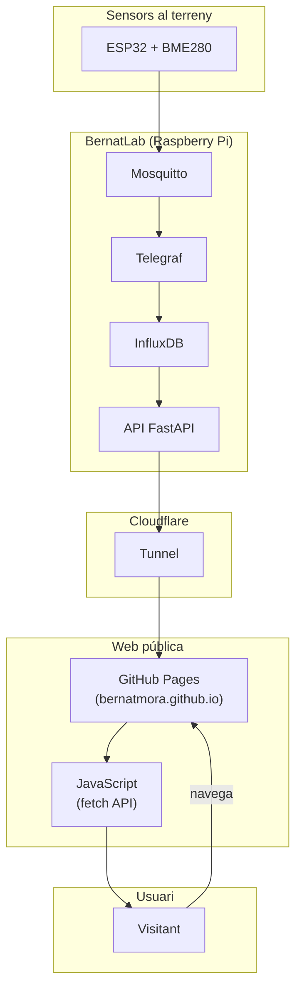

# Capítol 21 — Integració amb Hort Osona

> *"Una web estàtica pot ser bonica, però una web que respira amb dades reals és una altra cosa."*

## 21.1 On som

Al llarg d'aquest mòdul hem construït tota la cadena de dades:

- MQTT rep les dades dels sensors.
- Telegraf les mou a InfluxDB.
- Node-RED les processa i envia alertes.
- Grafana ensenya gràfiques.
- L'API FastAPI les serveix a qui les demani.

Ara toca tancar el cercle: **la web pública Hort Osona ha de consumir l'API per mostrar dades en temps quasi-real**.

La web actual ([bernatmora.github.io/hort-osona](https://bernatmora.github.io/hort-osona/)) és una PWA (Progressive Web App) allotjada a GitHub Pages, feta amb HTML, CSS i JavaScript vanilla. Té 80+ documents, 9 categories, 8 pàgines funcionals. Ara li afegirem una secció nova: **"Dades en directe"**, que mostrarà:

- Les últimes lectures de cada zona.
- Gràfiques històriques.
- L'estat dels sensors.

Això serà un procés incremental: primer una versió bàsica que consumeix l'API, després anirem afegint funcionalitats.

## 21.2 El problema de la connectivitat

Aquí topem amb un dels reptes del BernatLab: la Raspberry és a una xarxa privada (Tailscale), però la web pública és accessible des de qualsevol lloc del món. Com connectem les dues coses?

Tres opcions:

### Opció 1: exposar l'API a través de Tailscale

Si els visitants de la web tenen Tailscale instal·lat i estan autenticats a la nostra xarxa, poden accedir directament a `http://100.115.134.76:8000`. Però això és molt limitat: la majoria de visitants no tindran Tailscale.

### Opció 2: fer l'API accessible des d'Internet

Podem exposar el port 8000 a Internet a través del router. Però això és molt perillós: estarem exposant l'API a tothom, i malgrat l'API key, és un risc de seguretat innecessari.

### Opció 3: usar un túnel (Cloudflare Tunnel, ngrok, etc.)

Un túnel crea un punt de connexió segur entre la nostra màquina i un servidor intermedi. La nostra API queda exposada a través d'un domini propi (per exemple, `api.bernatlab.cat`) sense necessitat d'obrir ports al router.

Al BernatLab, farem servir **Cloudflare Tunnel**, que és gratuït, fàcil de configurar, i segur.

## 21.3 Configurar Cloudflare Tunnel

### Requisits

- Un domini gestionat per Cloudflare (pot ser gratuït).
- Un compte a Cloudflare.
- La imatge Docker `cloudflare/cloudflared`.

### Pas 1: crear el túnel

A la consola de Cloudflare, anem a **Zero Trust → Networks → Tunnels → Create a tunnel**. Triem el tipus **Cloudflared** i donem un nom al túnel (per exemple, `bernatlab-api`).

Cloudflare ens donarà una comanda per executar al nostre servidor. La forma és:

```bash
cloudflared service install TOKEN
```

On TOKEN és un token llarg que identifica el túnel.

### Pas 2: configurar el domini

A la configuració del túnel, afegim una ruta:

- **Subdomain**: `api`
- **Domain**: `bernatlab.cat`
- **Service**: `http://api:8000` (el nom del servei dins del `docker-compose.yml`)

Ara, qualsevol petició a `https://api.bernatlab.cat/` arriba al nostre servei API.

### Pas 3: afegir cloudflared al docker-compose.yml

```yaml
services:
  cloudflared:
    image: cloudflare/cloudflared:latest
    container_name: cloudflared
    restart: unless-stopped
    command: tunnel run
    environment:
      - TUNNEL_TOKEN=${CLOUDFLARE_TUNNEL_TOKEN}
    depends_on:
      - api
```

On `CLOUDFLARE_TUNNEL_TOKEN` és el token que hem obtingut al pas 1.

### Avantatges

- **Cap port obert al router**: la Raspberry és inaccessible directament des d'Internet.
- **Xifratge de punta a punta**: Cloudflare xifra la connexió fins al nostre servidor.
- **Protecció DDoS gratuïta**: Cloudflare filtra atacs.
- **Analytics**: podem veure quantes peticions arriben, des d'on, etc.

### Desavantatge

- Cal tenir un domini. Però un `.cat` o `.tk` pot costar només 5-10 € l'any.

## 21.4 Modificar la web Hort Osona

Ara que l'API és accessible des d'Internet (a través del túnel), podem modificar la web perquè la consumeixi.

### Estructura de la nova secció

A la web Hort Osona, afegirem una nova pàgina: `directe.html`. Aquesta pàgina tindrà:

1. **Una capçalera** amb l'estat general (l'hora de l'última actualització, el nombre de sensors actius).
2. **Una graella de targetes**, una per zona, amb l'última lectura de cada sensor.
3. **Una gràfica** amb l'evolució de la temperatura al llarg del temps.
4. **Un peu** amb informació de contacte i enllaços.

### Codi HTML bàsic

```html
<!DOCTYPE html>
<html lang="ca">
<head>
    <meta charset="UTF-8">
    <meta name="viewport" content="width=device-width, initial-scale=1.0">
    <title>Hort Osona - Dades en directe</title>
    <link rel="stylesheet" href="css/directe.css">
</head>
<body>
    <header>
        <h1>Hort Osona</h1>
        <nav>
            <a href="/">Inici</a>
            <a href="/hort/">L'hort</a>
            <a href="/directe/" class="active">Dades en directe</a>
        </nav>
    </header>

    <main>
        <section class="estat-general">
            <h2>Estat general</h2>
            <p>Última actualització: <span id="last-update">--</span></p>
            <p>Sensors actius: <span id="sensors-actius">--</span></p>
        </section>

        <section class="zones">
            <h2>Zones</h2>
            <div id="zones-grid" class="grid">
                <!-- Les targetes es generen dinàmicament -->
            </div>
        </section>

        <section class="grafica">
            <h2>Evolució de la temperatura (24 h)</h2>
            <canvas id="temperatura-chart"></canvas>
        </section>
    </main>

    <footer>
        <p>Dades proporcionades pel <a href="https://bernatlab.cat">BernatLab</a></p>
    </footer>

    <script src="https://cdn.jsdelivr.net/npm/chart.js@4.4"></script>
    <script src="js/directe.js"></script>
</body>
</html>
```

### JavaScript per consumir l'API

```javascript
// directe.js
const API_BASE = 'https://api.bernatlab.cat';
const API_KEY = 'CLAU_PUBLICA';  // compte: això serà visible

async function carregarDades() {
    try {
        // 1. Llista de zones
        const zonesResp = await fetch(`${API_BASE}/zones`, {
            headers: { 'X-API-Key': API_KEY }
        });
        const zones = await zonesResp.json();
        
        // 2. Per cada zona, obtenir últimes lectures
        const lectures = await Promise.all(
            zones.map(z => fetch(`${API_BASE}/zones/${z.zona}/latest`, {
                headers: { 'X-API-Key': API_KEY }
            }).then(r => r.json()))
        );
        
        // 3. Renderitzar
        renderitzarZones(lectures);
        
        // 4. Actualitzar estat general
        document.getElementById('last-update').textContent = 
            new Date().toLocaleString('ca-ES');
        document.getElementById('sensors-actius').textContent = zones.length;
        
    } catch (e) {
        console.error('Error carregant dades:', e);
    }
}

function renderitzarZones(lectures) {
    const grid = document.getElementById('zones-grid');
    grid.innerHTML = lectures.map(z => `
        <div class="zona-card">
            <h3>${z.zona}</h3>
            ${z.temperatura ? `
                <div class="mesura">
                    <span class="valor">${z.temperatura.valor}°C</span>
                    <span class="unitat">${z.temperatura.unitat}</span>
                </div>
            ` : ''}
            ${z.humitat ? `
                <div class="mesura">
                    <span class="valor">${z.humitat.valor}%</span>
                    <span class="unitat">${z.humitat.unitat}</span>
                </div>
            ` : ''}
            <p class="last-update">Actualitzat: ${new Date(z.last_update).toLocaleString('ca-ES')}</p>
        </div>
    `).join('');
}

async function carregarGrafica() {
    const resp = await fetch(`${API_BASE}/zones/zona-tomateres/measurements/temperatura?limit=100`, {
        headers: { 'X-API-Key': API_KEY }
    });
    const dades = await resp.json();
    
    const ctx = document.getElementById('temperatura-chart');
    new Chart(ctx, {
        type: 'line',
        data: {
            labels: dades.map(d => new Date(d.time).toLocaleTimeString('ca-ES')),
            datasets: [{
                label: 'Temperatura (°C)',
                data: dades.map(d => d.value),
                borderColor: '#1f3a5f',
                tension: 0.1
            }]
        },
        options: {
            responsive: true,
            plugins: {
                title: {
                    display: true,
                    text: 'Temperatura zona-tomateres'
                }
            }
        }
    });
}

// Inicialitzar
carregarDades();
carregarGrafica();

// Refrescar cada 60 segons
setInterval(carregarDades, 60000);
```

## 21.5 Seguretat: la clau pública

Aquí hi ha un problema: la clau d'API és visible al JavaScript del client, la qual cosa vol dir que qualsevol pot veure-la i fer-la servir.

### Solucions

**Opció 1: clau de només lectura amb limitacions**

Creem una clau d'API específica per a la web, que només pot llegir (`read-only`) i té un **rate limit** molt baix. Per exemple, 60 peticions per minut. Així, si algú roba la clau, no pot fer gaire mal.

**Opció 2: autenticació basada en domini**

L'API pot validar que les peticions vinguin de `bernatmora.github.io` mirant la capçalera `Referer`. Això no és gaire robust (es pot falsificar), però és una capa addicional.

**Opció 3: subscripció per correu**

Els visitants es subscriven al web amb el seu correu, i reben un enllaç amb un token únic. Per a cada sessió, es genera un token temporal.

**Opció 4: usar un intermediari**

Una Cloudflare Worker actua com a intermediari: la web la crida, la Worker valida el domini, i la Worker crida l'API. La clau de l'API no és mai visible al client.

Al BernatLab, **combinarem l'opció 1 i l'opció 4**: una clau read-only amb rate limit, i una Cloudflare Worker com a intermediari (si cal).

## 21.6 CORS: configurar bé l'origen

A l'API, hem de permetre l'origen de la web:

```python
allow_origins=["https://bernatmora.github.io"]
```

Si volem permetre també el domini propi, l'afegim:

```python
allow_origins=[
    "https://bernatmora.github.io",
    "https://hortosona.bernatlab.cat"
]
```

**Compte**: no posar mai `allow_origins=["*"]` en producció, perquè això permetria a qualsevol lloc accedir a l'API.

## 21.7 Caching al client

Per minimitzar el nombre de peticions, podem afegir caching al client:

```javascript
// Cache simple en memòria
const cache = new Map();
const CACHE_TTL = 60000;  // 1 minut

async function fetchCached(url, options) {
    const ara = Date.now();
    const cached = cache.get(url);
    
    if (cached && (ara - cached.timestamp) < CACHE_TTL) {
        return cached.data;
    }
    
    const resp = await fetch(url, options);
    const data = await resp.json();
    cache.set(url, { data, timestamp: ara });
    return data;
}
```

Això redueix el nombre de peticions quan l'usuari navega per la web ràpidament.

## 21.8 Service Worker: PWA offline

Com que la web és una PWA, podem afegir un Service Worker que cachegi les dades per a quan l'usuari està offline:

```javascript
// sw.js
const CACHE_NAME = 'hort-osona-v1';
const urlsToCache = [
    '/',
    '/directe/',
    '/css/directe.css',
    '/js/directe.js'
];

self.addEventListener('install', event => {
    event.waitUntil(
        caches.open(CACHE_NAME)
            .then(cache => cache.addAll(urlsToCache))
    );
});

self.addEventListener('fetch', event => {
    event.respondWith(
        caches.match(event.request)
            .then(response => response || fetch(event.request))
    );
});
```

Això permet que la web continuï funcionant (amb dades obsoletes) quan l'usuari perd la connexió.

## 21.9 Rendiment: optimitzar la càrrega

Per minimitzar el temps de càrrega:

1. **Comprimir les imatges**: usar formats moderns (WebP, AVIF).
2. **Minificar el CSS i JavaScript**: eliminar espais i comentaris.
3. **Carregar els scripts amb `defer` o `async`**: per no bloquejar la renderització.
4. **Usar CDNs per a llibreries externes**: Chart.js, per exemple.
5. **Limitar les dades retornades per l'API**: només el que la pàgina necessita.

## 21.10 Proves d'integració

Quan tot estigui enllestit, hem de provar:

1. **La web carrega correctament** amb dades reals.
2. **L'API respon** amb les dades esperades.
3. **El túnel Cloudflare funciona**.
4. **El CORS està ben configurat**.
5. **Les gràfiques es renderitzen**.
6. **El refresc periòdic funciona**.
7. **L'API key és vàlida**.
8. **El rate limit funciona** (per exemple, fent 100 peticions en 1 minut).

## 21.11 Publicació

Quan tot estigui provat, podem fer commit i push a GitHub:

```bash
cd hort-osona
git add directe.html css/directe.css js/directe.js sw.js
git commit -m "Afegeix secció Dades en directe"
git push origin main
```

GitHub Pages actualitzarà la web automàticament en pocs segons.

## 21.12 Esquema d'integració



## 21.13 Bones pràctiques

1. **Clau read-only amb rate limit** per a l'accés des de la web.
2. **CORS estricte**: només els orígens necessaris.
3. **Caching al client** per reduir peticions.
4. **Service Worker** per a offline.
5. **Comprimir imatges** i minificar codi.
6. **Provar en múltiples dispositius**: mòbil, tablet, PC.
7. **Documentar al README** com afegir noves zones o gràfiques.
8. **Monitorar l'API** amb Uptime Kuma.
9. **Versionar la web** amb Git, igual que el BernatLab.
10. **Fer commits petits i freqüents**, amb missatges clars.

## 21.14 Limitacions i millores

El que tenim ara és una primera versió funcional. Però hi ha moltes millores possibles:

- **Més gràfiques**: humitat, llum, etc.
- **Comparació entre zones**.
- **Mapa de l'hort** amb les zones marcades.
- **Alertes visuals** quan alguna cosa va malament.
- **Exportació de dades** (CSV, JSON).
- **Historial** amb calendari.
- **Integració amb calendaris** (sembra, collita).
- **Múltiples idiomes**.

Aquestes millores les farem gradualment, validant cada canvi amb el món real.

## 21.15 Resum

Hem après com connectar la web pública Hort Osona amb l'API del BernatLab, usant Cloudflare Tunnel com a intermediari segur. Hem vist el codi HTML, CSS i JavaScript necessari per mostrar les dades, hem après a configurar el CORS, a protegir la clau d'API, i a optimitzar el rendiment. En el proper i últim capítol del Mòdul 2 veurem l'operativa: còpies de seguretat, retenció, alerting avançat i quan caldrà pujar de hardware.

## 21.16 Exercicis pràctics

1. Configura Cloudflare Tunnel per exposar l'API.
2. Crea una nova pàgina `directe.html` a la web Hort Osona.
3. Escriu el JavaScript per consumir l'API i mostrar les dades.
4. Afegeix una gràfica de temperatura amb Chart.js.
5. Configura el CORS a l'API per permetre el domini de la web.
6. Prova la web localment amb `python -m http.server 8000`.
7. Fes commit i push a GitHub.
8. Verifica que la web pública mostra les dades correctament.
9. Documenta al README del projecte Hort Osona com funciona la integració.

Comandes útils:
```bash
# Servir la web localment per provar
cd hort-osona
python3 -m http.server 8000

# Comprovar l'API
curl -H "X-API-Key: CLAU" https://api.bernatlab.cat/zones

# Fer commit
git add .
git commit -m "Afegeix Dades en directe"
git push
```

Paraules clau: **web pública, Hort Osona, integració, API, Cloudflare Tunnel, Tailscale, CORS, rate limit, API key read-only, Chart.js, JavaScript, HTML, CSS, PWA, Service Worker, caching, GitHub Pages, Git, commit, push, monitoratge, Uptime Kuma, gràfica, zona, sensors, dades, BernatLab, domini, túnel, intermediari, seguretat, optimització, imatges, minificació, offline**.
