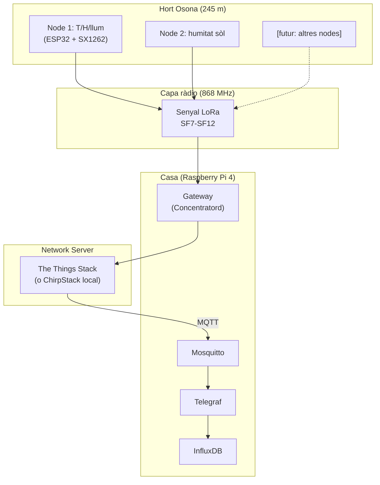

# Capítol 23 — Què és LoRa i per què per a Hort Osona

> *"245 metres, arbres al mig, cases al voltant, Wi-Fi de veïns. Si vols que un sensor al camp parli amb la Raspberry, la resposta pràctica és LoRa."*

## 23.1 El problema: distància i obstacles

Al BernatLab, tenim sensors al camp (l'hort és a uns 245 metres de casa) que han de comunicar-se amb la Raspberry. Les opcions "naturals" fallen totes:

- **Wi-Fi domèstica**: té un abast útil de 30-50 metres a l'aire lliure, menys a través de parets i arbres. A 245 metres, amb vegetació al mig, és pràcticament impossible sense repetidors o antenes directives.
- **Bluetooth/BLE**: 10-30 metres, insuficient.
- **Zigbee**: 100 metres en exterior, depèn molt del terreny. Millor que Wi-Fi, però encara just.
- **4G/cel·lular**: funciona, però requereix una SIM, una subscripció, i un mòdem. És car, depèn de cobertura, i afegeix un component de xarxa mòbil que complica el projecte.

Cap d'aquests encaixa bé. I aquí és on entra **LoRa**: una tecnologia de ràdio dissenyada exactament per cobrir distàncies d'uns quants quilòmetres amb un consum d'energia molt baix. LoRa no és una novetat — la tecnologia es remunta al 2015, quan Semtech va obrir les patents per a ús civil a la banda sub-GHz — però en els últims anys s'ha convertit en l'estàndard de facto per a IoT de llarg abast i baix consum.

## 23.2 Què és LoRa, exactament

**LoRa** (de **Lo**ng **Ra**nge) és una tècnica de **modulació de ràdio** propietat de Semtech, que opera a les bandes ISM (Industrial, Scientific, Medical) — bandes de freqüència lliures, sense necessitat de llicència, però subjectes a normatives locals de potència i ocupació.

Concretament, al BernatLab i a la majoria d'Europa, LoRa opera a la **banda dels 868 MHz** (de 863 a 870 MHz, amb sub-bandes específiques per a diferents usos). Aquesta banda té tres propietats excel·lents per al nostre cas:

1. **Penetra obstacles** molt millor que les freqüències altes (2,4 GHz del Wi-Fi, per exemple). Una ona a 868 MHz travessa arbres, parets de maó, i fins i tot edificis lleugers amb molta menys pèrdua.
2. **Consum molt baix**: la modulació és eficient, cosa que permet transmissions amb pocs mil·liwatts de potència.
3. **Lliure d'ús**: no cal pagar llicència, només respectar la normativa de duty cycle (percentatge de temps que podem transmetre).

LoRa, per si sol, és només una **modulació física** (PHY). Defineix com es modula el senyal, però no com s'organitzen les dades, com es xifra, com es gestiona l'accés al canal, com es connecten múltiples nodes. Per a tot això, necessitem una **capa superior** — i aquí és on apareix **LoRaWAN**.

## 23.3 LoRaWAN: la xarxa sobre LoRa

**LoRaWAN** és un protocol de xarxa (MAC + aplicació) definit per la LoRa Alliance, una associació industrial que aplega empreses com Semtech, IBM, Cisco, i centenars d'altres. Defineix:

- Com es **adreça** un node.
- Com s'**autentica** un node a la xarxa.
- Com es **xifra** la comunicació.
- Com es **gestiona** el canal quan múltiples nodes volen parlar alhora.
- Com les dades arriben al **servidor d'aplicació** (el "application server").

LoRaWAN defineix tres classes de dispositius (A, B, C) segons quan poden rebre. Per a sensors amb piles, la classe A és l'estàndard: el node només escolta durant uns segons després d'haver transmès. Això permet anys de vida útil amb una pila tipus AA o una LiPo petita.

L'arquitectura típica de LoRaWAN té quatre elements:

```
[NODES]  →  [GATEWAY]  →  [NETWORK SERVER]  →  [APPLICATION SERVER]
   ↑            ↓               ↓                    ↓
   └──── resposta ←─────────────┴────────────────────┘
```

- **Node** (End Device): el sensor, amb un microcontrolador i un mòdul LoRa.
- **Gateway**: un aparell que rep els paquets de ràdio dels nodes i els reenvia al network server per Internet. Pot servir molts nodes simultàniament.
- **Network Server** (NS): el cervell de la xarxa. Gestiona l'autenticació, el encaminament, les taxes de dades adaptatives (ADR), i desduplica missatges de múltiples gateways. N'hi ha de comercials (TTN, Helium, Loriot) i d'open source (ChirpStack).
- **Application Server** (AS): on aterren les dades ja desxifrades, normalment amb una API REST o un broker MQTT.

La part important: **un node LoRaWAN no parla directament amb un gateway concret**. Emet a l'aire, i qualsevol gateway que el senti redirigeix el missatge al network server. Això vol dir que podem moure'ns amb el node i continuar funcionant, i que un sol gateway pot cobrir tot un barri si té bona posició.

## 23.4 The Things Network (TTN): el network server gratuït

**The Things Network** (ara **The Things Stack**, o TTS) és un network server LoRaWAN **comunitari i gratuït**, mantingut per la fundació The Things Network. Té servidors a tot el món, una consola web per gestionar dispositius, i integracions natives amb MQTT, webhooks, i molts altres serveis.

Per a un homelab com el BernatLab, TTN és la millor opció per començar amb LoRaWAN perquè:

- **No cal mantenir infraestructura pròpia**: el network server el gestiona ells.
- **És gratuït** per a ús no comercial i amb un volum raonable (uns quants milers de missatges al dia, perfecte per a sensors ambientals).
- **Comunitat gran**: milers de tutorials, fòrums actius, documentació en diversos idiomes.
- **Integracions fàcils**: podem rebre les dades a la Raspberry per MQTT, HTTP webhook, o altres mecanismes.

L'alternativa open source és **ChirpStack**, que podem autoallotjar a la Raspberry o a un servidor propi. Té avantatges (control total, sense limits de la comunitat) i inconvenients (més feina de manteniment, hem de gestionar la seguretat nosaltres mateixos).

## 23.5 LoRa P2P: l'alternativa sense infraestructura

Hi ha una tercera via: usar la **modulació LoRa directament, sense LoRaWAN**. Això es coneix com a **LoRa punt a punt** (P2P) o **LoRa raw**. En aquest model:

- Dos mòduls SX1262 parlen directament entre ells, sense gateway, sense network server.
- Nosaltres definim el protocol: la longitud del payload, la freqüència, el spreading factor, si hi ha ACK o no.
- És més simple, però perdem tota la infraestructura de xarxa de LoRaWAN: no podem afegir un segon node fàcilment, no tenim desduplicació, no tenim xifratge estandarditzat.

**Quan té sentit LoRa P2P?**

- Quan tenim un sol node i un sol gateway casolà, i no volem la complexitat de TTN.
- Quan estem experimental i volem veure "com rau" LoRa abans d'introduir cap capa superior.
- Quan tenim limitacions de volum o privacitat que no ens permeten usar TTN.

**Quan NO té sentit LoRa P2P?**

- Quan volem afegir més d'un node.
- Quan volem un sistema escalable.
- Quan volem compatibilitat amb estàndards.

Al BernatLab, tenim clar que voldrem diversos nodes a l'hort (temperatura, humitat del sòl, llum, pluja...) i potser un node extra al camp del veí. Per tant, **LoRaWAN és la via natural**.

Dit això, durant el capítol 31 veurem un exemple de LoRa P2P, per si mai el necessites per a una situació específica o simplement per aprendre els fonaments de la capa física.

## 23.6 Quin model triem per a Hort Osona

L'arbre de decisió:

```
Estàs disposat a usar serveis de tercers (TTN, Helium)?
├── Sí → LoRaWAN amb TTN
│        ├── Tens cobertura d'un gateway TTN comunitari a menys de 5 km?
│        │   ├── Sí → Usa el gateway comunitari, no cal comprar res
│        │   └── No → Compra o munta un gateway propi
│        └── Tens cobertura d'un gateway comercial (Loriot, Actility)?
│            ├── Sí → Considera aquesta opció (pot ser de pagament)
│            └── No → Mateixa resposta: gateway propi
└── No → LoRa P2P amb SX1262
         └── Tens 1 o 2 nodes i poca escalabilitat
```

Per a Hort Osona, la recomanació és:

1. **Comprovar si hi ha cobertura TTN** a la zona. Pots fer-ho a https://ttnmapper.org/ o obrint la consola de TTN i mirant els gateways propers. A Osona (Vic, Manresa, àmbit rural català), la cobertura TTN comunitària és **decent però no omnipresent**. Si n'hi ha un a 3-5 km amb visió directa, podem començar a usar-lo.
2. **Si no n'hi ha**, muntem un gateway propi a la Raspberry. El programari estàndard és **Concentratord** (abans anomenat lora-packet-forwarder), de xdegaye, i és el que recomanarem al capítol 27.
3. **Els nodes** seran ESP32 + SX1262, amb la llibreria **LMIC** (IBM's LoRa MAC in C) o **MCCI LoRaWAN LMIC** per a LoRaWAN. Per a P2P, la llibreria **RadioLib** de jgromes.

## 23.7 Components que necessitarem

A grans trets, la llista de la compra per a Hort Osona:

### Per al gateway (a la Raspberry)

- Un **mòdul concentrador LoRa**: pot ser un **RAK2287** (USB, amb un SPI intern), un **Waveshare SX1302 LoRaWAN Gateway HAT** (per a Raspberry, molt popular), o un **Dragino LPS8** (gateway comercial, més car però robust).
- Una **antena 868 MHz** amb connector compatible.
- Un **cable pigtail** SMA si la distància entre el mòdul i l'antena és gran.

### Per als nodes (al camp)

- Un **ESP32** (molta varietat: WROOM, WROVER, DevKit, etc.).
- Un **mòdul SX1262**: pot ser en forma de **breakout board** (per a prototipatge en protoboard) o integrat en plaques com **Heltec LoRa 32** o **TTGO LoRa**.
- **Sensors** específics del que vulguem mesurar.
- Una **antena 868 MHz** adequada per a la banda.
- **Bateria o placa solar** per a ús autònom.

### Per al programari

- **The Things Stack** (consola web, gratuït).
- **Concentratord** (a la Raspberry) si no hi ha gateway TTN proper.
- **Node-RED** o un script Python per rebre els missatges via MQTT.

## 23.8 Com connecta amb la resta del BernatLab

El pipeline complet, un cop LoRa estigui en marxa:

```
Sensor al camp (ESP32 + SX1262)
    │ (LoRaWAN o LoRa P2P)
    ▼
Gateway (Concentratord a la Raspberry o TTN)
    │ (MQTT sobre TLS)
    ▼
Network Server (TTN o autoallotjat)
    │ (MQTT, o webhook, o directament a Telegraf)
    ▼
BernatLab (Raspberry)
├── Mosquitto (broker MQTT)
├── Telegraf (recol·lector)
├── InfluxDB (base de dades)
├── Node-RED (processament)
├── Grafana (visualització)
└── API FastAPI (per a la web Hort Osona)
```

Cada element ja està cobert als mòduls anteriors. El Mòdul 3 afegeix només la primera peça: **el node i el gateway LoRa**, i la integració amb el broker MQTT que ja tenim.

## 23.9 Esquema conceptual



## 23.10 Glossari de termes LoRa

Abans de continuar, fixem els termes que farem servir:

- **LoRa**: tècnica de modulació de ràdio (PHY).
- **LoRaWAN**: protocol de xarxa sobre LoRa (MAC + aplicació).
- **End Device / Node**: el sensor, amb ràdio LoRa.
- **Gateway**: aparell que rep transmissions LoRa i les passa al network server.
- **Network Server (NS)**: gestiona la xarxa LoRaWAN.
- **Application Server (AS)**: rep les dades ja desxifrades.
- **DevEUI / AppEUI / AppKey**: identificadors del node (veure capítols següents).
- **OTAA / ABP**: els dos mètodes d'unió d'un node a la xarxa.
- **SF (Spreading Factor)**: paràmetre de la modulació, de SF7 (ràpid, curt abast) a SF12 (lent, llarg abast).
- **BW (Bandwidth)**: amplada de banda del canal (125, 250, 500 kHz típicament).
- **RSSI / SNR**: indicadors de qualitat del senyal.
- **TTN / TTS**: The Things Network / The Things Stack.
- **ADR (Adaptive Data Rate)**: mecanisme pel qual el network server ajusta els paràmetres de transmissió segons la qualitat del senyal.

## 23.11 Què aprendrem en aquest mòdul

Aquest mòdul cobreix, en 10 capítols:

- **Cap 24** — Física de ràdio: freqüència, amplada de banda, spreading factor, RSSI, SNR, duty cycle, normativa.
- **Cap 25** — LoRaWAN vs LoRa P2P: avantatges, inconvenients, decisió.
- **Cap 26** — La capa LoRaWAN: TTN, device profiles, formats de payload, decoders.
- **Cap 27** — Muntar un gateway LoRaWAN a la Raspberry amb Concentratord.
- **Cap 28** — Hardware del node: ESP32 + SX1262, esquema elèctric, antena, alimentació.
- **Cap 29** — Programar el node: ESP32 amb Arduino, codi complet d'un sensor LoRaWAN.
- **Cap 30** — Recepció al BernatLab: TTN → Mosquitto → Telegraf → InfluxDB.
- **Cap 31** — LoRa P2P: cas alternatiu per a un sol node, exemple complet amb RadioLib.
- **Cap 32** — Proves de camp, cobertura, calibratge, resolució de problemes.
- **Cap 33** — Mòdul 3 a la pràctica: el teu primer node LoRa en producció.

## 23.12 Resum

En aquest capítol hem vist què és LoRa (modulació de ràdio de llarg abast a 868 MHz) i per què és la tecnologia adequada per a Hort Osona: distància, penetració d'obstacles, baix consum, sense llicència. Hem après l'arquitectura de LoRaWAN (node → gateway → network server → application server) i hem decidit que la millor opció per al nostre cas és **LoRaWAN amb The Things Stack**, amb un gateway propi si no n'hi ha cap comunitari a prop. Hem vist quin hardware cal i com es connecta amb la resta del BernatLab. En el proper capítol ens endinsarem en la física de ràdio: freqüència, amplada de banda, spreading factor, i la resta de paràmetres que defineixen una transmissió LoRa.

## 23.13 Exercicis pràctics

1. Comprova si hi ha cobertura TTN a la teva zona: https://ttnmapper.org/
2. Crea un compte a The Things Network: https://console.thingsnetwork.org/
3. Comprova si tens visió directa entre casa i l'hort. Si no, identifica on podries posar el gateway.
4. Fes una llista del hardware que necessitaries comprar: gateway, nodes, antenes, sensors, bateries.
5. Comprova el preu de:
   - Un gateway Waveshare SX1302 per a Raspberry Pi (~50-80 €).
   - Un node Heltec LoRa 32 V3 (~25 €).
   - Un node ESP32-DevKit + SX1262 breakout (~15-25 €).
6. Documenta al README del projecte quina estratègia has decidit (TTN + gateway propi, P2P, etc.).

Paraules clau: **LoRa, LoRaWAN, 868 MHz, ISM, gateway, network server, application server, The Things Network, TTN, ChirpStack, Concentratord, packet forwarder, SX1262, ESP32, RSSI, SNR, spreading factor, bandwidth, node, end device, OTAA, ABP, ADR, duty cycle, EU868, MQTT, Telegraf, InfluxDB, BernatLab, Hort Osona, RPi 4, cobertura, visió directa, antena, pigtail, breakout, dev kit, Heltec, TTGO, LMIC, RadioLib, Arduino, MicroPython, ESP-IDF**.
