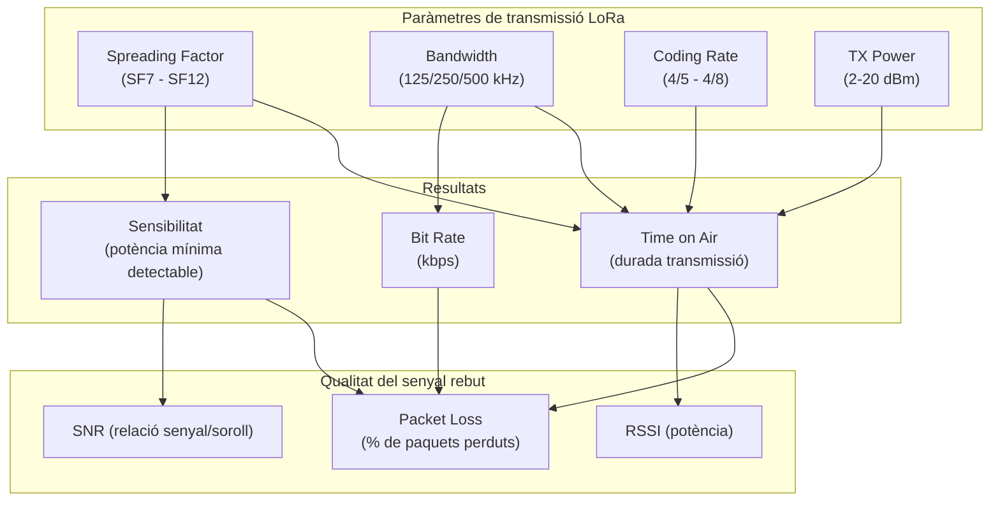

# Capítol 24 — Física de ràdio: els paràmetres que importen

> *"LoRa és com una guitarra: amb els mateixos materials pots fer un concert o un mal so. La diferència està en com toques les cordes."*

## 24.1 Què passa quan un mòdul LoRa transmet

Abans d'entendre els paràmetres, cal entendre què està passant realment a nivell físic. Quan un SX1262 transmet, fa el següent:

1. **Codifica les dades** en bits.
2. **Aplica un codi de correcció d'errors** (FEC, Forward Error Correction). LoRa usa un codi amb taxa variable (de 4/5 a 4/8) — com més protecció, menys capacitat però més robustesa.
3. **Intercala els bits** per protegir-se de ràfegues d'errors.
4. **Modula amb Chirp Spread Spectrum (CSS)**: cada bit es converteix en un "chirp", un senyal que canvia de freqüència al llarg del temps de manera lineal. La freqüència instantània augmenta (up-chirp) o disminueix (down-chirp) contínuament.
5. **Emet el senyal** a la freqüència portadora (868 MHz típicament) amb una amplada de banda (BW) concreta i un spreading factor (SF) determinat.

A la recepció, el procés és invers: el receptor correlaciona el senyal rebut amb chirps coneguts i n'extreu els bits originals.

La bellesa d'aquest esquema és que **com més ample de banda i més spreading factor, més robust** és el senyal davant de soroll, interferències i obstacles — però més **lent** és. La capacitat de transmissió i la sensibilitat del receptor es poden ajustar amb només tres paràmetres: BW, SF i CR.

## 24.2 Amplada de banda (Bandwidth, BW)

L'**amplada de banda** és el rang de freqüències que el senyal ocupa. LoRa estandarditza tres valors principals:

- **125 kHz**: el més comú, bon equilibri capacitat/abast. Usa la meitat del canal.
- **250 kHz**: més capacitat, però ocupa tot un canal i consumeix més energia.
- **500 kHz**: el màxim, molt capacitat però poca eficiència energètica.

A la banda EU868, tenim canals definits a 868.1, 868.3, 868.5, 867.1, 867.3, 867.5, 867.7, 867.9 MHz (8 canals estàndard a 125 kHz). Per a 250 kHz, hi ha canals a 868.5, 867.1, 867.7. Per a 500 kHz, a 868.5 MHz.

**Quan fer servir cada BW?**

- **125 kHz**: per defecte. Sempre que no necessitem més capacitat.
- **250 kHz**: quan volem enviar més dades (firmware updates, payloads grans).
- **500 kHz**: només per experiments; rarament útil.

## 24.3 Spreading Factor (SF)

El **spreading factor** és el paràmetre més important. Determina quant s'expandeix el senyal en el temps. LoRa defineix SF7 a SF12, amb SF7 el més ràpid i SF12 el més robust:

| SF | Bits/simbòlic | Temps per byte | Sensibilitat (aprox.) | Abast relatiu |
|----|---------------|----------------|------------------------|---------------|
| SF7 | 7 | 41 ms | -123 dBm | 1× (base) |
| SF8 | 8 | 72 ms | -126 dBm | 1.4× |
| SF9 | 9 | 144 ms | -129 dBm | 2× |
| SF10 | 10 | 288 ms | -132 dBm | 2.8× |
| SF11 | 11 | 577 ms | -134.5 dBm | 4× |
| SF12 | 12 | 992 ms | -137 dBm | 5.7× |

**Com interpretar-ho?**

- A SF7, podem enviar un missatge en 41 ms i el receptor detecta senyals fins a -123 dBm (un nivell molt baix). Però cada byte "costa" poca energia de senyal.
- A SF12, el mateix missatge triga 24 vegades més (992 ms), però el receptor detecta senyals 14 dB més febles, equivalent a 5-6 vegades més distància.

A la pràctica: per a sensors ambientals amb pocs bytes cada 5-15 minuts, **SF7 o SF8** funcionen perfectament a 245 metres amb bona visió. Si tenim obstacles o volem més marge, **SF9-SF11**. **SF12** és per a casos extrems (quilòmetres) o quan tenim pèrdues molt severes.

**Quin és el cost?** A SF12, **cada transmissió gasta 24 vegades més temps d'aire** que a SF7. A la banda EU868, hi ha un límit de **duty cycle** (1% per defecte): només podem transmetre l'1% del temps. Si un missatge a SF12 dura 1 segon, hem d'esperar 99 segons entre missatges. A SF7, podem enviar un missatge cada ~4 segons.

## 24.4 Coding Rate (CR)

El **coding rate** (4/5, 4/6, 4/7, 4/8) defineix la redundància afegida pel codi de correcció d'errors. Com més baix, menys protecció però menys overhead. Per defecte, 4/5 és el valor estàndard. Si tenim molts errors, podem pujar a 4/7 o 4/8.

## 24.5 Cicle de treball (Duty Cycle)

A la banda EU868, la normativa ETSI EN 300 220 limita el **duty cycle** (percentatge de temps que podem transmetre) a:

- Sub-banda 868.0-868.6 MHz: **1%** (és a dir, com a molt 36 segons per hora).
- Sub-banda 868.7-869.2 MHz: **0.1%** (12 segons per hora).
- Sub-banda 869.4-869.65 MHz: **10%** (potencia limitada a 500 mW).

A la pràctica, la majoria de xarxes LoRaWAN usen la sub-banda 868.0-868.6 amb 1% de duty cycle. Això vol dir que si un missatge dura 1 segon, hem d'esperar 99 segons fins al proper. Per a sensors ambientals, és perfecte: publiquem cada 5-15 minuts, molt per sota del límit.

Però compte: el càlcul és per sub-banda, no per node. Si tenim 5 nodes transmetent a la mateixa sub-banda, tots compten contra el 1% agregat. En sistemes petits, no és un problema. En sistemes grans, cal planificar.

## 24.6 Potència de transmissió (TX Power)

LoRa permet ajustar la potència entre **2 dBm (1.6 mW)** i **20 dBm (100 mW)** típicament, segons el mòdul. Com més potència, més abast però més consum de bateria.

Per a un sensor a 245 metres amb bona visió, **8-10 dBm (6-10 mW)** és més que suficient. Per a distàncies quilomètriques o amb obstacles, pujar a **14-17 dBm (25-50 mW)**.

A la Raspberry (gateway), solem usar **14-17 dBm**, que és el que solen suportar els mòduls concentradors SX1302.

Important: la potència màxima legal a EU868 és **25 mW ERP** (14 dBm) per a la majoria de sub-bandes, tot i que el SX1262 pot arribar a 20 dBm. Si anem més enllà del límit legal, podem tenir problemes amb les autoritats de telecomunicacions (a Espanya, la Secretaría de Estado de Telecomunicaciones).

## 24.7 RSSI i SNR

Quan el gateway rep un missatge, ens dóna dues mètriques de qualitat:

- **RSSI (Received Signal Strength Indicator)**: la potència del senyal rebut, en dBm. Com més proper a 0, millor. Valors típics:
  - **-30 a -60 dBm**: senyal excel·lent (a pocs metres).
  - **-60 a -90 dBm**: senyal bo (a desenes de metres).
  - **-90 a -110 dBm**: senyal acceptable (a cent metres).
  - **-110 a -120 dBm**: senyal just (a quilòmetres, depèn de l'entorn).
  - **< -120 dBm**: massa feble per a SF7, pot funcionar a SF12.

- **SNR (Signal-to-Noise Ratio)**: la relació senyal-soroll, en dB. Com més alt, millor. Valors típics:
  - **> 10 dB**: excel·lent.
  - **5-10 dB**: bo.
  - **0-5 dB**: acceptable.
  - **< 0 dB**: el senyal està per sota del soroll; la modulació LoRa encara pot desxifrar-lo gràcies a la seva robustesa, però estem al límit.

**Com usar RSSI i SNR a la pràctica?**

A TTN (i a la majoria de network servers), podem veure RSSI i SNR de cada missatge. Si veiem que RSSI baixa gradualment, pot ser que la bateria del node s'està acabant. Si SNR baixa sobtadament, pot ser que un obstacle nou (una branca, una persona) estigui bloquejant el senyal.

## 24.8 L'equació de la capacitat: bit rate, time on air, payload màxim

LoRa té una fórmula per calcular el **bit rate** i el **time on air** d'un missatge. Sense entrar en les matemàtiques completes, les conclusions pràctiques són:

- A **SF7, BW 125 kHz**: el bit rate és ~5.5 kbps, i el temps d'un missatge de 20 bytes és ~60 ms.
- A **SF12, BW 125 kHz**: el bit rate és ~0.3 kbps, i el mateix missatge dura ~1.5 segons.

El **payload màxim** (mida útil de dades per transmissió) varia amb SF:

- SF7: 222 bytes.
- SF8: 222 bytes.
- SF9: 115 bytes.
- SF10: 51 bytes.
- SF11: 51 bytes.
- SF12: 51 bytes.

Per a sensors ambientals (temperatura, humitat, etc.), el payload és típicament 5-20 bytes, lluny dels límits.

## 24.9 ADR: Adaptive Data Rate

**ADR** és un mecanisme pel qual el **network server** ajusta els paràmetres de transmissió (SF, BW, potència) de cada node en funció de la qualitat del senyal que rep. La idea és:

- Si un node s'envia amb SF12 però el gateway el rep a RSSI -50 dBm, el node està gastant molta energia innecessàriament. El NS li pot dir "baixa a SF8 i a 8 dBm".
- Si un node s'envia amb SF7 però el gateway el rep a RSSI -115 dBm, el NS li pot dir "puja a SF10".

L'ADR és opcional, però molt recomanable. Millora la capacitat de la xarxa i allarga la vida de les bateries. TTN l'implementa per defecte.

## 24.10 Les bandes ISM al món

Cada regió té les seves bandes ISM. Les més importants:

- **EU868** (Europa, Àfrica, bona part d'Àsia): 863-870 MHz, amb sub-bandes específiques. La que ens afecta.
- **US915** (EUA): 902-928 MHz, amb 64 canals a 125 kHz (més canals, però menys temps d'aire per missatge).
- **AS923** (Àsia-Pacífic): 915-928 MHz, una mena de pont entre EU868 i US915.
- **AU915** (Austràlia): similar a US915.
- **CN470** (Xina): 470-510 MHz, diferent de les altres.
- **IN865** (Índia): 865-867 MHz.
- **KR920** (Corea): 920-925 MHz.

Al BernatLab, estem a Europa, per tant treballem amb **EU868**.

## 24.11 El concepte de "canal" i "data rate"

A LoRaWAN, una combinació de SF + BW es coneix com a **Data Rate (DR)**. Per exemple:

- **DR0**: SF12, BW 125 kHz (més lent, més abast).
- **DR5**: SF7, BW 125 kHz (més ràpid, menys abast).

A EU868, els data rates van de DR0 a DR5 (6 valors). La idea és la mateixa que amb SF aïllat: valors baixos = més abast, valors alts = més velocitat.

Quan parlem de "canal", ens referim a una freqüència concreta dins de la banda. Un missatge concret es transmet en un canal concret amb un data rate concret.

## 24.12 RSSI vs SNR vs Link Budget

El **link budget** és la diferència entre la potència transmesa i la sensibilitat del receptor. Per exemple:

- TX Power: 14 dBm.
- Sensibilitat del receptor (a SF7): -123 dBm.
- Link budget: 14 - (-123) = 137 dB.

Aquest número ens diu quanta "pèrdua" podem tolerar entre l'antena emissora i la receptora. A 868 MHz, la pèrdua en espai lliure segueix la fórmula de Friis:

```
P_r(dBm) = P_t(dBm) + G_t(dBi) + G_r(dBi) - 20·log10(d) - 20·log10(f) - 32.45
```

on `d` és la distància en km i `f` la freqüència en MHz. A 868 MHz, 1 km, 0 dBi d'antenes:

```
P_r = 0 - 20·log10(1) - 20·log10(868) - 32.45 ≈ -91.2 dBm
```

A 245 metres, afegint-hi 0 dBi d'antenes (cas base):

```
P_r = 0 - 20·log10(0.245) - 20·log10(868) - 32.45 ≈ -66.8 dBm
```

Això és molt millor que -123 dBm (sensibilitat a SF7), per tant SF7 funciona bé en espai lliure a 245 metres. Si afegim obstacles (un arbre de 5 metres al mig), la pèrdua pot pujar a 10-20 dB, i estarem a -85 dBm, encara perfectament dins del rang.

## 24.13 Què vol dir "Banda ISM"

**ISM** (Industrial, Scientific, Medical) són bandes de freqüència reservades per a ús industrial, científic i mèdic sense necessitat de llicència. N'hi ha diverses al món:

- 6.78 MHz, 13.56 MHz, 27.12 MHz (ús general).
- 433.92 MHz (Europa, Àsia).
- 868 MHz (Europa, Àsia).
- 915 MHz (Amèrica).
- 2.45 GHz (Wi-Fi, Bluetooth, microones).
- 5.8 GHz (Wi-Fi, alguns radars).

Aquestes bandes estan compartides amb molts altres serveis, per la qual cosa la normativa imposa **límits de potència** i **duty cycle** per evitar interferències.

## 24.14 Què passa si comparteixo la banda amb altres

A 868 MHz, podem trobar:

- Sistemes d'alarma sense fils.
- Lectors RFID.
- Comandaments a distància de portes de garatge.
- Sensors industrials.
- Altres xarxes LoRa.

Com que la modulació LoRa és molt robusta (gràcies al spreading factor i al CSS), aguanta bé la coexistència amb altres sistemes. Tanmateix, podem rebre **interferències**, que es manifesten com a SNR baix o paquets perduts.

Solucions:

- Canviar de canal (si la nostra xarxa ho permet).
- Usar SF més alt (més robust davant d'interferències, però més lent).
- Usar ADR perquè el NS trobi la millor combinació automàticament.

## 24.15 Glossari visual



## 24.16 Com aplicar-ho a Hort Osona

Per a un node a 245 metres de la Raspberry, amb possibles arbres al mig, una bona configuració inicial és:

- **BW**: 125 kHz.
- **SF**: SF9 (bon equilibri abast/consum/velocitat).
- **CR**: 4/5 (per defecte).
- **TX Power**: 10 dBm (10 mW) — abundant per a 245 m, deixa marge.
- **ADR**: activat (TTN el gestionarà sol).

Aquesta configuració permet transmissions cada 5-10 minuts, payload de fins a 115 bytes, i una vida útil de bateria de mesos amb piles AA o una LiPo petita.

## 24.17 Resum

En aquest capítol hem après la física darrere de LoRa: com la modulació Chirp Spread Spectrum permet transmissions de llarg abast amb poc consum, què significa cada paràmetre (BW, SF, CR, TX Power), com es mesura la qualitat del senyal (RSSI, SNR), quines limitacions normatives tenim (duty cycle, potència màxima), i quines combinacions funcionen bé per a l'escenari de Hort Osona. En el proper capítol veurem les dues grans topologies: LoRaWAN i LoRa P2P, i decidirem quina és la millor per al nostre cas.

## 24.18 Exercicis pràctics

1. Calcula el temps on air d'un missatge de 20 bytes a SF7, BW 125 kHz, CR 4/5. Usa una calculadora online com https://www.loratools.nl/#/airtime.
2. Calcula el temps on air del mateix missatge a SF12. Quantes vegades més llarg és?
3. Comprova quins canals de 868 MHz estan lliures a la teva zona amb un scanner com https://github.com/cyberman54/LoRa-Scanner.
4. Si el teu node envia cada 5 minuts (300 segons) un missatge de 100 ms a SF7, quin percentatge de duty cycle uses? (Pista: 100 ms / 300 s = 0,03%.)
5. Quina seria la durada màxima de missatge a SF12, BW 125 kHz, sense superar el 1% de duty cycle a la sub-banda principal?
6. Comprova la pèrdua en espai lliure a 245 metres, 868 MHz, amb la fórmula de Friis.
7. Fes una taula amb les combinacions BW × SF que faries servir per a:
   - Sensor a 50 metres (interior de casa).
   - Sensor a 245 metres (hort).
   - Sensor a 1 km (per si mai).

Paraules clau: **LoRa, modulació, chirp, CSS, spreading factor, SF7, SF8, SF9, SF10, SF11, SF12, bandwidth, BW, 125 kHz, 250 kHz, 500 kHz, coding rate, duty cycle, ETSI EN 300 220, EU868, ISM, RSSI, SNR, packet loss, link budget, Friis, pèrdua en espai lliure, ADR, data rate, canal, payload, time on air, antena, dBi, dBm, mW, potència, normativa, telecomunicacions, 868 MHz, 915 MHz, US915, EU868, AS923, TTN, TTN, xarxa, network server, node, gateway, end device, OTAA, ABP, EU868, EU433, US915, CN470, KR920, IN865, AS923, AU915, ISM, sub-banda, 868.0, 868.3, 868.5, 867.1, 867.3, 867.5, 867.7, 867.9, 869.4, 869.65**.
